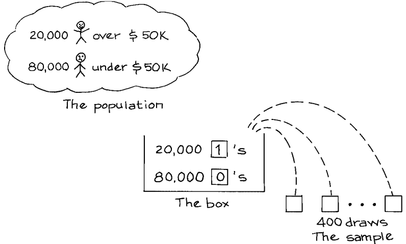
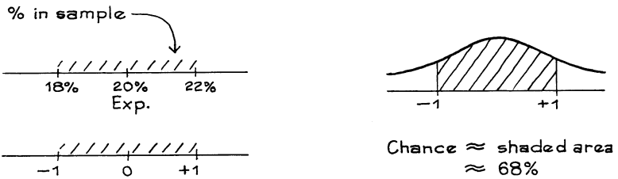
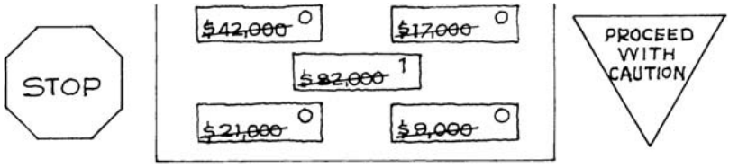
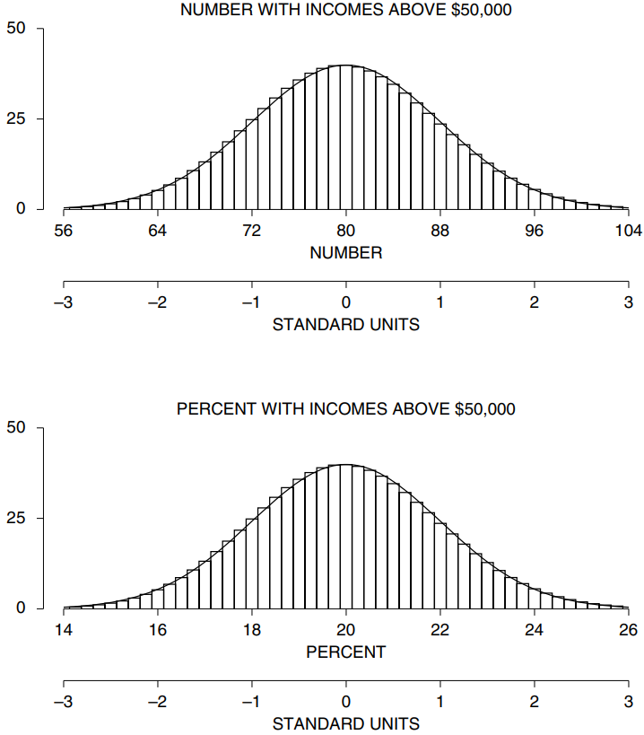

# Using the Normal Curve

Mục này sẽ xem xét `expected value` và `SE` cho tỷ lệ phần trăm mẫu và sử dụng `normal curve` để tính toán cơ hội.

_Ví dụ 1._ Ở một thị trấn nọ, công ty điện thoại có 100.000 thuê bao phụ. Họ có kế hoạch lấy một `simple random sample` gồm 400 người trong số đó như một phần của nghiên cứu thị trường. Theo dữ liệu Điều tra dân số, 20% số người đăng ký của công ty kiếm được trên $50.000 một năm. Tỷ lệ phần trăm những người trong mẫu có thu nhập trên $50.000 một năm sẽ vào khoảng **\_**, thêm hoặc bớt **\_** hoặc hơn.

_Giải pháp._ Bước đầu tiên là làm mô hình hộp. Lấy mẫu 400 người đăng ký cũng giống như rút ngẫu nhiên 400 phiếu từ một hộp 100.000 phiếu. Có một phiếu trong hộp cho mỗi người trong tổng thể và một phiếu rút thăm cho mỗi người trong mẫu. Việc rút được thực hiện ngẫu nhiên không thay thế.

Vấn đề liên quan đến việc phân loại những người trong mẫu theo thu nhập của họ có trên $50.000 một năm hay không, sau đó đếm những người có thu nhập trên mức đó. Vì vậy, mỗi phiếu trong ô phải được đánh dấu 1 hoặc 0. Những người kiếm được trên $50.000 sẽ nhận được 1 và những người khác nhận được 0. Giả sử rằng 20% số người đăng ký kiếm được trên $50.000 một năm, vì vậy 20.000 phiếu trong hộp được đánh dấu 1. 80.000 phiếu còn lại được đánh dấu 0. Mẫu giống như 400 phiếu rút thăm từ hộp. Và số người trong mẫu kiếm được trên $50.000 một năm cũng giống như tổng số lần rút thăm. Thế là hoàn thành bước đầu tiên, thiết lập mô hình hộp.

Bây giờ bạn phải tính tổng số lần rút từ hộp. `expected value` của tổng là \\(400 \times 0.2 = 80\\). Để tính `standard error`, bạn cần `SD` của hộp là \\(\sqrt{0.2} \times 0.8 = 0.4\\). Có 400 lượt rút, do đó `SE` cho tổng là \\(\sqrt{400} \times 0.4 = 8\\). Tổng sẽ vào khoảng 80, thêm hoặc bớt 8 hoặc hơn. Nói cách khác, số người trong mẫu kiếm được hơn $50.000 một năm sẽ là khoảng 80, thêm hoặc bớt 8 hoặc hơn.
Tuy nhiên, câu hỏi là về phần trăm. Bạn chuyển đổi sang phần trăm tương ứng với kích thước của mẫu: 80 trên 400 là 20% và 8 trên 400 là 2%. `expected value` của tỷ lệ phần trăm mẫu là 20% và `SE` là 2%. Điều đó hoàn thành giải pháp: tỷ lệ người có thu nhập cao trong mẫu sẽ vào khoảng 20%, thêm hoặc bớt 2% hoặc hơn. (Điều này có thể không may, nhưng các nhà thống kê sử dụng ký hiệu % làm từ viết tắt cho cả "phần trăm" và "điểm phần trăm".)

Tất nhiên, `expected value` của phần trăm mẫu khá dễ tính toán mà không cần đi vòng qua số mẫu. Khi rút ngẫu nhiên từ một hộp 0 và 1, `expected value` của tỷ lệ phần trăm số 1 trong số các lần rút sẽ bằng tỷ lệ phần trăm số 1 trong hộp [Mục 20.2](../ch20/ch20-02.md).

> Khi rút ngẫu nhiên từ hộp gồm 0 và 1, tỷ lệ phần trăm số 1 trong số các lần rút có thể là khoảng **\_**, thêm hoặc bớt \_\_\_\_ hoặc hơn. `expected value` cho tỷ lệ phần trăm của 1 trong số các lần rút sẽ điền vào chỗ trống đầu tiên. `SE` cho tỷ lệ phần trăm của 1 trong số các lần rút thăm sẽ điền vào chỗ trống thứ hai.

_Ví dụ 2._ (Tiếp tục Ví dụ 1.) Ước tính khả năng có khoảng 18% đến 22% số người trong mẫu kiếm được trên $50.000 một năm.

_Giải pháp._ `expected value` của tỷ lệ phần trăm mẫu là 20% và `SE` là 2%. Bây giờ chuyển đổi sang `standard units`:

Điều này hoàn thành giải pháp.

Ở đây, `normal curve` được sử dụng để tính toán cơ hội. Tại sao điều đó là hợp lệ? Có một `probability histogram` cho số người có thu nhập cao trong mẫu (Hình 3). Các vùng trong biểu đồ này thể hiện cơ hội. Ví dụ: khu vực từ 80 đến 90 thể hiện cơ hội rút ra được mẫu có từ 80 đến 90 người có thu nhập cao. Như đã thảo luận ở Chương 18, `probabiltiy histogram` này tuân theo `normal curve` (hình trên cùng của Hình 3). Việc chuyển đổi sang phần trăm chỉ là sự thay đổi về tỷ lệ, do đó `probabiltiy histogram` cho phần trăm mẫu (bảng dưới cùng) trông giống như biểu đồ trên cùng - và cũng đi theo đường cong. Trong Ví dụ 2, đường cong được sử dụng trên `probabiltiy hisgram` cho tỷ lệ phần trăm mẫu chứ không phải trên biểu đồ cho dữ liệu.

Ví dụ 1 và 2 là về dữ liệu định tính. Thu nhập bắt đầu dưới dạng dữ liệu định lượng - các con số. Tuy nhiên, các vấn đề liên quan đến việc phân loại và đếm. Mỗi người được phân loại là có thu nhập trên $50.000 một năm hoặc ít hơn. Sau đó, những người có thu nhập cao sẽ được tính. Nói cách khác, dữ liệu được coi là định tính: mỗi thu nhập có hoặc không có chất lượng trên $50.000 một năm.

**
Hình 3. Bảng trên cùng hiển thị `probabiltiy histogram` của số người trong mẫu có thu nhập trên $50.000. Bảng dưới cùng hiển thị `probability histogram` cho phần trăm số người trong mẫu có thu nhập trên $50.000. Trong các `standard unit`, hai biểu đồ hoàn toàn giống nhau.[^3] (Bốn trăm người được chọn ngẫu nhiên từ `population` 100.000 người.)
**

Khi nào bạn chuyển sang hộp 0-1? Để trả lời câu hỏi này, hãy nghĩ về phép tính số học được thực hiện trên các giá trị mẫu. Phép tính có thể liên quan đến:

- cộng các giá trị mẫu để lấy giá trị trung bình;
  hoặc
- phân loại và đếm, để có được phần trăm.

Nếu vấn đề là về phân loại và đếm, hãy cho các số 0 và 1 vaof hộp (Mục 5 của Chương 17).
