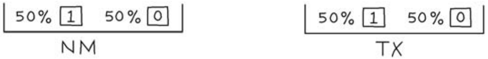
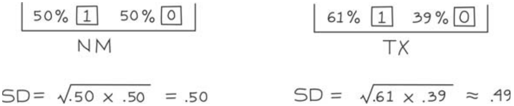
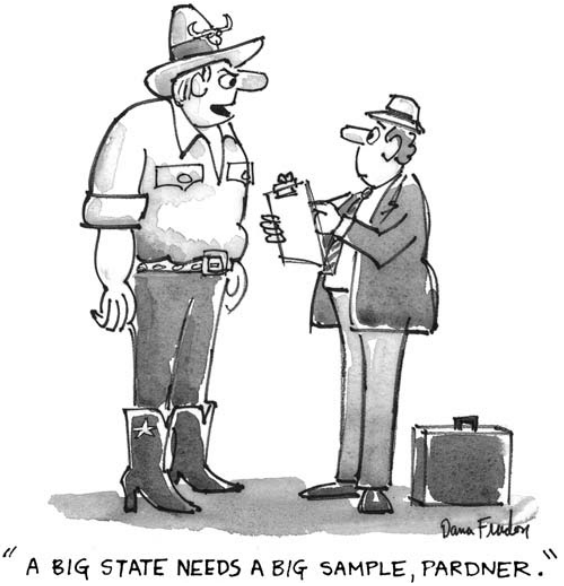

# The Correlation Factor

Ngay sau Ngày Lao động năm 2004. Chiến dịch tranh cử tổng thống (Bush so với Kerry) đang diễn ra sôi nổi và trọng tâm là ở Tây Nam. Những người thăm dò ý kiến đang cố gắng dự đoán kết quả. Có khoảng 1.5 triệu cử tri đủ điều kiện ở New Mexico và khoảng 15 triệu ở bang Texas. Giả sử một tổ chức bỏ phiếu lấy một `simple random sample` gồm 2.500 cử tri ở New Mexico để ước tính tỷ lệ cử tri ở bang đó là đảng Dân chủ. Một tổ chức bỏ phiếu khác lấy `simple random sample` gồm 2.500 cử tri từ Texas. Cả hai cuộc thăm dò đều sử dụng các kỹ thuật giống hệt nhau. Cả hai ước tính đều có thể sai lệch một chút, do `chance error`. Đối với cuộc thăm dò nào thì `chance error` có thể nhỏ hơn?

Cuộc thăm dò ở New Mexico đang lấy mẫu một cử tri trong số 600 người, trong khi cuộc thăm dò ở Texas đang lấy mẫu một cử tri trong số 6.000 người. Có vẻ như cuộc thăm dò ở New Mexico sẽ chính xác hơn cuộc thăm dò ở Texas. Tuy nhiên, đây là một trong những chỗ mà trực giác xung đột trực tiếp với lý thuyết thống kê và trực giác phải nhường chỗ. Trên thực tế, độ chính xác được mong đợi từ cuộc thăm dò ở New Mexico cũng gần giống như độ chính xác được mong đợi từ cuộc thăm dò ở Texas.

> Khi ước tính tỷ lệ phần trăm, kích thước tuyệt đối của mẫu quyết định độ chính xác chứ không phải kích thước tương ứng với `population`. Điều này đúng nếu mẫu chỉ là một phần nhỏ của tổng thể, đây là trường hợp thông thường.[^5]

Một mô hình hộp sẽ giúp tập trung vào vấn đề. Chúng ta sẽ cần hai hộp, NM và TX. Hộp NM đại diện cho New Mexico, hộp TX đại diện cho Texas. Box NM có 1.500.000 phiếu, mỗi cử tri một phiếu. Các phiếu tương ứng với Đảng Dân chủ được đánh dấu 1, các phiếu còn lại được đánh dấu 0. Để đơn giản, chúng tôi đặt tỷ lệ phần trăm của số 1 trong hộp bằng 50%. Chúng tôi thuê một tổ chức bỏ phiếu để lấy một `simple random sample` từ hộp NM mà không cho họ biết trong hộp có gì. (Hãy nhớ rằng, `simple random sample` nghĩa là lấy ngẫu nhiên không thay thế.) Công việc của tổ chức bỏ phiếu là ước tính tỷ lệ phần trăm của số 1 trong hộp. Đương nhiên, họ sử dụng tỷ lệ phần trăm của 1 trong mẫu của họ.

Bây giờ cho Hộp TX. Nó đại diện cho Texas nên chứa 15.000.000 phiếu. Một lần nữa, chúng ta đánh dấu 1 trên một nửa số phiếu trong hộp và 0 trên những phiếu còn lại. Một cuộc bỏ phiếu hoặc tổ chức khác được thuê để lấy `simple random sample` gồm 2.500 phiếu từ hộp TX mà không biết thành phần của hộp. Tổ chức này cũng sẽ ước tính tỷ lệ phần trăm số 1 trong hộp theo tỷ lệ phần trăm trong mẫu và sẽ bị sai sót do một `chance error`.

Hộp NM và hộp TX được bố trí với cùng thành phần phần trăm và hai mẫu có cùng kích thước. Trực giác sẽ khẳng định rằng việc lấy mẫu của tổ chức từ hộp NM sẽ có `chance error` nhỏ hơn nhiều, bởi vì hộp NM nhỏ hơn rất nhiều. Nhưng lý thuyết thống kê cho thấy mức độ `chance error` có thể xảy ra ở hai cuộc thăm dò là gần như nhau.

Vấn đề bây giờ đã được nêu rõ. Lý thuyết thống kê biện minh cho chính nó như thế nào? Để bắt đầu, giả sử các mẫu được rút có thay thế. Khi đó việc sử dụng hộp nào sẽ không còn quan trọng nữa. Sẽ có 50-50 cơ hội nhận được 0 hoặc 1 trong mỗi lần rút thăm và kích thước của ô sẽ hoàn toàn không liên quan. Hộp NM và hộp TX có cùng `SD` là 0.5, vì vậy cả hai tổ chức bỏ phiếu sẽ có cùng `SE` cho số 1 trong số các lần rút thăm:

\\[
\sqrt{2.500} \times 0.5 = 25
\\]

Kết quả là cả hai đều có cùng `SE` cho tỷ lệ phần trăm là 1 trong số các lần rút:

\\[
\frac{25}{2500} \times 100\\% = 1\\%
\\]

Nếu rút ngẫu nhiên có thay thế, cả hai tổ chức sẽ chênh lệch khoảng 1 điểm phần trăm.

Trong thực tế, các lần rút được thực hiện mà không thay thế. Tuy nhiên, số lần rút chỉ là một phần rất nhỏ so với số lượng phiếu trong hộp. Việc rút thăm không thay thế hầu như không làm thay đổi thành phần của hộp. Trong mỗi lần rút thăm, cơ hội nhận được 1 vẫn phải rất gần 50%, và tương tự là 0. Về cơ hội thì gần như không có sự khác biệt giữa việc rút có hoặc không thay thế.

Về bản chất, đó là lý do tại sao quy mô `population` hầu như không liên quan gì đến tính chính xác của các ước tính. Tuy nhiên, vẫn có một chút khác biệt giữa việc vẽ có và không thay thế. Khi rút không thay thế, hộp sẽ nhỏ hơn một chút, làm giảm độ biến thiên một chút. Vì vậy `SE` cho việc rút không thay thế sẽ nhỏ hơn một chút so với `SE` cho việc rút có thay thế. Có một công thức toán học cho biết nhỏ hơn bao nhiêu:

\\[
\text{SE when drawing WITHOUT replacement} = \text{correction factor} \times \text{SE when drawing WITH replacement}
\\]

Bản thân hệ số hiệu chỉnh có phần phức tạp:

\\[
\sqrt{\frac{\text{number of tickets in box - number of draws}}{\text{number of tickets in box - one}}}
\\]

Khi số lượng phiếu trong hộp lớn so với số lần rút thăm,

| Number of tickets in the box | Correction factor(to five decimals) |
| ---------------------------- | ----------------------------------- |
| 5.000                        | 0.70718                             |
| 10.000                       | 0.86607                             |
| 100.000                      | 0.98743                             |
| 500.000                      | 0.99750                             |
| 1.500,000                    | 0.99917                             |
| 15.000,000                   | 0.99992                             |

**
Bảng 3. Hệ số hiệu chỉnh; số lần rút được cố định là 2.500.
**

hệ số hiệu chỉnh gần bằng 1 và có thể bỏ qua (Bảng 3). Sau đó, kích thước tuyệt đối của mẫu quyết định độ chính xác, thông qua `SE` cho việc rút có thay thế. Kích thước `population` không thực sự quan trọng. Mặt khác, nếu mẫu là một phần đáng kể của tổng thể thì phải sử dụng hệ số hiệu chỉnh.
Trong mô hình hộp của chúng ta, tỷ lệ phần trăm của 1 là như nhau cho cả hai hộp. Trên thực tế, tỷ lệ đảng viên Đảng Dân chủ ở hai bang sẽ khác nhau. Tuy nhiên, ngay cả một sự khác biệt khá lớn cũng sẽ không quan trọng lắm. Ví dụ, trong cuộc bầu cử tổng thống năm 2004, 50% cử tri ở New Mexico đã chọn ứng cử viên Đảng Cộng hòa (Bush), so với 61% ở Texas.[^6] Nhưngcác `SD` của hai bang gần như giống nhau:

Một mẫu cỡ 2.500 cũng sẽ phù hợp ở Texas cũng như ở New Mexico, mặc dù Texas lớn hơn gấp 10 lần. Người Texas trong phim hoạt hình đã sai.

Một sự tương tự phi toán học có thể hữu ích. Giả sử bạn lấy một giọt chất lỏng từ chai để phân tích hóa học. Nếu chất lỏng được trộn đều, thành phần hóa học của giọt sẽ phản ánh thành phần của toàn bộ chai và việc chai đó là ống nghiệm hay bình gallon sẽ không thành vấn đề. Nhà hóa học không quan tâm mức giảm là 1% hay 1/100 của 1% dung dịch.

Sự tương tự là chính xác. Có một phiếu trong hộp ứng với mỗi phân tử trong chai. Nếu chất lỏng được trộn đều, giọt nước sẽ giống như một mẫu ngẫu nhiên. Số lượng phân tử trong giọt tương ứng với số lượng phiếu được rút ra. Con số này- cỡ mẫu - lớn đến mức `chance error` về tỷ lệ phần trăm là không đáng kể.

---

[^5]: The issues may be different in other contexts. For instance, suppose you are sampling from two different strata, and want to allocate a fixed number of sampling units between the two. If the object is to equalize accuracy of the two estimated percentages, a reasonable first cut is to use equal sample sizes. If the object is to equalize accuracy of estimated numbers, or to estimate a percentage that is pooled across the strata, a larger sample should generally be drawn from the larger stratum. Gains in accuracy from stratification—as opposed to simple random sampling— should not be overestimated (note 12 to chapter 19).

[^6]: Voting-age population by state comes from Statistical Abstract, 2006, table 408; election results by state from table 388. The population for NM was closer to 1.4 million; for TX, 16 million.
