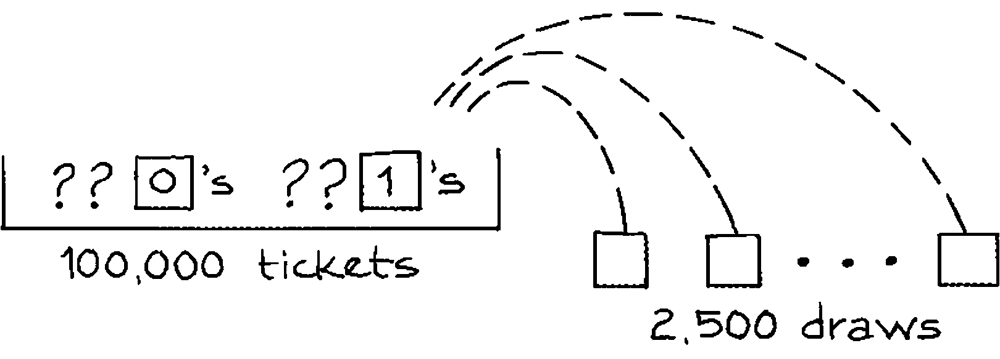
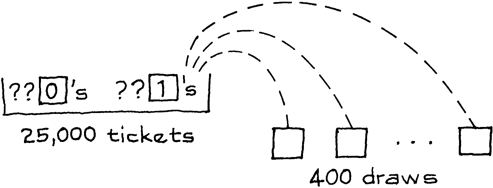

# Introduction

Chương trước lý luận từ hộp đến rút thăm. Các lần rút được thực hiện ngẫu nhiên từ một hộp đã biết thành phần bên trong và một vấn đề điển hình là tìm khả năng tỷ lệ phần trăm của 1 trong số các lần rút sẽ nằm trong một khoảng nhất định. Như Sherlock Holmes đã chỉ ra, thường rất hữu ích khi đảo ngược suy luận này, thay vì đi từ các lần rút thăm đến hộp. Một nhà thống kê sẽ gọi đây là `inference` từ mẫu cho dân số. `inference` là chủ đề của chương này.

Ví dụ: giả sử một tổ chức muốn biết tỷ lệ Đảng viên Đảng Dân chủ ở một quận nhất định. Họ có thể ước tính bằng cách lấy một `simple random sample`. Đương nhiên, tỷ lệ Đảng viên Đảng Dân chủ trong mẫu sẽ được sử dụng để ước tính tỷ lệ phần trăm Đảng viên Đảng Dân chủ trong khu vực - một ví dụ về suy luận ngược từ bốc thăm từ hộp. Vì mẫu được chọn ngẫu nhiên, hoàn toàn có thể nói ước tính chính xác đến mức nào, chỉ từ quy mô và thành phần của mẫu. Chương này sẽ giải thích làm điều đó như thế nào.

Kỹ thuật này là một trong những ý tưởng chính trong lý thuyết thống kê. Nó sẽ được trình bày trong bối cảnh bỏ phiếu. Một ứng cử viên chính trị muốn tham gia cuộc bầu cử sơ bộ ở một quận có 100.000 cử tri hợp lệ, nhưng chỉ khi anh ta có cơ hội thắng cử cao. Anh ta thuê một tổ chức khảo sát lấy mẫu ngẫu nhiên đơn giản gồm 2.500 cử tri. Trong mẫu, 1.328 ủng hộ ứng cử viên, vì vậy tỷ lệ phần trăm là:

\\[
\frac{1.328}{2.500} \times 100\\% \approx 53\\%
\\]

Ứng cử viên đang thảo luận về kết quả này với người thăm dò ý kiến của mình.

**Politician:** Tôi thắng

**Pollster:** Đừng vội. Bạn muốn biết tỷ lệ phần trăm bạn được bầu trong số tất cả các cử tri trong khu vực. Chúng tôi chỉ có nó từ mẫu.

**Politician:** Nhưng với một mẫu tốt, nó chắc chắn sẽ giống nhau.

**Pollster:** Không đúng. Tôi đã nói trước đây. Tỷ lệ bạn được bầu trong mẫu khác với tỷ lệ trong toàn quận. Sự khác biệt được gọi là lỗi cơ hội.

**Politician:** Mẫu có thể sai lệch tới 3% không? Nếu thế thì tôi thua.

**Pollster:** Trên thực tế, có thể tự tin khoảng 95% rằng chúng tôi đúng trong phạm vi 2% . Điều đó vẻ tốt.

**Politician:** Điều gì mang lại cho bạn kích cỡ của lỗi cơ hội?

**Pollster:** `standard error`. Chúng ta đã nói về điều đó hôm trước, nhớ chứ?

**Politician:** Xin lỗi, tôi đang đợi điện thoại.

<figure>
    

</figure>

Chính trị gia đã đi đến một câu hỏi quan trọng cần đặt ra khi xem xét dữ liệu khảo sát: ước tính có khả năng sai đến mức nào? Như người thăm dò ý kiến muốn nói, kích thước khả dĩ của lỗi cơ hội được đưa ra bởi `standard error`. Để hình dung điều đó, cần 1 mô hình hộp. Nên có một vé trong hộp cho mỗi cử tri, tổng cộng là 100.000 vé. Mỗi phiếu phải được đánh dấu 1 hoặc 0, trong đó 1 có nghĩa là phiếu bầu cho ứng cử viên, 0 là phiếu bầu chống lại ứng cử viên đó. Có 2500 lượt rút ngẫu nhiên từ hộp. Dữ liệu giống như các lần rút thăm và số lượng cử tri trong mẫu ủng hộ ứng cử viên tương tự tổng các lần rút thăm. Đây là mô hình hoàn chỉnh.

<figure>
    

</figure>

Để lấy `SE` cho tổng, tổ chức khảo sát cần `SD` của hộp. Đây là

\\[
\sqrt{(fraction\ of\ 1's) \times (fraction\ of\ 0's)}
\\]

<figure>
    

</figure>

Đến đây, những người thăm dò dường như bị mắc kẹt. Họ không biết mỗi vé trong hộp được đánh dấu như thế nào. Họ thậm chí không biết tỉ lệ của 1 trong hộp. Tham số này đại diện cho tỷ lệ cử tri trong khu vực ủng hộ ứng cử viên của họ, đó chính xác là những gì họ được thuê để tìm hiểu. (Do đó các dấu hỏi trong hộp.)

Các tổ chức khảo sát vượt qua loại trở ngại này bằng chiến lược của riêng họ[^2]. Họ tính các tỉ lệ quan sát được trong mẫu thay vì trong hộp. Trong ví dụ này, 1.328 người trong số 2.500 người được chọn ủng hộ ứng viên. Vì vậy, 1.328/2.500 \\(\approx\\) 0.53 của mẫu ủng hộ anh ta và 0.47 còn lại phản đối. Ước tính khoảng 0.53 trong số 100.000 vé trong hộp được đánh dấu 1, 0.47 còn lại được đánh dấu 0.

Trên cơ sở này, `SD` của hộp được ước tính là \\( \sqrt{0,53 \times 0,47} \approx 0,50\\). `SE` cho số cử tri trong mẫu ủng hộ ứng cử viên được ước tính là \\(\sqrt{2.500} \times 0,50 = 25\\). 25 đo lường mức độ sai số ngẫu nhiên có thể xảy ra trong 1.328. Bây giờ 25 người trong số 2.500 (cỡ mẫu) là 1%. `SE` cho tỷ lệ cử tri trong mẫu ủng hộ ứng cử viên được ước tính là 1%. Điều này hoàn thành thủ tục `bootstrap` để ước tính `standard error`.

Đối với ứng cử viên, phép tính này cho thấy ước tính 53% của người thăm dò ý kiến của anh ta chỉ có khả năng sai lệch 1% hoặc hơn. Nó rất không có khả năng giảm tới 3% hay 3 `SE`. Anh ấy đang ở mức an toàn là 50%, có khả năng lọt vào vòng trong.

> Thủ tục `Bootstrap`. Khi lấy mẫu từ hộp 0-1 có thành phần không xác định, `SD` của hộp có thể được ước tính bằng cách thay thế các tỉ lệ của 0 và 1 trong mẫu cho các tỉ lệ chưa biết trong hộp. Ước tính là tốt khi mẫu đủ lớn.

Thủ tục `bootstrap` có vẻ thô thiển. Nhưng ngay cả với các mẫu có kích thước vừa phải, tỷ lệ 1 trong số các lần rút thăm có thể sẽ khá gần với tỷ lệ trong hộp. Tương tự cho số 0. Nếu các tổ chức khảo sát sử dụng các phân số mẫu của họ trong công thức tính `SD` của hộp thì họ không có khả năng sai nhiều trong việc ước tính `SE`.

Một điểm đáng để thảo luận thêm. Giá trị kỳ vọng cho số 1 trong số các lần rút thăm (hay số lượng cử tri mẫu dự kiến ủng hộ ứng cử viên) là

\\[
2.500 \times fraction\ of \ 1's\ in\ the\ box
\\]

Điều này là không xác định, bởi vì tỉ lệ của 1 trong hộp là không xác định. `SE` của 25 cho biết mức 1.328 cách giá trị kỳ vọng của nó bao xa. Theo thuật ngữ thống kê, 1.328 là một giá trị được quan sát; sự tương phản là với giá trị kỳ vọng chưa biết. (Các giá trị quan sát được thảo luận ở trang 292.)

[^2]: The technique described in the text is a special case of what statisticians now call the “bootstrap” method for estimating standard errors. See Brad Efron and Rob Tibshirani, An Introduction to the Bootstrap (Chapman & Hall, 1993). For a cautionary note, see L. D. Brown, T. T. Cai, and A. DasGupta, “Confidence intervals for a binomial proportion and asymptotic expansions,’ Annals of Statistics vol. 30 (2002) pp. 160–201.
