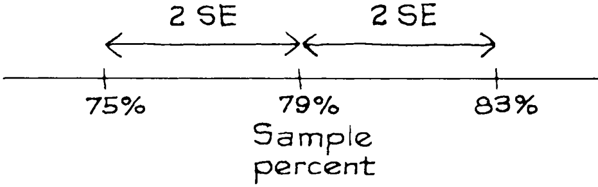
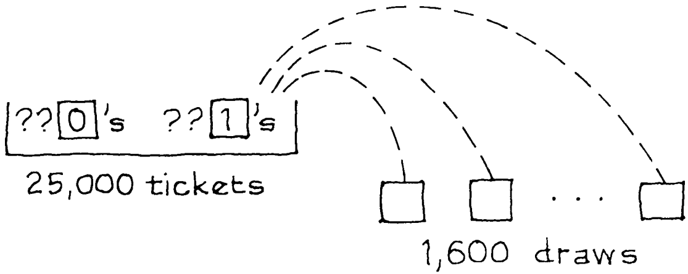

# Confidence Intervals

Trong ví dụ ở phần trước, 79% học sinh trong mẫu đang sống ở nhà: `sample percentage` là 79%. `population percentage` có thể đạt tới mức 79% là bao xa? (Hãy nhớ rằng, "population percentage" có nghĩa là tỷ lệ phần trăm của tất cả sinh viên tại trường đại học đang sống ở nhà.) `standard error` được ước tính là 2%, cho thấy `chance error` khoảng 2%. Vì vậy, `population percentage` có thể dễ dàng là 77%. Điều này có nghĩa là `chance error` là 2%:

\\[
\begin{align*}
\text{sample percentage} &= \text{population percentage} + \text{chance error} \\\\
79\\% &= 77\\% + 2\\%
\end{align*}
\\]

`population percentage` cũng có thể là 76%, tương ứng với `chance error` là 3%. Điều này khó xảy ra vì 3% đại diện cho 1.5 `SE`. `population percentage` thậm chí có thể nhỏ tới 75%, nhưng điều này còn khó xảy ra hơn; 4% đại diện cho 2 `SE`. Tất nhiên, `population percentage` có thể nằm ở phía bên kia của `sample percentage`, tương ứng với các `chance error` âm. Ví dụ, `population percentage` có thể là 83%. Khi đó ước tính thấp hơn 4%: `chance eror` là −4%, tức là −2 `SE`.

Với những `chance error`, không có ranh giới rõ ràng giữa điều có thể và điều không thể. Lỗi có kích thước lớn hơn 2 `SE` xảy ra - không thường xuyên. Điều gì xảy ra với điểm cắt ở 2 `SE`? Lấy khoảng từ dưới 2 `SE` đến trên 2 `SE` `sample percentage`:

Đây là `confidence interval` cho `population percentage`, với `confidence level` khoảng 95%. Bạn có thể tin cậy khoảng 95% rằng `population percentage` nằm trong khoảng từ 75% đến 83%.

Điều gì sẽ xảy ra nếu bạn muốn có một `confidence level` khác? Bất cứ điều gì ngoại trừ 100% đều có thể thực hiện được, bằng cách đi đúng số lượng `SE` theo một trong hai hướng so với `sample percentage`. Ví dụ:

- Khoảng "sample percentage \\(\pm 1\\) `SE`" là một khoảng tin cậy 68% cho `population percentage`.
- Khoảng "sample percentage \\(\pm 2\\) `SE`" là một khoảng tin cậy 95% cho `population percentage`.
- Khoảng "sample percentage \\(\pm 3\\) `SE`" là một khoảng tin cậy 99.7% cho `population percentage`.

Tuy nhiên, ngay cả 10 `SE` cũng có thể không mang lại sự tự tin 100%, vì có khả năng xa vvời rằng `chance error` rất lớn. Không có giới hạn xác định nào cho `normal curve`: cho dù bạn chọn khoảng hữu hạn lớn đến đâu, `normal curve` vẫn có một số diện tích nằm ngoài khoảng đó.[^6]

_Ví dụ 2._ Một `simple random sample` gồm 1.600 người được lấy để ước tính tỷ lệ phần trăm đảng viên Đảng Dân chủ trong số 25.000 cử tri đủ điều kiện ở một thị trấn nhất định. Hóa ra 917 người trong mẫu là đảng viên Đảng Dân chủ. Tìm khoảng tin cậy 95% cho tỷ lệ phần trăm đảng viên Đảng Dân chủ trong số 25.000 cử tri đủ điều kiện.

_Giải pháp._ Tỷ lệ phần trăm đảng viên Đảng Dân chủ trong mẫu là

\\[
\frac{917}{1600} \times 100\\% \approx 57.3\\%
\\]

Ước tính: khoảng 57.3% cử tri đủ điều kiện trong thị trấn là đảng viên Đảng Dân chủ. Đối với `standard error`, cần có mô hình hộp. Có một phiếu trong hộp cho mỗi cử tri đủ điều kiện trong thị trấn, tổng cộng là 25.000 phiếu. Có 1.600 lượt rút thăm, tương ứng với cỡ mẫu là 1.600. Vấn đề này liên quan đến việc phân loại (Dân chủ hoặc không) và đếm nên mỗi phiếu được đánh dấu 1 hoặc 0. Đảng Dân chủ đang được đếm. Vì vậy, các phiếu tương ứng với Đảng Dân chủ được đánh dấu 1, các phiếu còn lại được đánh dấu 0. Có 1.600 phiếu rút ngẫu nhiên từ hộp. Dữ liệu giống như số lần rút thăm và số lượng đảng viên Đảng Dân chủ trong mẫu giống như tổng số lần rút thăm. Thế là hoàn thành mô hình.

Tỷ lệ số 1 trong hộp(tạm dịch - tỷ lệ đảng viên Đảng Dân chủ trong số 25.000 cử tri đủ điều kiện) không xác định, nhưng có thể được ước tính bằng 0.573, tỷ lệ đảng viên Đảng Dân chủ trong mẫu. Tương tự, phần số 0 trong hộp được ước tính là 0.427. Vì vậy `SD` của hộp được ước tính bằng phương pháp bootstrap là \\(\sqrt{0.573 \times 0.427} \approx 0.5\\). `SE` cho số lượng đảng viên Đảng Dân chủ trong mẫu được ước tính là \\(\sqrt{1.600} \times 0.5 = 20\\). Số 20 cho biết mức độ `chance error` có thể xảy ra trong 917. Bây giờ hãy chuyển đổi sang phần trăm, tương ứng với kích thước của mẫu:

\\[
\frac{20}{1600} \times 100\\% = 1.25\\%
\\]

`SE` cho tỷ lệ phần trăm đảng viên Đảng Dân chủ trong mẫu là 1.25%. Tỷ lệ phần trăm của đảng viên Đảng Dân chủ trong mẫu có thể thấp hơn tỷ lệ phần trăm của đảng viên Đảng Dân chủ trong `population`, khoảng 1.25 điểm phần trăm. Khoảng tin cậy 95% cho tỷ lệ phần trăm đảng viên Đảng Dân chủ trong số 25.000 cử tri đủ điều kiện là

\\[
57.3\\% \pm 2 \times 1.25\\%
\\]

Đó là câu trả lời. Chúng ta có thể tin tưởng khoảng 95% rằng từ 54.8% đến 59.8% cử tri đủ điều kiện ở thị trấn này là đảng viên Đảng Dân chủ.

Các `confidence level` thường được cho là "khoảng" quá nhiều. Có hai lý do. (i) `standard error` đã được ước tính từ dữ liệu. (ii) `normal approximation` đã được dùng. Nếu `normal approximation` không áp dụng được thì các phương pháp của chương này cũng vậy. Không có quy tắc cứng nhắc và nhanh chóng nào cho việc quyết định. Cách tốt nhất để tiến hành là tưởng tượng rằng `pupulation` có cùng thành phần phần trăm như mẫu. Sau đó cố gắng quyết định xem liệu `normal approximation` có áp dụng được cho tổng số lần rút ra từ hộp hay không. Ví dụ, tỷ lệ phần trăm mẫu gần 0% hoặc 100% gợi ý rằng hộp bị lệch, do đó sẽ cần một số lượng lớn các lần rút trước khi `normal approximation` diễn ra (Mục 5 của chương 18). Mặt khác, nếu `sample percentage` gần 50% thì `normal approximation` sẽ đạt yêu cầu khi chỉ có khoảng 100 lần rút thăm.

[^6]: Suppose we draw at random with replacement. As the sample size \\(n \rightarrow \infty\\),
    \\[
    P[\hat{p} - k SE < p < \hat{p} + k SE]
    \\]
    có xu hướng tới diện tích dưới `normal curve` giữa −k và k; nó nhỏ hơn 1
