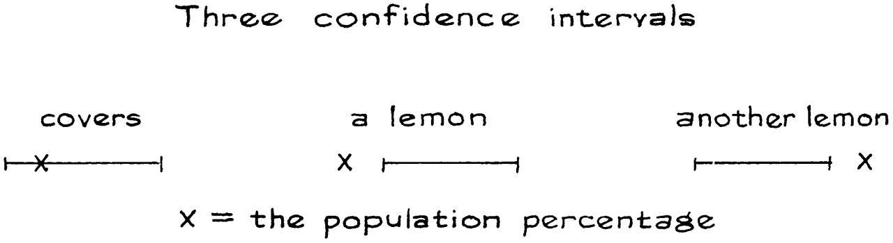
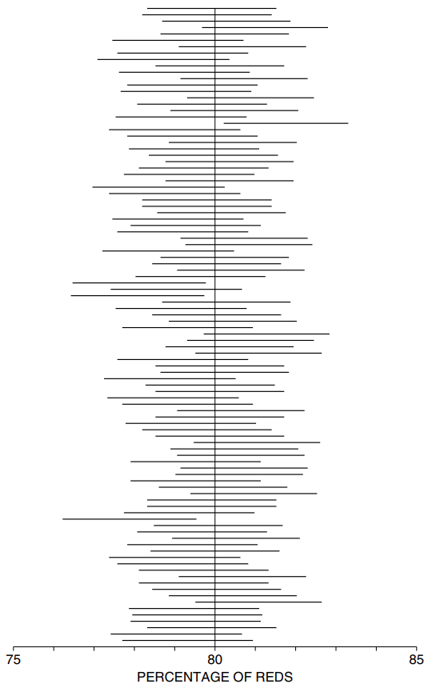

# Interpreting a Confidence Interval

Trong Ví dụ 1 [Mục 21.1](../ch21/ch21-01.md), một `simple random sample` được lấy để ước tính phần trăm sinh viên đăng ký vào một trường đại học vào mùa thu năm 2005 sống ở nhà. Khoảng tin cậy xấp xỉ 95% cho tỷ lệ phần trăm này dao động từ 75% đến 83%, vì

\\[
\text{sample percentage} \pm 2SE = \text{75% to 83%}
\\]

Có vẻ tự nhiên hơn khi nói "Có 95% khả năng tỷ lệ phần trăm dân số nằm trong khoảng từ 75% đến 83%". Nhưng có một vấn đề ở đây. Trong _frequency thoery_, một khả năng biểu thị phần trăm số lần mà điều gì đó sẽ xảy ra. Cho dù bạn có kiểm kê tất cả sinh viên đã đăng ký tại trường đại học đó vào mùa thu năm 2005 bao nhiêu lần đi nữa thì tỷ lệ phần trăm những người sống ở nhà vào thời điểm đó sẽ không thay đổi. Tỷ lệ phần trăm này có thể nằm trong khoảng từ 75% đến 83% hoặc không. Thực sự không có cách nào để xác định khả năng tham số sẽ nằm trong khoảng từ 75% đến 83%. Đó là lý do tại sao các nhà thống kê phải xoay chuyển vấn đề một chút.[^7] Họ nhận ra rằng cơ hội nằm ở quy trình lấy mẫu chứ không phải ở tham số. Và họ dùng từ mới "confidence" để nhắc nhở bạn về điều này.

> Khả năng nằm ở quy trình lấy mẫu, không phải ở tham số.

`confidence level` 95% nói lên điều gì đó về quá trình lấy mẫu và chúng ta sẽ xem đó là gì. Điểm đầu tiên cần lưu ý: `confidence interval` phụ thuộc vào mẫu. Nếu mẫu có kết quả khác thì `conficence interval` sẽ khác. Với một số mẫu, khoảng "tỷ lệ phần trăm mẫu \\(\pm 2\\) `SE`" bẫy tỷ lệ phần trăm tổng thể. (Từ mà các nhà thống kê sử dụng là _bao phủ_.) Nhưng với các mẫu khác, khoảng không bao phủ được. Nó giống như mua một chiếc xe đã qua sử dụng. Đôi khi bạn nhận được một quả chanh - khoảng tin cậy không bao phủ tham số.

`confidence level` 95% bây giờ có thể được giải thích. Đối với khoảng 95% số mẫu, khoảng

\\[
\text{sample percentage} \pm 2 SE
\\]

bao phủ phần trăm dân số, còn 5% còn lại thì không. Tất nhiên, các nhà điều tra thường không thể biết liệu khoảng cụ thể của họ có bao phủ phần trăm dân số hay không vì họ không biết tham số đó. Nhưng họ đang sử dụng một quy trình có hiệu quả 95% số lần: lấy một `simple random sample` và dịch 2 `SE` theo tỷ lệ phần trăm mẫu. Nó giống như thể khoảng được rút ngẫu nhiên từ một hộp gồm các khoảng, trong đó 95% bao phủ tham số và chỉ 5% là chanh. Điều này đánh bại những chiếc xe cũ.

> `confidence interval` được sử dụng khi ước tính một tham số chưa biết từ dữ liệu mẫu. Khoảng cung cấp phạm vi cho tham số và `confidence level` rằng phạm vi đó bao gồm giá trị thực.

`confidence level` hơi khó khăn vì chúng liên quan đến việc suy nghĩ không chỉ về mẫu thực tế mà còn về các mẫu khác có thể được rút ra. Cách giải thích được minh họa trong Hình 1. Một trăm tổ chức khảo sát được thuê để ước tính tỷ lệ phần trăm số bi đỏ trong một hộp lớn. Những người thăm dò ý kiến không biết,tỷ lệ này là 80%. Mỗi tổ chức lấy một mẫu ngẫu nhiên đơn giản gồm 2.500 viên bi và tính khoảng tin cậy 95% cho phần trăm số màu đỏ trong hộp, sử dụng công thức

\\[
\text{percentage of reds in sample} \pm 2 SE
\\]

**
Hình 1. Giải thích `confidence interval`. Khoảng tin cậy 95% được hiển thị cho 100 mẫu khác nhau. Khoảng thay đổi từ mẫu này sang mẫu khác. Đối với khoảng 95% mẫu, khoảng này bao gồm `population percetage`, được đánh dấu bằng một đường thẳng đứng.[^8]
**

Tỷ lệ phần trăm màu đỏ ở mỗi mẫu là khác nhau và `standard error` ước tính cũng khác nhau. Kết quả là các khoảng có tâm và độ dài khác nhau. Một số khoảng bao gồm tỷ lệ phần trăm số bi đỏ trong hộp, một số khác thì không. Khoảng 95% trong số đó phải bao gồm tỷ lệ phần trăm được đánh dấu bằng một đường thẳng đứng. Trên thực tế, 96 trên 100 người làm như vậy. Tất nhiên, đây chỉ là mô phỏng trên máy tính, được thiết kế để minh họa lý thuyết. Trong thực tế, người điều tra sẽ chỉ có một mẫu và không biết `parameter`.

Xác suất được sử dụng khi bạn suy luận về phía trước, từ hộp đến kết quả rút thăm; `confidence level` được sử dụng khi suy luận ngược, từ các kết quả rút ra đến hộp(xem trích dẫn mở đầu chương). Có rất nhiều điều để suy nghĩ ở đây, nhưng hãy ghi nhớ ý chính của chương này.

> `sample percentage` sẽ nằm ngoài `population percentage` do `chance error`. `SE` cho bạn biết kích cỡ của số lượng có thể thay đổi.

`confidence level` được đưa ra để làm cho ý tưởng này mang tính định lượng hơn.

---

[^7]: This book takes a strict frequentist line. Other views are cited in note 1 to chapter 13. Many colleagues will feel that we shut our eyes and walked across an intellectual minefield in this section. We hope they will be charitable in their judgment of the results.

[^8]: This picture was proposed by Juan Ludlow, CIMASS/UNAM, Mexico.
