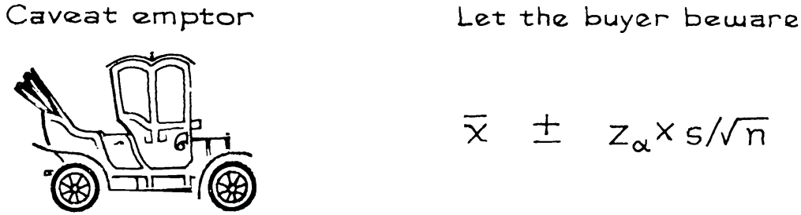

# Caveat Emptor

Các phương pháp của chương này được phát triển cho các `simple random sample`. Chúng có thể không áp dụng cho các loại mẫu khác. Nhiều tổ chức khảo sát sử dụng các phương pháp xác suất khá phức tạp để lấy mẫu ([Mục 19.4](../ch19/ch19-04.md)). Kết quả là họ phải sử dụng các phương pháp phức tạp hơn để ước tính `standard error` của mình. Một số tổ chức khảo sát không bận tâm đến việc sử dụng các phương pháp xác suất. Hãy coi chừng họ.

> Cảnh báo. Công thức cho `simple random sample` có thể không áp dụng được cho các loại mẫu khác.

Đây là lý do. Về mặt logic, các quy trình trong chương này đều bắt nguồn từ luật căn bậc hai ([Mục 17.2](../ch17/ch17-02.md)). Khi cỡ mẫu nhỏ so với cỡ của tổng thể, việc lấy `simple random sample` cũng gần giống như lấy mẫu ngẫu nhiên có thay thế từ một hộp - tình huống cơ bản mà luật căn bậc hai áp dụng. Cụm từ "ngẫu nhiên" ở đây được sử dụng theo nghĩa kỹ thuật: ở mỗi giai đoạn, mọi phiếu trong hộp phải có cơ hội được chọn như nhau. Nếu mẫu không được lấy ngẫu nhiên thì luật căn bậc hai không được áp dụng và có thể đưa ra những câu trả lời ngớ ngẩn.[^9]

Mọi người thường nghĩ rằng một công thức thống kê bằng cách nào đó sẽ tự kiểm tra khi nó được sử dụng để đảm bảo rằng nó được áp dụng. Không gì có thể hơn được sự thật. Trong thống kê, cũng như trong chủ nghĩa tư bản lỗi thời, trách nhiệm thuộc về người tiêu dùng.

---

[^9]: The standard errors applicable to simple random samples are often computed for samples of convenience. In some contexts, the results may be useful. For example, the objective may be to show that the sampling procedure at issue is quite different from simple random sampling (as in exercise 26 on [Mục 23.6](../ch23/ch23-06.md)).
