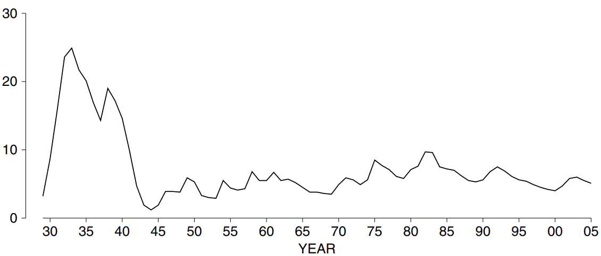

# Introduction

Tỷ lệ thất nghiệp là một trong những con số quan trọng nhất được chính phủ công bố. Tỷ lệ thất nghiệp chỉ ở mức 3% vào năm 1929, trước khi thị trường chứng khoán sụp đổ (Hình 1). Nó đạt tới 25% trong thời kỳ suy thoái và vẫn ở mức khá cao cho đến khi Mỹ bước vào Thế chiến II. Gần đây hơn, do các biện pháp chống lạm phát được Cục Dự trữ Liên bang áp dụng vào năm 1981, nền kinh tế đã rơi vào suy thoái sâu vào năm 1982-83 và tỷ lệ thất nghiệp gần như lên tới 10%. Đến cuối những năm 1980, tỷ lệ này đã giảm xuống dưới 6%; ở nhiều khu vực đô thị đang thiếu hụt công nhân lành nghề. Năm 2003, sau khi bong bóng Internet sụp đổ, tỷ lệ này quay trở lại mức 6%. Tỷ lệ thất nghiệp giảm từ đó đến cuối năm 2005.

**
Hình 1. Tỷ lệ thất nghiệp từ năm 1929 đến năm 2005.
**

Cơ quan chính phủ chịu trách nhiệm về số lượng việc làm là Cục Thống kê Lao động. Nhưng làm thế nào để họ biết ai đang có việc làm hay thất nghiệp? Số liệu thống kê việc làm được ước tính từ một cuộc khảo sát mẫu - Current Population Survey. Cuộc khảo sát mẫu quy mô lớn và được tổ chức đẹp mắt này được thực hiện hàng tháng cho Cục Thống kê Lao động của Cục Điều tra Dân số.[^1] Trong tuần có ngày 19 trong tháng, một vị trí hiện trường gồm 1.700 người phỏng vấn đã khảo sát một mẫu xác suất toàn quốc gồm khoảng 110.000 người. Quy mô của lực lượng lao động, tỷ lệ thất nghiệp và một loạt số liệu thống kê kinh tế và nhân khẩu học khác (như phân bổ thu nhập và trình độ học vấn) được ước tính từ kết quả khảo sát, với chi phí năm 2005 là khoảng 60 triệu đô la một năm. Kết quả được công bố tại:

- _Monthly Labor Review_,
- _Employment and Earnings_ (monthly),
- _The Employment Situation_ (monthly),
- _Current Population Reports_ (irregular),
- _Statistical Abstract of the United States_ (annual),
- _Economic Report of the President_ (annual).

Mục tiêu của chương này là trình bày chi tiết về Current Population Survey ngay từ đầu. Điều này sẽ minh họa và củng cố các ý tưởng được giới thiệu trong các chương trước. Nó cũng sẽ làm cho các cuộc khảo sát quy mô lớn khác trở nên dễ hiểu hơn. Các kết luận chính từ nghiên cứu điển hình này:

- Trong thực tế, phải sử dụng các phương pháp xác suất khá phức tạp để lấy mẫu. Lấy `simple random sample` chỉ là một phần cơ bản trong các thiết kế này.
- Công thức `standard error` cho các `simple random sample` không áp dụng cho những thiết kế phức tạp này và phải sử dụng các phương pháp khác để ước tính `standard error`.

[^1]: We are grateful to many people at Census Bureau for their help with previous editions, including Sherry Courtland, Charles Jones (deceased), Donna Kostanich, Marty Riche, and Jay Waite. For the 4th edition, we thank Louis Kincannon, Greg Weyland, and Cindy Taeuber.\
   The Bureau of the Census is responsible for the sample design, collection, and production of data, as well as calculation of the estimates and their standard errors. The Bureau of Labor Statistics does the seasonal adjustments, and is responsible for the publication and economic interpretation of the results. Some useful references on the Current Population Survey-\
   http://www.bls.gov/cps\
   http://www.census.gov/cps\
   Bureau of the Census, _The Current Population Survey: Design and Methodology_, Technical Paper No. 63rv (2002).\
   _Employment and Earnings_ vol. 52, no. 12 (December, 2005).\
   Technical Documentation, March 2005 Current Population Survey.\
   M. Thompson and G. Shapiro, "The Current Population Survey: An overview," _Annals of
   Economics and Social Measurement_ vol. 2 (1973).
