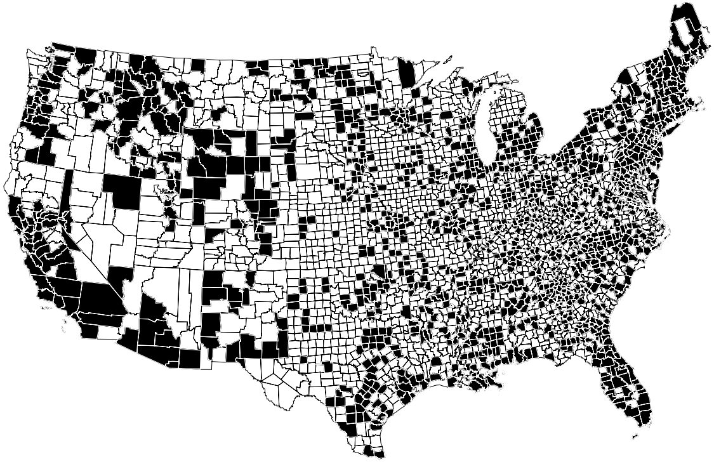

# The Design of the Current Population Survey

Current Population Survey được Cục Điều tra Dân số thiết kế lại định kỳ để tận dụng thông tin mới và hoàn thành các mục tiêu mới. Có một sự thiết kế lại lớn vào đầu những năm 2000, sử dụng dữ liệu từ cuộc điều tra dân số năm 2000.

Có 3.142 quận và thành phố độc lập ở Hoa Kỳ. Bước đầu tiên trong quá trình thiết kế lại, Cục đã tập hợp chúng lại thành các nhóm để tạo thành 2.025 Primary Sampling Unit(hay gọi tắt là PSU). Mỗi PSU bao gồm một thành phố, một quận hoặc một nhóm các quận liền kề.[^2] Các PSU này được sắp xếp thành 824 tầng, được chọn sao cho các PSU trong mỗi tầng sẽ giống nhau về các đặc điểm kinh tế và nhân khẩu học nhất định (như tỷ lệ thất nghiệp tại thời điểm phân tầng, số hộ đông người và số người làm nghề buôn bán lẻ). Các tầng không vượt quá ranh giới các bang. Nhiều PSU lớn hơn, như New York hay Los Angeles, đã được tự mình đưa vào phân tầng.
Mẫu được chọn theo hai giai đoạn. Để bắt đầu, một PSU được chọn từ mỗi tầng, sử dụng phương pháp xác suất đảm bảo rằng trong tầng đó, khả năng một PSU lọt vào mẫu tỷ lệ thuận với `population` của nó. Vì có 824 tầng nên giai đoạn đầu tiên tạo ra một mẫu gồm 824 PSU. Cho đến lần thiết kế lại tiếp theo (sau cuộc điều tra dân số năm 2010), tất cả các cuộc phỏng vấn cho Khảo sát đều diễn ra ở 824 PSU này và không có ở nơi nào khác. Các PSU cho thiết kế trước đó được hiển thị trong Hình 2.

**
Hình 2. Đơn vị lấy mẫu chính cho Current Population Survey: thiết kế mẫu năm 1995 với 792 PSU.
**

_Note: Alaska and Hawaii not shown.\
Source: Bureau of the Census, Statistical Methods Division._

Mỗi PSU được chia thành các Ultimate Sampling Unit(hoặc USU), mỗi đơn vị bao gồm khoảng 4 ngôi nhà. Ở giai đoạn thứ hai, một số USU được chọn ngẫu nhiên cho mẫu. Cuối cùng, mọi người từ 16 tuổi trở lên sống trong USU được chọn trong PSU được chọn sẽ tham gia Current Population Survey. Đối với toàn bộ nước Mỹ, tỷ lệ lấy mẫu là khoảng 1 trên 2.000. Nhưng tỷ lệ này thay đổi từ khoảng 1 trên 300 ở D.C. hoặc Wyoming đến 1 trên 3.000 ở các bang lớn như California, New York và Texas.[^3] Mục tiêu là ước tính tỷ lệ thất nghiệp ở mỗi bang trong số 50 tiểu bang và Quận Columbia với độ chính xác như nhau.[^4] Điều này có nghĩa là cân bằng, ít nhất là đại khái, kích thước tuyệt đối của 51 mẫu phụ ([Mục 20.4](../ch20/ch20-04.md)). Vì vậy, tỷ lệ giữa cỡ mẫu và cỡ tổng thể phải khác nhau giữa các tiểu bang.

Các lựa chọn của Cục cho mẫu được sử dụng từ năm 2005 đến năm 2015 đều được thực hiện tốt trước năm 2005. Thiết kế thậm chí còn cung cấp cho những người sẽ sống trong những ngôi nhà chưa được xây dựng. Và trên thực tế, Cục đã chọn không chỉ một mẫu mà là 16 mẫu khác nhau, nhằm luân chuyển một phần mẫu hàng tháng. Sau khi được đưa vào mẫu, một đơn vị nhà ở được giữ ở đó trong 4 tháng, bỏ đi trong 8 tháng và sau đó được đưa trở lại trong 4 tháng cuối cùng. Tại sao phải xoay mẫu? Vì một lý do, sau một thời gian, người phỏng vấn có thể mất đi sự chào đón. Mặt khác, câu trả lời của mọi người có thể thay đổi do được phỏng vấn, dần dần thiên vị mẫu (điều này được gọi là `panel bias`). Ví dụ, có một số bằng chứng cho thấy rằng mọi người có nhiều khả năng nói rằng họ đang tìm việc làm trong lần phỏng vấn đầu tiên hơn là lần thứ hai. Vậy thì tại sao không thay đổi mẫu hoàn toàn hàng tháng? Giữ nguyên một phần sẽ tiết kiệm được rất nhiều tiền. Ngoài ra, việc có một số điểm trùng lặp trong mẫu giúp dễ dàng ước tính những thay đổi hàng tháng về việc làm và thất nghiệp.

---

[^2]: There are a few exceptions in the Northeast; Hawaii is also exceptional.

[^3]: In November 2005, the sampling fraction was 1/2160 overall, 1/283 for Wyoming, 1/3286 for Texas. Rates will change over time, especially when the sample is redesigned after the 2010 Census. A number of interesting points are glossed over in the main text. (i) The discussion focused on the “unit frame,” for the household population. There is a separate frame for group quarters, and an “area frame” to sample geographical areas which are sparesly population, or where addresses are poorly defined. (ii) Some large USUs are treated differently. (iii) Within a PSU, the Bureau takes a random-start list sample. The list is organized to reduce variance. In effect, this stratifies the USUs. (iv) Fairly detailed information is collected on persons age 15, and on military personnel living off-post; some information is collected on persons age 14 and below. These data are not published.

[^4]: For the 1995 design, the precision of monthly estimates in the 11 largest states was equalized, as well as the precision of the annual averages in the remaining 40 states; the District of Columbia counts as a state, and “precision” means the coefficient of variation of the estimated number of unemployed persons. For 2005, there were separate controls on several large substate areas, including the county of Los Angeles and the Bronx.
