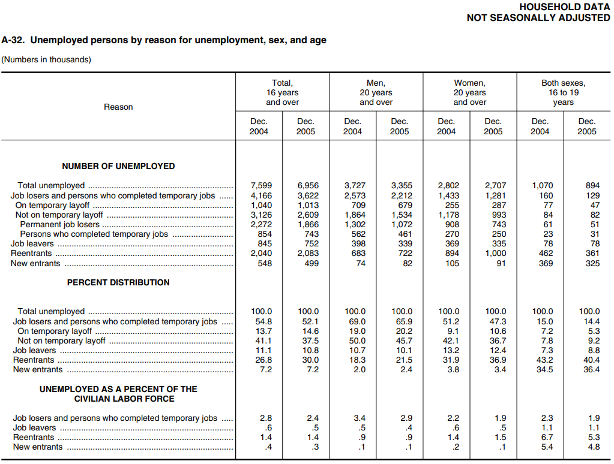

# Carrying Out the Survey

Thiết kế khảo sát năm 2005 đưa ra 72.000 đơn vị nhà ở được kiểm tra mỗi tháng. Trong đó, có khoảng 12.000 công trình không đủ điều kiện đưa vào mẫu (bị bỏ trống, thậm chí bị phá bỏ kể từ khi mẫu được thiết kế). Khoảng 4.500 cái khác không có sẵn vì không có ai ở nhà hoặc vì những người ở nhà không hợp tác. Điều đó để lại khoảng 55.500 đơn vị nhà ở trong Khảo sát. Tất cả những người từ 16 tuổi trở lên trong các đơn vị nhà ở này đều được hỏi về kinh nghiệm làm việc của họ trong tuần trước. Dựa trên câu trả lời của họ, họ được phân loại là:

- có việc làm (những người đã làm bất kỳ công việc được trả lương nào trong tuần trước hoặc tạm thời vắng mặt ở công việc thường lệ);
- hoặc thất nghiệp (những người không có việc làm trong tuần trước nhưng đã sẵn sàng làm việc và tìm việc trong bốn tuần qua);
- hoặc bên ngoài lực lượng lao động (bất chấp Aristotle, Cục định nghĩa đây là tình trạng không có việc làm cũng như không thất nghiệp).[^5]

Những người được tuyển dụng được hỏi về số giờ họ làm việc và loại công việc họ làm. Những người thất nghiệp được hỏi về công việc cuối cùng của họ, khi nào và tại sao họ rời bỏ công việc đó cũng như cách họ tìm việc làm. Những người ngoài lực lượng lao động được hỏi liệu họ đang ở nhà, đang đi học, không thể đi làm hoặc không làm việc vì lý do nào khác (trong trường hợp đó, họ được yêu cầu nêu rõ lý do). Kết quả tháng 11 năm 2005 được thể hiện trong Bảng 1.

**
Bảng 1. Dân số phi thể chế từ 16 tuổi trở lên.[^6] Cục Thống kê Lao động ước tính, tháng 11 năm 2005. Tính bằng triệu.
**

|                         |        |        |        |
| ----------------------- | ------ | ------ | ------ |
| Employed                | 142.97 |        |        |
| Unemployed              | 7.27   |        |        |
| Labor force             |        | 150.24 |        |
| Outside the labor force |        | 76.96  |        |
| Total                   |        |        | 227.20 |

_Source: Employment and Earnings, December 2005, table A-13._

Theo định nghĩa, _lực lượng lao động dân sự_ bao gồm những người dân thường đang có việc làm hoặc thất nghiệp. Vào tháng 11 năm 2005, con số đó lên tới \\(142.97 + 7.27 = 150.24\\) triệu người.[^7] Tỷ lệ thất nghiệp là tỷ lệ phần trăm lực lượng lao động dân sự bị thất nghiệp, và điều đó đã dẫn đến

\\[
\frac{7.27}{150.24} \times 100\\% \approx 4.8\\%
\\]

Tỉ lệ 4.8% này là tỷ lệ thất nghiệp trung bình của tất cả các phân nhóm dân số. Giống như nhiều mức trung bình, nó ẩn chứa một số khác biệt nổi bật. Những khác biệt này được đưa ra bằng quá trình lập bảng chéo. Thất nghiệp rơi nhiều hơn vào thanh thiếu niên và người da đen, như được trình bày trong Bảng 2.

**
Bảng 2. Tỷ lệ thất nghiệp theo chủng tộc, độ tuổi và giới tính. Ước tính của Cục Thống kê Lao động, tháng 11 năm 2005. Bằng phần trăm.
**

| Race  | Sex    | 16–19 | 20–64 | 65 and over |
| ----- | ------ | ----- | ----- | ----------- |
| White | Male   | 15.1  | 3.5   | 3.2         |
| White | Female | 12.4  | 3.7   | 2.4         |
| Black | Male   | 41.6  | 9.6   | 6.8         |
| Black | Female | 31.7  | 9.0   | 4.5         |

_Source: Employment and Earnings, December 2005, table A-13._

Tỷ lệ thất nghiệp tổng thể khá biến thiên, như thể hiện trong Hình 1 trên trang. 396. Nhưng mô hình tỷ lệ trong Bảng 2 khá ổn định ở một số khía cạnh. Ví dụ, tỷ lệ thất nghiệp của người da đen gần gấp đôi tỷ lệ thất nghiệp của người da trắng trong giai đoạn 1961-2005. Một sự phát triển đáng chú ý. Từ những năm 1990 trở đi, tỷ lệ thất nghiệp ở nam giới đã cao hơn ở nữ giới - một sự thay đổi so với quá khứ.

Số liệu thất nghiệp được công bố để phân loại tốt hơn nhiều so với số liệu trong Bảng 2, bao gồm tình trạng hôn nhân, chủng tộc, tuổi tác, giới tính, loại công việc gần đây nhất, lý do thất nghiệp (ví dụ: bị sa thải hoặc bỏ việc) và thời gian thất nghiệp. Cục bắt đầu với một mẫu lớn. Nhưng vào thời điểm những người đàn ông da trắng ở độ tuổi 35-44 bỏ công việc quản lý, đã thất nghiệp từ 5 đến 14 tuần và đang tìm việc bằng cách đọc báo, thì có thể không còn lại quá nhiều trường hợp. Hình 3 thể hiện ước tính theo lý do thất nghiệp, giới tính và độ tuổi. (Việc làm và Thu nhập đi vào chi tiết hơn nhiều.)

**
Hình 3. Bảng A-32, Việc làm và Thu nhập, tháng 12 năm 2005.
**

_NOTE: Beginning in January 2005, data reflect revised population controls used in the household survey._

Nói chung, tại thời điểm một mẫu lớn được lập bảng chéo, sẽ chỉ có các mẫu con rất nhỏ trong một số phân loại. Những suy luận về các nhóm quần thể tương ứng sẽ khá không chắc chắn. Bây giờ, giả sử rằng mỗi ước tính nằm trong khoảng 1% giá trị thực của nó với xác suất là 95%. Với hàng nghìn ước tính (tương đương với con số về Việc làm và Thu nhập), sẽ không có gì đáng ngạc nhiên nếu một vài trong số đó nhiều hơn 1% một chút. Cục lấy một mẫu lớn vì họ phải đưa ra nhiều ước tính về nhiều nhóm nhỏ và họ muốn có sự tự tin hợp lý rằng tất cả chúng đều khá chính xác. Trên thực tế, Cục sẽ không đưa ra ước tính khi mẫu phụ giảm xuống dưới kích thước ngưỡng khoảng 50 trường hợp.

_"The dip in sales seems to coincide with the decision to eliminate the sales staff."\
Drawing by Leo Cullum; ⃝c 2006 The New Yorker Magazine, Inc._

[^5]: Persons who worked in their own business or profession, or on their own farm, are counted as employed; so are persons who worked at least 15 hours (even without pay) in a family business. Persons on layoff, but expecting to be recalled, need not be looking for work in order to be counted as unemployed. There is another classification-"discouraged workers"-for persons who want a job, but are no longer actively looking for a job because they believe no jobs are available. The official definitions have remained essentially unchanged since the survey was first conducted in 1940. Some revisions were made in 1994, as part of the redesign of the survey; and the questionnaire changed appreciably. See note 13 below.

[^6]: Inmates of penal and mental institutions, and the military, are excluded from “the civilian noninstitutional population.” Data in tables 1–3 are not seasonally adjusted.

[^7]: The total labor force equals the civilian labor force plus the military.
