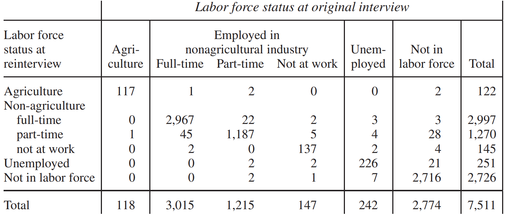

# Bias

`bias` còn nguy hiểm hơn `chance error`, đặc biệt nếu nó tác động ít nhiều đồng đều trên mẫu. `SE` được tính toán bằng phương pháp nửa mẫu - hoặc bất kỳ phương pháp nào khác - sẽ không thu được loại `bias` đó. Đo lường `bias`, thậm chí là đại khái, là một công việc khó khăn và liên quan đến việc vượt ra ngoài dữ liệu mẫu.

> Khi `bias` tác động ít nhiều đồng đều trên toàn bộ mẫu thì không thể phát hiện được nó chỉ bằng cách nhìn vào dữ liệu.

Cục đã thực hiện những nghiên cứu cẩn thận một cách bất thường về những thành kiến trong Current Population Survey. Nhìn chung, những điều này dường như không đáng kể, mặc dù kích thước chính xác của chúng vẫn chưa được biết. Để bắt đầu, thiết kế Survey dựa trên dữ liệu Census(Mục 2) và Census bỏ sót một tỷ lệ nhỏ dân số. Tỷ lệ phần trăm này không dễ để xác định. Ngay cả khi Cục biết điều đó, họ vẫn sẽ gặp khó khăn trong việc điều chỉnh số lượng người thất nghiệp ước tính (chẳng hạn) để bù đắp cho số lượng thiếu, bởi vì những người bị bỏ sót trong Census có thể khác với những người mà Census tìm thấy. Một khó khăn tương tự lại xuất hiện ở một nơi khác. Survey bỏ sót khoảng 10% số người được đếm ibởi Cesus. Ở một mức độ nào đó, trọng số đưa những người mất tích này trở lại ước tính. Nhưng `non-response bias` không dễ khắc phục như vậy. Những người mà Survey bỏ sót có lẽ khác với những người mà nó tìm thấy, trong khi trọng số giả vờ như họ giống nhau.[^12]

Tiếp theo, sự khác biệt giữa "có việc làm" và “thất nghiệp” hơi mờ nhạt. Ví dụ, những người có công việc bán thời gian nhưng muốn làm việc toàn thời gian được phân loại là có việc làm, nhưng họ thực sự là người thất nghiệp một phần. Hơn nữa, những người muốn làm việc nhưng đã từ bỏ việc tìm kiếm được phân loại là nằm ngoài lực lượng lao động, mặc dù có lẽ họ nên được phân loại là thất nghiệp. Tiêu chí của Cục về thất nghiệp, cụ thể là không có việc làm, sẵn sàng làm việc và đang tìm việc, nhất thiết phải mang tính chủ quan. Trong thực tế, nó hơi trơn. Kết quả từ chương trình tái phỏng vấn (Mục 6) cho thấy số người thất nghiệp cao hơn ước tính của Cục, khoảng vài trăm nghìn người. Trong trường hợp này, `bias` lớn hơn sai số lấy mẫu.[^13] Trong giai đoạn từ 1980 đến 2005, số người thất nghiệp dao động từ 5 đến 10 triệu. Nói một cách tương đối, cả lỗi lấy mẫu và lỗi không lấy mẫu đều nhỏ.

---

[^12]: Census undercount in 1980 is discussed in R. E. Fay, J. S. Passel, J. G. Robinson and C. D. Cowan, The Coverage of the Population in the 1980 Census, Bureau of the Census, 1988; also see Survey Methodology vol. 18, no. 1, June, 1992. For discussions of the undercount in 1990, and proposals for adjustment, see Jurimetrics vol. 34, no. 1 (fall 1993), Statistical Science (November 1994), and Evaluation Review (August 1996).\
    On proposed adjustments for Census 2000, see Society, vol. 39 no. 1 (November, 2001); D. A. Freedman and K. W. Wachter, “On the likelihood of improving the accuracy of the census through statistical adjustment,” in Science and Statistics: A Festscrift for Terry Speed, Institute of Mathematical Statistics Monograph 40 (2003).\
    On coverage differences between the Current Population Survey (CPS) and the Census, see pp. G5–6 in the technical documentation to the March 2005 CPS.

[^13]: The evidence suggests that the Bureau can find out reasonably well who has a full-time job, and who is outside the labor force. The problem is with a third group, the marginal workers who are classified either as part-time workers, or with a job but not at work, or unemployed. For example, results from the reinterview program for the last quarter of 1987 can be tabulated as shown below.\
    Thus, 7,511 people were reinterviewed; 3,015 were classified as working full time in nonagricultural industries at the original interview, but 2,997 were classified that way—presumably correctly—at reinterview. The decrease is 0.6 of 1%. On the other hand, the number of part-time workers went up by 4.5%, and the number of unemployed went up by 3.7%. The overall number of unemployed—based on the original interviews—was estimated as about 7,000,000. Since 3.7% of 7,000,000 = 250,000, the bias in the estimate amounts to several hundred thousand people. The number of unemployed persons in these data is small, so the calculation is only to illustrate the idea. Also see K. W. Clarkson and R. F. Meiners, “Institutional changes, reported unemployment, and induced institutional changes,” Supplement to Journal of Monetary Economics (1979).

    _Notes: After reconciliation, before weighting; 75% sample.\
    Source: Bureau of the Census, Statistical Methods Division_
    In 1994, there was a major revision to the CPS questionnaire; new “probe” questions were added on hours of work and duration of unemployment; the definitions of “discouraged workers” and involuntary part-time workers were changed. See the Monthly Labor Review for September 1993, and Employment and Earnings for February 1994. Changing the questions made a noticeable impact on the numbers, confirming that biases in the data (although small) are probably larger than sampling error. Also see T. J. Plewes, “Federal agencies introduce redesigned Current Population Survey,” Chance vol. 7, no. 1 (1994) pp. 35–41.\
    In theory, ratio estimates can create small biases. In practice, however, with reasonably large samples the bias from this source is negligible. There is one problem the Bureau does not have: household bias (note 15 to chapter 19). The reason is that the sample includes all persons age 16 and over in the selected households, not just one person that the interviewer finds at home.
