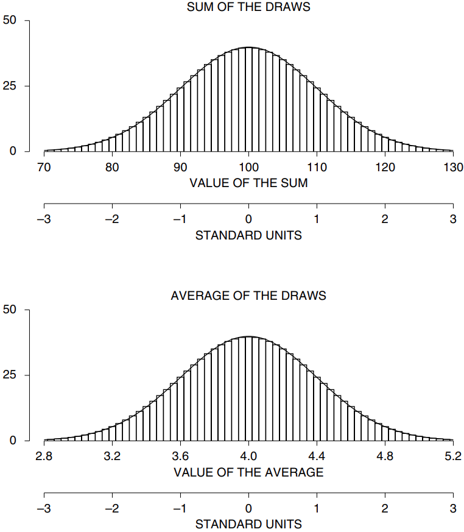
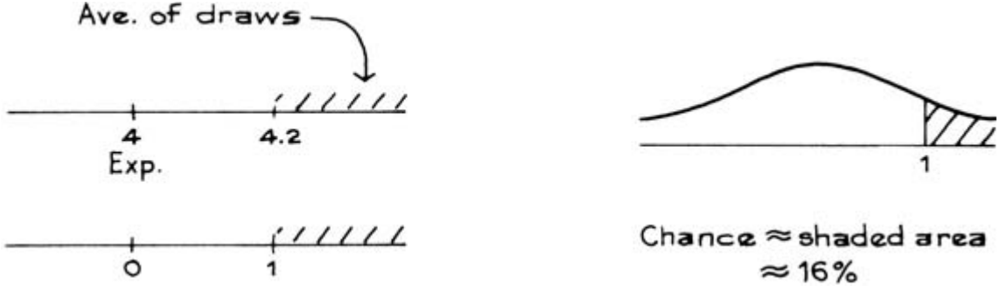

# Introduction

Mục tiêu của chương này là ước tính độ chính xác của giá trị trung bình được tính từ một `simple random sample`. Phần này giải quyết một câu hỏi sơ bộ: Có bao nhiêu biến thiên cơ hội trong trung bình của các số được rút ra từ một hộp? Ví dụ, lấy hộp

Máy tính được lập trình để thực hiện 25 lần rút ngẫu nhiên có thay thế từ hộp này:

\\[
2,4,3,2,5 \quad 7,5,6,4,5 \quad 4,4,1,2,4 \quad 4,6,4,7,2 \quad 7,2,5,7,3
\\]

Tổng của các số này là 105 nên trung bình của chúng là \\(105/25 = 4.2\\). Máy tính thực hiện lại thí nghiệm và kết quả cho ra khác hẳn:

\\[
5,1,4,3,4 \quad 5,2,1,7,7 \quad 1,2,3,2,4 \quad 7,1,6,5,3 \quad 6,6,3,3,4
\\]

Bây giờ tổng là 95, vậy trung bình là \\(95/25 = 3.8\\). Tổng số lần rút có thể biến thiên cơ hội, do đó trung bình cũng vậy. Vấn đề mới là tính `expected value` và `standard error` cho điểm trung bình của các lần rút thăm. Phương pháp này sẽ được chỉ ra bằng ví dụ.

_Ví dụ 1._ 25 lần rút sẽ được thực hiện ngẫu nhiên có thay thế từ hộp

Trung bình của các lần rút sẽ vào khoảng ......, thêm hoặc bớt ...... hoặc hơn.

_Giải pháp._ Trung bình của hộp là 4 nên trung bình của các lần rút sẽ vào khoảng 4. Số thêm hoặc bớt là `SE`. Để có được `SE` cho trung bình, chúng ta quay lại phép tính tổng. `expected value` của tổng là

\\[
\text{number of draws} \times \text{average of box} = 25 \times 4 = 100
\\]

`SD` của hộp là 2 và `SE` của tổng là

\\[
\sqrt{\text{number of draws}} \times \text{SD of box} = \sqrt{25} \times 2 = 10
\\]

Tổng sẽ vào khoảng 100, thêm hoặc bớt 10 hoặc hơn.

Điều này nói gì về trung bình của các lần rút? Nếu tổng là một `SE` trên `expected value` hay 100 + 10 thì trung bình của 25 lần rút là

\\[
\frac{100 + 10}{25} = \frac{100}{25} + \frac{10}{25} = 4 + 0.4
\\]

Mặt khác, nếu tổng này thấp hơn `expected value` một `SE` hay 100 − 10 thì giá trị trung bình là

\\[
\frac{100 - 10}{25} = \frac{100}{25} - \frac{10}{25} = 4 - 0.4
\\]

Trung bình của các lần rút sẽ vào khoảng 4, thêm hoặc bớt 0.4 hoặc hơn. Số 4 là `expected value` cho trung bình của các lần rút. 0.4 là lỗi `standard error`, hoàn thành giải pháp.
Tóm tắt ý tưởng:

\\[
\begin{align*}
\text{sum of 25 draws} &= 100 \pm 10 \text{ or so} \\\\
\text{average of 25 draws} &= \frac{100}{25} \pm \frac{10}{25} \text{ or so}
\end{align*}
\\]

Nói cách khác, để tìm `SE` cho trung bình của các lần rút, chỉ cần quay lại và lấy `SE` cho tổng; sau đó chia cho số lần rút.

Khi rút ngẫu nhiên từ một hộp:
\\[
\begin{align*}
\text{EV for average of draws} &= \text{average of box} \\\\
\text{SE for average of draws} &= \frac{\text{SE for sum}}{\text{number of draws}}
\end{align*}
\\]

`SE` cho mức trung bình cho biết trung bình của các lần rút có thể cách mức trung bình của hộp bao xa.

**
Hình 1. Phần trên hiển thị `probability histogram` cho tổng 25 lần rút thăm từ hộp [1 2 3 4 5 6 7] .Phần dưới hiển thị `probability histogram` cho trung bình của các lần rút. Trong các `standard unit`, hai biểu đồ hoàn toàn giống nhau.
**

Nếu số lần rút đủ lớn, `normal curve` có thể được sử dụng để tính cơ hội cho mức trung bình. Hình 1 (phần dưới) cho thấy `probability histogram` cho mức trung bình của 25 lần rút thăm từ hộp

Biểu đồ tuân theo đường cong, do đó diện tích dưới biểu đồ có thể được xấp xỉ bằng diện tích dưới đường cong.

Tại sao `probability histogram` của giá trị trung bình trông giống `normal curve`? Đây là một hệ quả tất yếu của toán học ở Chương 18. `probability histogram` cho tổng của 25 lần rút gần với `normal curve`(phần trên của Hình 1). Trung bình của các lần rút bằng tổng của chúng chia cho 25. Cách chia này chỉ là một sự thay đổi về tỷ lệ và được tính theo `standard unit`. Hai biểu đồ trong Hình 1 có hình dạng giống hệt nhau và cả hai đều theo đường cong.

Khi rút ngẫu nhiên từ một hộp, `probability histogram` của mức trung bình của các lần rút sẽ tuân theo `normal curve`, ngay cả khi nội dung của hộp không như vậy. Biểu đồ phải được chuyển thành `standard unit` và số lần rút phải lớn một cách hợp lý.[^1]

_Ví dụ 2._ Một trăm lần rút thăm sẽ được thực hiện ngẫu nhiên có thay thế hộp ở Ví dụ 1.

(a) Trung bình của các lần rút sẽ vào khoảng ......, thêm hoặc bớt ...... hoặc hơn.

(b) Ước tính khả năng mà trung bình của các lần rút lớn hơn 4.2.

_Giải pháp._ Như trong Ví dụ 1, tổng các lần rút sẽ vào khoảng \\(100 \times 4 = 400\\). Thêm hoặc bớt \\(\sqrt{100} \times 2 = 20\\). Tổng số lần rút sẽ vào khoảng 400, thêm hoặc bớt 20 hoặc hơn . Trung bình của các lần rút sẽ vào khoảng \\(400/100 = 4\\), thêm hoặc bớt \\(20/100 = 0.2\\) hoặc hơn. `SE` cho trung bình 100 lần rút là 0.2.

Phần (b) được xử lý bằng phép `normal approximation`.

Cơ hội là khoảng 16%. Điều này hoàn thành giải pháp.

Trong Ví dụ 1 và 2, khi số lần rút tăng lên theo hệ số 4, từ 25 lên 100, `SE` của mức trung bình của các lần rút giảm xuống theo hệ số \\(\sqrt{4} = 2\\), từ 0.4 xuống 0,2. Điều này nói chung là như vậy.

> Khi rút ngẫu nhiên có thay thế từ hộp, nhân số lần rút với một hệ số (như 4) chia `SE` cho trung bình của các lần rút cho căn bậc hai của hệ số đó (\\(\sqrt{4} = 2\\)).

Khi số lần rút tăng lên, `SE` cho tổng sẽ lớn hơn và `SE` cho trung bình sẽ nhỏ hơn. Đây là lý do. `SE` của tổng tăng lên, nhưng chỉ bằng căn bậc hai của số lần rút. Kết quả là, mặc dù `SE` cho tổng lớn hơn về mặt tuyệt đối, nhưng so với số lần rút thì nó lại nhỏ hơn. Việc chia cho số lần rút khiến `SE` cho trung bình đi xuống. Hãy ghi nhớ sự khác biệt này giữa hai `SE`.

Khi rút không thay thế, có thể tìm thấy `SE` chính xác cho trung bình của các lần rút bằng cách sử dụng hệ số hiệu chỉnh ([Mục 20.4](../ch20/ch20-04.md))

\\[
\text{SE without} = \text{(correction factor)} \times \text{(SE with)}
\\]

Thông thường, số lần rút sẽ nhỏ so với số phiếu trong hộp, hệ số hiệu chỉnh sẽ gần bằng 1 nên có thể bỏ qua.

[^1]: The draws can be made with replacement, or without. In the second case, the number of draws and the number of tickets left in the box—both have to be large; the correction factor may be needed for computing the `SE` ([Mục 20.3](../ch20/ch20-03.md)). See T. Hoglund, "Sampling from a finite population: a remainder term estimate," Scandinavian Journal of Statistics vol. 5 (1978) pp. 69–71. If the number of draws is small, the distribution of the sum depends strongly on the contents of the box, and may be quite far from normal: see chapter 18, or [Mục 26.6](../ch26/ch26-06.md) on the t-test.
