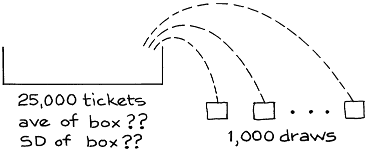
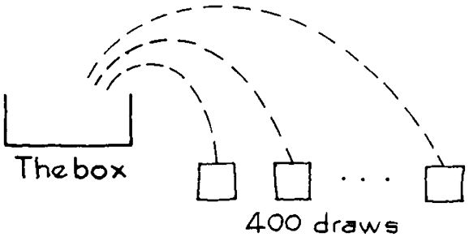
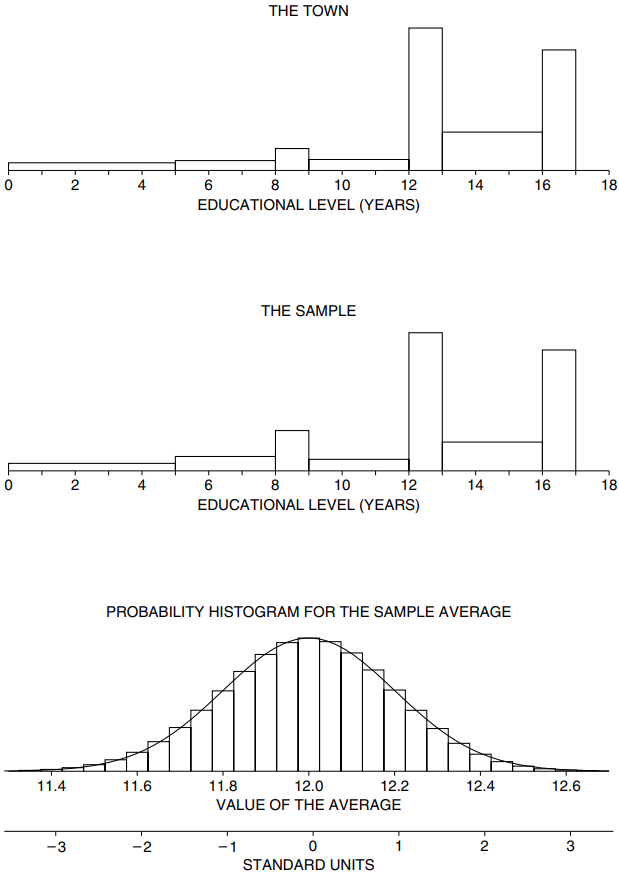

# The Sample Average

Ở Mục 1, các số trong hộp đã biết trước, và vấn đề là nói điều gì đó về trung bình của các lần rút thăm. Phần này đưa ra lý do theo hướng ngược lại và thực tế hơn. Một mẫu ngẫu nhiên được lấy từ một hộp có thành phần chưa biết và vấn đề là ước tính giá trị trung bình của hộp. Đương nhiên, mức trung bình của các lần rút được sử dụng làm ước tính. Và `SE` cho giá trị trung bình của mẫu có thể được sử dụng với `normal curve` để đánh giá độ chính xác của ước tính. (Chương 21 sử dụng kỹ thuật tương tự cho tỷ lệ phần trăm.)

Phương pháp sẽ được trình bày bằng ví dụ. Trên hành trình này, sẽ có hai câu hỏi cần trả lời:

-Sự khác biệt giữa `SD` của mẫu và `SE` của mức trung bình mẫu là gì?
-Tại sao có thể sử dụng `normal curve` để tính `confidence level`?
Bây giờ, ví dụ. Giả sử một người quản lý thành phố muốn biết thu nhập trung bình theo độ tuổi của 25.000 gia đình sống trong thị trấn của mình. Anh ta thuê một tổ chức khảo sát để lấy một `simple random sample` gồm 1.000 gia đình. Tổng thu nhập của mẫu 1.000 gia đình là $62.396.714 . Thu nhập trung bình của họ là \\(\\$62.396.714/1.000 \approx \\$62.400\\). Thu nhập trung bình của tất cả 25.000 gia đình được ước tính là $62.400. Tất nhiên, ước tính này bị sai lệch do `chance error`. Vấn đề là đặt một con số thêm hoặc bớt vào ước tính:

\\[
\\$62.400 \pm \\$\...?
\\]

Cần có `SE` và để làm được điều đó, cần có một mẫu hộp. Trong hộp phải có một tấm vé cho mỗi gia đình trong thị trấn, thể hiện thu nhập của gia đình đó. Dữ liệu tương tự 1.000 lần rút ra từ hộp.

Thu nhập trung bình của các gia đình mẫu cũng giống như mức trung bình của các lần rút thăm. Hiện tại, `SE` cho điểm trung bình của các lần rút có thể được tìm thấy bằng phương pháp ở Mục 1. Bước đầu tiên là tìm `SE` cho tổng các lần rút. Vì 1.000 là một phần nhỏ của 25.000 nên không có sự khác biệt thực sự giữa việc rút có và không thay thế. `SE` cho tổng là

\\[
\sqrt{1.000} \times \text{SD of box}
\\]

Tất nhiên, tổ chức khảo sát không biết `SD` của hộp nhưng họ có thể ước tính nó bằng `SD` của mẫu. (Đây là một ví dụ khác về phương pháp `bootstrap` được thảo luận ở [Mục 21.1](../ch21/ch21-01.md)).

> Với `simple random sample`, `SD` của mẫu có thể được sử dụng để ước tính `SD` của hộp. Ước lượng là tốt khi mẫu lớn.

Có 1.000 gia đình trong mẫu và `SD` thu nhập của họ là $53.000. `SD` của hộp được ước tính khoảng $53.000. `SE` cho tổng được ước tính là

\\[
\sqrt{1.000} \times \\$53.000 \approx \\$1.700.000
\\]

Để có được `SE` cho trung bình, ta chia cho số gia đình trong mẫu: \\(\\$1.700.000/1.000 = \\$1.700\\). Đó là câu trả lời. Trung bình của các lần rút là khoảng $1.700 so với trung bình của hộp. Vì vậy, thu nhập trung bình của tất cả 25.000 gia đình trong thị trấn có thể được ước tính là

\\[
\\$62.400 \pm \\$1.700
\\]

Hãy ghi nhớ cách giải thích về con số $1.700: đó là `margin of error` trong ước tính. Điều này hoàn thành ví dụ.

Một điểm đáng được thảo luận nhiều hơn. `expected value` của tổng các lần rút thăm - tổng thu nhập của các gia đình mẫu - là

\\[
1.000 \times \text{average of the box}
\\]

Điều này chưa được biết vì giá trị trung bình của hộp chưa được biết. Tổng thu nhập của 1.000 gia đình mẫu là $62.396.714. Đây là giá trị quan sát được cho tổng các lần rút. `SE` của tổng số tiền - $1.700.000 - đo lường mức độ chênh lệch có thể xảy ra giữa $62.396.714 và `expected value`. Nói chung,

\\[
\text{observed value = expected value + chance error}
\\]

`SE` đo lường kích thước có thể xảy ra của `chance error`.

`confidence interval` cho tỷ lệ phần trăm (dữ liệu định tính) đã được thảo luận trong [Mục 21.2](../ch21/ch21-02.md). Ý tưởng tương tự có thể được sử dụng để có được `confidence interval` cho giá trị trung bình của hộp (dữ liệu định lượng). Ví dụ: `confidence interval` 95% cho thu nhập trung bình của tất cả 25.000 gia đình trong thị trấn có được bằng cách dịch 2 `SE` tính từ trung bình mẫu:

\\[
\\$62.400 \pm 2 \times \\$1.700 = \\$59.000 \text{ to } \\$65.800
\\]

("Trung bình mẫu" là cách viết tắt thống kê cho trung bình của các số trong mẫu).

Hai con số khác nhau được đưa ra trong các phép tính: `SD` của mẫu là $53.000 và `SE` cho trung bình của mẫu là $1.700. Hai con số này làm những việc khác nhau.

- `SD` cho biết thu nhập của các gia đình cách trung bình bao xa - đối với các gia đình điển hình.
- `SE` cho biết trung bình của các mẫu cách mức trung bình của `population` bao xa - đối với các mẫu điển hình.

Những người nhầm lẫn `SD` với `SE` có thể nghĩ rằng bằng cách nào đó, 95% gia đình trong thị trấn có thu nhập trong khoảng \\(\\$62.400 \pm \\$3.400\\). Điều đó thật nực cười. Phạm vi \\\(\\$62.400 \\pm \\$3.400\\) chỉ bao gồm một phần rất nhỏ trong phân phối thu nhập: `SD` là khoảng $53.000. `confidence interval` là dành cho cái gì đó khác. Trong khoảng 95% tổng số mẫu, nếu bạn dịch 2 `SE` tính từ mức trung bình của mẫu, thì `confidence interval` của bạn sẽ bao gồm mức trung bình của toàn thị trấn; trong 5% còn lại, khoảng của bạn sẽ bị bỏ lỡ. Từ "confidence" nhằm nhắc nhở bạn rằng cơ hội nằm ở quy trình lấy mẫu; mức trung bình của hộp không chạy lung tung. (Những vấn đề này đã được thảo luận trước đó, ở [Mục 21.3](../ch21/ch21-03.md)).

_Ví dụ 3._ Là một phần của cuộc khảo sát ý kiến, một `simple random sample` gồm 400 người từ 25 tuổi trở lên được lấy tại một thị trấn nhất định ở Appalachia. Tổng số năm đi học của những người trong mẫu là 4.635. Vậy trình độ học vấn trung bình của họ là \\(4.635/400 \approx 11.6\\) năm. `SD` của mẫu là 4.1 năm. Tìm `confidence interval` 95% cho trình độ học vấn trung bình của tất cả những người từ 25 tuổi trở lên ở thị trấn này.

_Giải pháp._ Đầu tiên, một mô hình hộp. Trong hộp phải có một phiếu cho mỗi người từ 25 tuổi trở lên ở thị trấn, ghi số năm học của người đó đã hoàn thành; 400 lần rút thăm được thực hiện ngẫu nhiên từ hộp. Dữ liệu tương tự các lần rút thăm và trung bình mẫu giống như trung bình của các lần rút thăm. Thế là hoàn thành mô hình.

Chúng ta cần tính `SE` cho trung bình của các lần rút. `SE` có tổng là \\(\sqrt{400} \times SD\\) của hộp. `SD` của hộp chưa được biết nhưng có thể ước tính bằng

`SD` của mẫu là 4.1 năm. Vì vậy `SE` cho tổng các lần rút thăm được ước tính là \\(\sqrt{400} \times 4.1 = 82\\) năm. (82 đo lường độ lớn của `chance error`trong tổng, là 4.635.) `SE` cho trung bình là \\(82/400 \approx 0.2\\) năm. Trình độ học vấn trung bình của những người trong mẫu sẽ thấp hơn mức trung bình của thị trấn khoảng 0.2 năm. `confidence interval` xấp xỉ 95% cho trình độ học vấn trung bình của tất cả những người từ 25 tuổi trở lên trong thị trấn là

\\[
11.6 \pm 0.4 \text{ years}
\\]

Đó là câu trả lời.

`confidence interval` 95% là diện tích dưới `normal curve` nằm giữa −2 và 2. Tại sao đường cong này lại liên quan? Xét cho cùng, biểu đồ cho các cấp học ([Mục 3.3](../ch03/ch03-03.md)) trông không giống đường cong chút nào. Tuy nhiên, đường cong không được sử dụng để tính gần đúng biểu đồ của dữ liệu; nó được sử dụng để ước tính `probability histogram` cho trung bình của mẫu.
Một mô phỏng máy tính sẽ giúp ích. Trong máy tính có một phiếu trong hộp dành cho mỗi người từ 25 tuổi trở lên ở thị trấn, thể hiện trình độ học vấn của người đó. Biểu đồ về nội dung trong hộp được hiển thị ở đầu Hình 2. Biểu đồ này thể hiện trình độ học vấn của tất cả những người từ 25 tuổi trở lên trong thị trấn. Hình dạng của nó không giống như `normal curve`. (Hãy nhớ rằng đây chỉ là mô phỏng; trên thực tế, bạn sẽ không biết nội dung của chiếc hộp - nhưng lý thuyết toán học vẫn có thể được sử dụng).

Bây giờ, 400 lần rút phải được thực hiện ngẫu nhiên không thay thế từ hộp để lấy mẫu. Máy tính đã được lập trình để làm việc này. Biểu đồ cho 400 lần rút thăm được hiển thị trong phần thứ hai. Điều này thể hiện sự phân bố trình độ học vấn của 400 người trong mẫu. Nó rất giống với biểu đồ đầu tiên, mặc dù có quá nhiều người có trình độ học vấn từ 8-9 năm. Đó là một `chance variation`. Hình 2 cho biết tại sao `SD` của mẫu là ước tính tốt cho `SD` của hộp. Hai biểu đồ cho thấy mức độ lan truyền gần như nhau.

Cho đến nay, chúng ta đã thấy hai biểu đồ, cả hai đều dành cho dữ liệu. Bây giờ `probability histogram` sẽ xuất hiện, tính theo mức trung bình của các lần rút thăm. Biểu đồ này được hiển thị trong phần dưới cùng. Biểu đồ thứ ba này không đại diện cho dữ liệu. Thay vào đó, nó thể hiện cơ hội cho mức trung bình của mẫu. Ví dụ, lấy diện tích dưới `probability histogram` trong khoảng từ 11.6 đến 12.4 năm. Khu vực này thể hiện khả năng trung bình 400 lần rút ra từ hộp sẽ nằm trong khoảng từ 11.6 đến 12.4 năm. Diện tích hiện hữu đạt khoảng 95%. Đối với 95% mẫu, trình độ học vấn trung bình của các gia đình mẫu sẽ nằm trong khoảng từ 11.6 đến 12.4 năm. Đối với 5% còn lại, giá trị trung bình mẫu sẽ nằm ngoài phạm vi này. Bất kỳ diện tích nào bên dưới `probabiltiy histogram` đều có thể được giải thích theo cách tương tự.

Bây giờ bạn có thể thấy tại sao `normal approximation` lại hợp lý. Như hình minh họa cho thấy, `normal curve` là một sự xấp xỉ tốt với `probability histogram` cho trung bình của các lần rút thăm - mặc dù dữ liệu không tuân theo đường cong. Đó là lý do tại sao đường cong có thể được sử dụng để tính `confidence level`. Ngay cả với các mẫu lớn, `confidence level` đọc được từ `normal curve` chỉ mang tính xấp xỉ, vì chúng phụ thuộc vào `normal approximation`; với mẫu nhỏ thì không nên sử dụng `normal curve`([Mục 26.6](../ch26/ch26-06.md)).

**
Hình 2. Mô phỏng máy tính. Hình trên cùng thể hiện sự phân bố về trình độ học vấn của những người từ 25 tuổi trở lên trên toàn thị trấn. Phần giữa thể hiện sự phân bổ trình độ học vấn trong mẫu. Đây là những biểu đồ cho dữ liệu. Bảng dưới cùng hiển thị `probability histogram` cho trung bình 400 lần rút thăm từ hộp; nó gần với `normal curve`. Trình độ học vấn trung bình của thị trấn là 12.0 năm, `SD` là 4.0 năm; trong mẫu, các số tương ứng là 11.6 và 4.1. (Quy ước điểm cuối cho biểu đồ dữ liệu: ví dụ: khoảng lớp 12-13, bao gồm tất cả những người đã hoàn thành 12 năm học chứ không phải 13 - những người tốt nghiệp trung học chưa học xong một năm đại học.)
**

