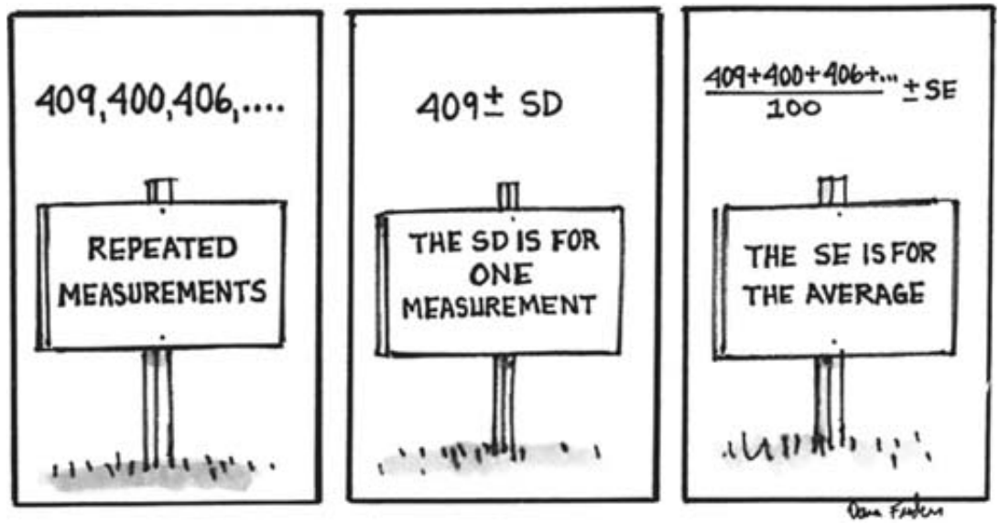

# Estimating the Accuracy of an Average

Trong phần này của cuốn sách, frequency theory cho chance sẽ được sử dụng để nghiên cứu sai số đo lường và di truyền học. Về mặt lịch sử, frequency theory được phát triển để giải quyết các vấn đề thuộc loại rất đặc biệt - tính toán tỷ lệ trong các trò chơi may rủi. Cần phải có một số nỗ lực để áp dụng lý thuyết này vào các tình huống bên ngoài bối cảnh cờ bạc. Trong mỗi trường hợp, cần phải chỉ ra rằng tình huống đang được nghiên cứu giống như một quá trình - giống như việc rút ngẫu nhiên từ một chiếc hộp - mà lý thuyết sẽ áp dụng vào đó. Những mô hình hộp này đôi khi được gọi là _chance model_ hoặc _stochastic model_. Ví dụ đầu tiên sẽ là _chance model_ cho sai số đo lường.

Để ôn lại nhanh(chương 6), bất kỳ phép đo nào cũng có thể có `chance error` và nếu lặp lại sẽ cho kết quả hơi khác một chút. Để xác định được mức độ của `chance error`, điều tốt nhất cần làm là lặp lại phép đo nhiều lần. Sự lây lan trong các phép đo, như được cho thấy bởi `SD`, ước tính kích thước có thể xảy ra của `chance error` trong một phép đo. Chương 6 dừng lại ở đó. Chương này tiếp tục thảo luận: trọng tâm là giá trị trung bình của các phép đo trong chuỗi chứ không phải một phép đo đơn lẻ. Vấn đề là ước tính mức độ của `chance error` cho trung bình. Nếu phép đo giống như rút ra từ một chiếc hộp thì có thể sử dụng phương pháp của Chương V và VI.

[Bảng 1 Mục 6.2](../ch06/ch06-02.md) hiển thị 100 phép đo trên NB 10. Tất cả những phép đo này đều tụt từ 10 gram, với các lượng khác nhau. Bảng này cung cấp các lượng, tính bằng microgam. (Một microgam bằng một phần triệu gram, gần bằng trọng lượng của một hạt bụi). `SD` của 100 con số trong bảng là khoảng 6 microgam: một phép đo duy nhất chỉ có độ chính xác tối đa 6 microgam hoặc hơn. Dự đoán tốt nhất về trọng lượng của NB 10 là giá trị trung bình của tất cả 100 phép đo, tức là thiếu 404.6 microgam so với 10 gram. Vì mỗi phép đo đều có sai số nên giá trị trung bình cũng không thể chính xác. Nhưng giá trị trung bình sẽ chính xác hơn bất kỳ phép đo đơn lẻ nào, do đó, nó sẽ sai lệch ít hơn 6 microgam.

Con số thêm hoặc bớt phù hợp để đặt ở mức trung bình là gì?

\\[
average \pm ......
\\]

Câu trả lời được đưa ra là `SE` cho giá trị trung bình, có thể được tính giống như trong Chương 23. (Việc tính toán dựa trên mô hình hộp, sẽ được thảo luận trong Mục 2 và 3 bên dưới). `SE` cho tổng của 100 phép đo có thể được ước tính như

\\[
\sqrt{100} \times \text{ micrograms} = 60 \text{ micrograms}
\\]

Khi đó `SE` cho giá trị trung bình của 100 lần đo là

\\[
\frac{\text{60 micrograms}}{100} = \text{0.6 micrograms}
\\]

Điều này hoàn thành việc tính toán. Trung bình của tất cả các số trong bảng là 404.6 microgam. Kích thước có thể xảy ra của `chance error` trung bình được ước tính là 0.6 microgam. Vì vậy, NB 10 thực sự nặng khoảng 404.6 microgam dưới 10 gam, cộng hoặc trừ 0.6 microgam hoặc hơn.

Hai con số xuất hiện trong phép tính: 6 microgam và 0.6 microgam. Đầu tiên là `SD` của 100 phép đo, thứ hai là `SE` cho mức trung bình. Sự khác biệt giữa chúng là gì?

- `SD` cho biết một phép đo đơn lẻ có độ chính xác lên tới 6 microgam hoặc hơn.
- `SE` cho biết trung bình của tất cả 100 phép đo có độ chính xác lên tới 0.6 microgam hoặc hơn.

_Ví dụ 1._ 100 phép đo được thực hiện trên một trọng lượng nhất định. Trung bình của các phép đo này là 715 microgam trên một kg và `SD` là 80 microgam.
(a) Liệu một phép đo đơn lẻ có thể chênh lệch trọng lượng chính xác khoảng 8 microgam hay 80 microgam không?

(b) Giá trị trung bình của tất cả 100 phép đo có thể chênh lệch trọng lượng chính xác khoảng 8 microgam hay 80 microgam không?

_Giải pháp._ Một phép đo duy nhất bị sai lệch do `chance error` có kích thước tương tự như `SD` của phép đo. Là 80 microgam. Câu trả lời cho (a) là 80 microgam. Đối với (b), `SE` cho tổng số đo được ước tính là \\(\sqrt{100} \times 80 = 800\\) microgam. Vì vậy, `SE` trung bình là \\(800/100 = 8\\) micro gram. Đó là câu trả lời cho (b).
Trong ví dụ 1, con số cho hoặc nhận cho giá trị trung bình của các phép đo là 8 microgam. Để làm cho điều này chính xác hơn, các nhà thống kê sử dụng `confidence interval`, giống như trong lấy mẫu. `confidence interval` 95% cho trọng lượng chính xác có thể đạt được bằng cách dịch 2 `SE` theo một trong hai hướng so với mức trung bình. Trung bình là 715 microgam trên một kg và 2 `SE` là \\(2 \times 8 = 16\\) microgam. Vì vậy, trọng lượng thực tế nằm trong khoảng từ 699 đến 731 microgam trên một kg, với độ tin cậy 95%. Phép tính:

\\[
715 - 16 = 699, 715 + 16 = 731
\\]

Một lần nữa, từ "confidence" xuất hiện như một lời nhắc nhở rằng cơ hội nằm ở quá trình đo lường chứ không phải ở vật được đo: trọng lượng chính xác không phụ thuộc vào _chance variability_. (Để thảo luận tương tự trong bối cảnh lấy mẫu, hãy xem [Mục 21.3](../ch21/ch21-03.md)).

> _chance_ nằm ở quy trình đo lường chứ không phải ở vật được đo lường.

`normal curve` chỉ nên được sử dụng để có được `confidence interval` khi có số lượng phép đo khá lớn. Với ít hơn 25 phép đo, hầu hết các nhà thống kê sẽ sử dụng một quy trình hơi khác một chút, dựa trên cái được gọi là `t-distribution` ([Mục 26.6](../ch26/ch26-06.md)).

_Historical note_. Có mối liên hệ giữa lý thuyết sai số đo lường và các dấu hiệu neon. Vào năm 1890, người ta tin rằng bầu khí quyển bao gồm nitrogen (khoảng 80%), oxygen (dưới 20%), carbon dioxide, hơi nước và không có gì khác. Các nhà hóa học đã có thể loại bỏ oxy, carbon dioxide và hơi nước. Khí dư phải là nitơ nguyên chất.

Lord Rayleigh đã tiến hành so sánh trọng lượng của khí dư với trọng lượng của một thể tích nitrogen tinh khiết về mặt hóa học. Một phép đo về trọng lượng của khí dư cho kết quả 2.31001 gam. Và một phép đo nitrogen nguyên chất cho kết quả ít hơn một chút, 2.29849 gram. Tuy nhiên, sự khác biệt 0.01152 gram là khá nhỏ và trên thực tế có thể so sánh với `chance error` do quy trình cân gây ra.

Có thể sự khác biệt là do `chance error`? Nếu không, khí dư phải chứa thứ gì đó nặng hơn nitrogen. Những gì Rayleigh đã làm là lặp lại thí nghiệm đó cho đến khi ông có đủ số đo để chứng minh rằng khí cặn từ khí quyển nặng hơn nitrogen nguyên chất.

Ông tiếp tục cô lập loại khí hiếm gọi là _argon_, loại khí này nặng hơn nitrogen nguyên chất và hiện diện trong khí quyển với số lượng nhỏ. Các nhà nghiên cứu khác sau đó đã phát hiện ra các loại khí tương tự như neon, krypton và xenon, tất cả đều xuất hiện tự nhiên (với một lượng nhỏ) trong khí quyển. Những loại khí này là nguyên nhân làm cho bảng hiệu "neon" phát sáng với nhiều màu sắc khác nhau.[^1]

---

[^1]: W. J. Youden, Experimentation and Measurement (National Science Teachers Association, Washington, D.C., 1962)
