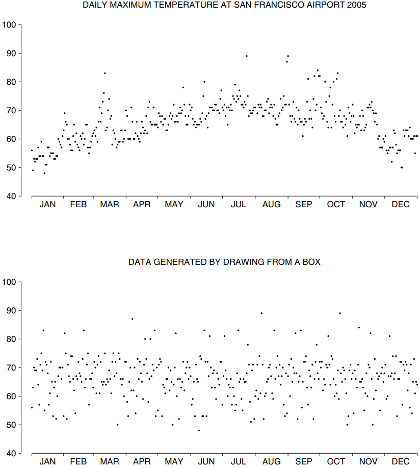
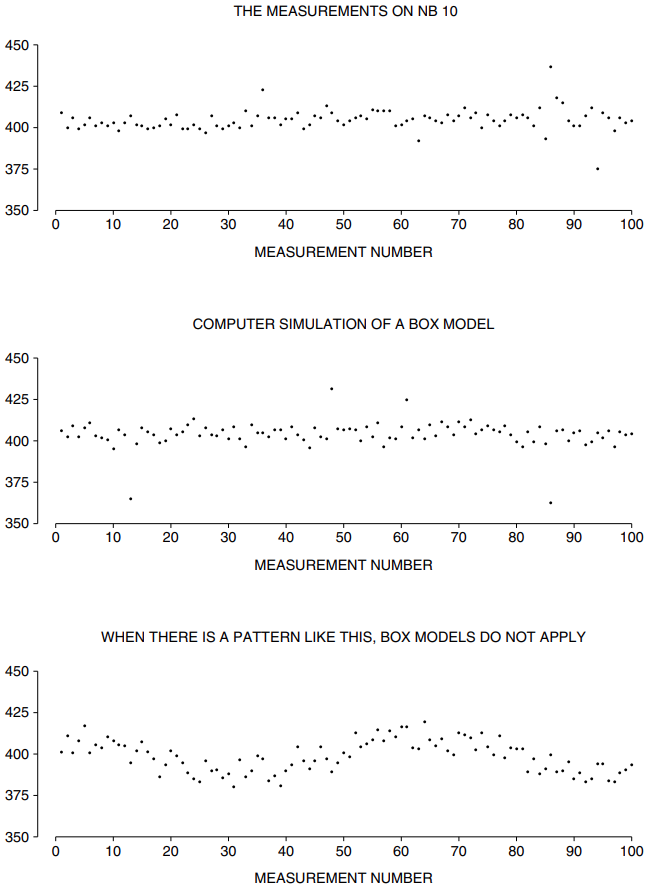

# Chance Models

Mục 1 đã giải thích cách đặt `standard error` lên mức trung bình của các phép đo lặp lại. Phép tính số học có thể được thực hiện dễ dàng trên bất kỳ danh sách số nào, nhưng phương pháp này chỉ hợp lý khi độ biến thiên của dữ liệu tương tự độ biến thiên trong các lần rút ra lặp đi lặp lại từ một hộp.

> Nếu dữ liệu hiển thị xu hướng hoặc khuôn theo thời gian thì mô hình hộp sẽ không được áp dụng.

Lý do: rút từ hộp không thể hiện xu hướng hoặc khuôn mẫu theo thời gian. Các ví dụ sau đây minh họa ý tưởng này.

_Ví dụ 2._ Bảng 1 cho biết dân số Hoa Kỳ từ năm 1790 đến năm 2000. Những con số này có giống như những con số được rút ngẫu nhiên từ một hộp không?

**
Table 1. Dân số Hoa Kỳ 1790 đến 2000.
**

|      |             |
| ---- | ----------- |
| 1790 | 3.929.214   |
| 1800 | 5.308.483   |
| 1810 | 7.239.881   |
| 1820 | 9.638.453   |
| 1830 | 12.866.020  |
| 1840 | 17.069.453  |
| 1850 | 23.191.876  |
| 1860 | 31.443.321  |
| 1870 | 39.818.449  |
| 1880 | 50.189.209  |
| 1890 | 62.979.766  |
| 1900 | 76.212.168  |
| 1910 | 92.228.496  |
| 1920 | 106.021.537 |
| 1930 | 123.202.624 |
| 1940 | 132.164.569 |
| 1950 | 151.325.798 |
| 1960 | 179.323.175 |
| 1970 | 203.302.031 |
| 1980 | 226.542.199 |
| 1990 | 248.718.302 |
| 2000 | 281.422.602 |

_Notes: Resident population. From 1950 onwards, includes Alaska and Hawaii.\
Revised figures for 1870–1940. Source: Statistical Abstract, 2006, Table 1._

_Giải pháp._ Không. Dân số Hoa Kỳ đang tăng lên đều đặn. Các số được rút ngẫu nhiên từ một hộp không làm được điều đó: đôi khi chúng tăng lên và những lần khác chúng lại giảm xuống.

_Ví dụ 3._ Trung bình 22 số ở Bảng 1 là 94.7 triệu và `SD` là 89.3 triệu. Người điều tra gắn `standard error` vào giá trị trung bình theo quy trình sau:

\\[
\begin{align*}
\text{SE for the sum} &\approx \sqrt{22} \times \text{89.3 million} \approx \text{419 million}\\\\
\text{SE for average} &\approx 419/22 \approx \text{19.0 million}
\end{align*}
\\]

Điều này có hợp lý không?

_Giải pháp._ Giá trị trung bình và `SD` có ý nghĩa như số liệu thống kê mô tả. Chúng tóm tắt một phần thông tin trong Bảng 1, mặc dù chúng bỏ lỡ khá nhiều thông tin - ví dụ, thực tế là các con số tăng đều đặn. Tuy nhiên, `SE` 19 triệu thì thật ngớ ngẩn. Nếu người điều tra muốn biết trung bình cộng của 22 số trong bảng thì số đó đã được tính toán và không cần phải lo lắng về `chance error`. Tất nhiên, có thể liên quan đến điều gì đó khác, chẳng hạn như giá trị trung bình của một danh sách thể hiện dân số Hoa Kỳ hàng năm từ 1790 đến 2000. (Mỗi con số thứ mười trong danh sách đó được trình bày trong Bảng 1; những con số ở giữa được biết với ít chính xác hơn, vì Điều tra dân số chỉ được thực hiện mười năm một lần.) Khi đó, điều tra viên sẽ đưa ra suy luận, sử dụng mức trung bình từ Bảng 1 để ước tính mức trung bình kia. Và ước tính sẽ bị sai lệch một lượng. Nhưng luật căn bậc hai không thể giúp ích nhiều với margin of error. Lý do là những con số ở Bảng 1 không giống như những con số được rút ra từ một chiếc hộp.

> Luật căn bậc hai chỉ áp dụng cho những lần rút ra từ một hộp.

_Ví dụ 4._ Một danh sách được lập, hiển thị nhiệt độ tối đa hàng ngày tại sân bay San Francisco. Những dữ liệu này có giống như rút ra từ một chiếc hộp không?

_Giải pháp._ Không, có một mô hình theo mùa nhất định đối với những dữ liệu này - ấm hơn vào mùa hè, lạnh hơn vào mùa đông. Thậm chí còn có các mẫu cục bộ cho dữ liệu. Nhiệt độ của một ngày có xu hướng giống như nhiệt độ của ngày hôm trước.
Dữ liệu nhiệt độ được biểu thị ở phần trên cùng của Hình 1. Có một dấu chấm phía trên mỗi ngày trong năm đối với năm 2005, hiển thị nhiệt độ tối đa vào ngày đó. Mô hình theo mùa là rõ ràng. Nhìn chung, các chấm vào mùa hè cao hơn vào mùa đông. Ngoài ra, có một mô hình lượn sóng không đều trong mỗi mùa. Đỉnh sóng tượng trưng cho những ngày ấm áp kéo dài - một khoảng thời gian ấm áp. Những đợt lạnh đang tràn vào.

Để so sánh, phần thứ hai trong Hình 1 dành cho một sân bay huyền thoại có khí hậu trung bình như San Francisco, nhưng nhiệt độ tối đa hàng ngày giống như được rút ra từ một chiếc hộp. Những dữ liệu này là ngẫu nhiên: chúng không cho thấy xu hướng hay mô hình nào trong năm. Với kiểu khí hậu này, việc dự báo thời tiết sẽ trở nên vô vọng.

**
Hình 1. Mô hình nhiệt độ và hộp. Biểu đồ đầu tiên hiển thị nhiệt độ tối đa hàng ngày tại sân bay San Francisco vào năm 2005[^3]. Dữ liệu có khuôn mẫu theo mùa, ấm hơn vào mùa hè so với mùa đông. Ngoài ra còn có các mô hình cục bộ: đợt ấm và đợt lạnh. Một mô hình hộp sẽ không được áp dụng. Biểu đồ thứ hai hiển thị nhiệt độ sẽ như thế nào nếu chúng được tạo ra bằng cách rút từ hộp.
**

Ở Mục 1, chúng ta hành động như thể số đo trên NB 10 giống như những thước đo được rút ra từ một chiếc hộp. Điều này có hợp lý không? Phần jtrên cùng trong Hình 2 (trang tiếp theo) là biểu đồ dữ liệu. Có một điểm cho mỗi phép đo. Tọa độ x cho biết phép đo đó là: thứ nhất, thứ hai, hoặc thứ ba, v.v. Tọa độ y cho biết số đo dưới 10 gram là bao nhiêu microgam. Các điểm không hiển thị bất kỳ xu hướng hoặc mô hình nào theo thời gian; chúng trông ngẫu nhiên như được rút ra từ một chiếc hộp. Trên thực tế, phần thứ hai hiển thị dữ liệu giả định được tạo trên máy tính bằng mô hình hộp[^4]. Nếu bạn không biết cái nào là cái nào thì sẽ khó phân biệt được sự khác biệt giữa hai biểu đồ này. Khi so sánh, biểu đồ thứ ba (cũng dành cho dữ liệu do máy tính tạo ra) hiển thị một mẫu rõ ràng: mô hình hộp sẽ không được áp dụng.

**
Hình 2. Biểu đồ trên cùng biểu thị các phép đo lặp lại trên NB 10 ([Mục 6.2](../ch06/ch06-02.md)). Biểu đồ ở giữa biểu thị dữ liệu giả thuyết, được tạo bằng mô phỏng máy tính của mô hình hộp. Hai biểu đồ này rất giống nhau, cho thấy mô hình hộp thể hiện dữ liệu thực tốt như thế nào. Dữ liệu biểu đồ của cái dưới cùng hiển thị một khuôn mẫu rõ ràng: mô hình hộp sẽ không được áp dụng.
**

Không phải ngẫu nhiên mà dữ liệu trên NB 10 trông giống như rút từ một chiếc hộp. Các nhà điều tra tại Cục sử dụng các hình ảnh của dữ liệu, giống như bảng trên cùng trong Hình 2, để kiểm tra công việc của họ. Xu hướng hoặc mô hình là tín hiệu cho thấy có điều gì đó không ổn và cần được sửa chữa. Ý tưởng này là cơ bản cho công việc đo lường chính xác - và kiểm soát chất lượng trong sản xuất, trong đó số lượng đơn vị bị lỗi được biểu thị theo thời gian.

---

[^3]: Data from http://www.wunderground.com

[^4]: The error box was a bit complicated: 95% of the tickets followed the normal curve, with an average of 0 and an SD of 4 micrograms; the other 5% followed the normal curve with an average of 0 and an SD of 25 micrograms. Two normal curves were needed, one for the middle and one for the outliers.
