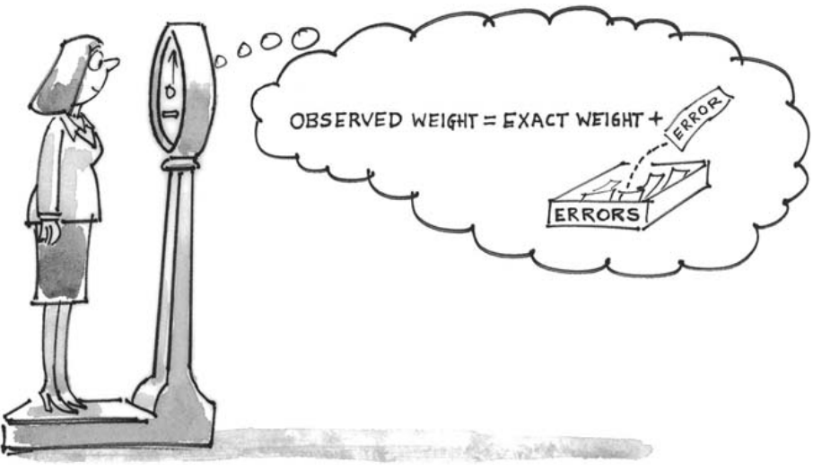
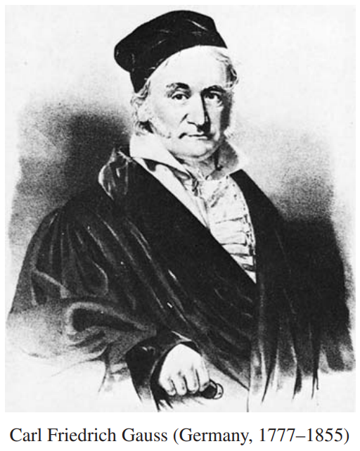

# The Gauss Model

Mô hình hộp về sai số đo bây giờ sẽ được mô tả chi tiết hơn. Tình huống cơ bản là một loạt các phép đo lặp lại được thực hiện trên một đại lượng nào đó. Theo mô hình, mỗi phép đo khác với giá trị chính xác do `chance error`; lỗi này tương tự một lần rút ngẫu nhiên từ một hộp - _error box_. Các phép đo liên tiếp được thực hiện độc lập và trong cùng điều kiện, do đó việc rút ra từ *error box*được thực hiện có thay thế. Để nắm bắt được ý tưởng rằng các `chance error` không dương hoặc âm một cách có hệ thống, người ta giả định rằng trung bình của các số trong _error box_ bằng 0. Mô hình này được đặt theo tên của Carl Friedrich Gauss (Đức, 1777-1855) , người đã nghiên cứu về sai số đo lường trong dữ liệu thiên văn.

> Trong mô hình Gauss, mỗi lần thực hiện phép đo, một phiếu sẽ được rút ngẫu nhiên có thay thế từ error box. Con số trên phiếu là `chance error`. Nó được thêm vào giá trị chính xác để đưa ra số đo thực tế. Giá trị trung bình của error box bằng 0.

Trong mô hình, chính `SD` của hộp sẽ cung cấp kích thước có thể xảy ra của các `chance error`. Thông thường, `SD` này không xác định và phải được ước tính từ dữ liệu. Lấy 100 đo lường trên NB 10 chẳng hạn. Theo mô hình, mỗi phép đo đều có trọng lượng chính xác nhưng bị sai lệch bởi một rút thăm từ error box:

\\[
\begin{align*}
\text{1st measurement} &= \text{exact weight + 1st draw from error box}\\\\
\text{1st measurement} &= \text{exact weight + 1st draw from error box}\\\\
\vdots\\\\
\text{100st measurement} &= \text{exact weight + 100st draw from error box}\\\\
\end{align*}
\\]

_
Wolff-Leavenworth collection, courtesy of the 
Syracuse University Art Collection.
_

Với dữ liệu NB 10, `SD` của 100 lần rút sẽ là một ước tính tốt cho `SD` của error box[^5]. Điều đáng chú ý là các lần rút không thể được phục hồi từ dữ liệu vì không xác định được trọng số chính xác. Tuy nhiên, độ biến thiên trong các phép đo bằng với độ biến thiên trong các lần rút, vì trọng lượng chính xác không thay đổi từ phép đo này sang phép đo khác. Về mặt kỹ thuật hơn, việc thêm giá trị chính xác cho tất cả các lỗi sẽ không làm thay đổi `SD` ([Mục 5.6](../ch05/ch05-06.md)). Đó là lý do tại sao các nhà thống kê sử dụng `SD` của phép đo khi tính `SE`. Và điều đó hoàn thành lý do đằng sau phép tính ở Mục 1[^6].

> Khi áp dụng mô hình Gauss, `SD` của một loạt phép đo lặp lại có thể được sử dụng để ước tính `SD` của hộp lỗi. Ước tính tốt khi có đủ phép đo.

Có thể có một cách khác để lấy `SD` của error box. Khi có nhiều kinh nghiệm về quy trình đo, tốt hơn nên ước tính `SD` từ tất cả dữ liệu trong quá khứ thay vì một vài phép đo hiện tại. Nguyên nhân: error box thuộc về quá trình đo chứ không phải vật được đo.

_Ví dụ 5._ (Giả thuyết.) Sau khi thực hiện hàng trăm phép đo trên NB 10 và tìm thấy `SD` khoảng 6 microgam, các nhà điều tra của Cục đã đánh nhầm trọng số kiểm tra này. Họ đi ra ngoài và mua một cái mới. Họ đo trọng lượng của nó theo cùng một quy trình như đối với NB 10 và trên cùng một thang đo. Sau một tuần, họ tích lũy được 25 số đo. Những con số này trung bình lên tới 605 microgam trên 10 gam và `SD` là 7 microgam. Giả sử mô hình Gauss, trọng lượng mới là 605 microgam trên 10 gam, bằng hoặc bằng khoảng

\\[
\text{6 microgams} \quad \text{7 microgams} \text{1.2 microgams} \quad \text{1.4 microgams}
\\]

_Giải pháp._ Theo mô hình, `chance error` trong mỗi phép đo tương tự một lần rút từ error box. Error box thuộc về cân chứ không phải trọng lượng. `SD` của error box phải được ước tính bằng `SD` của lượng lớn dữ liệu trong quá khứ trên NB 10, chứ không phải lượng nhỏ dữ liệu hiện tại về trọng lượng mới. `SD` của error box được ước tính là 6 microgam. Điều này cho biết kích thước có thể xảy ra của `chance error` trong một phép đo. Nhưng độ lớn của `chance error` trong trung bình của 25 phép đo là nhỏ hơn. `SE` trung bình là 1.2 microgam. Đó là câu trả lời.

Trong mô hình, error box thuộc về cân chứ không phải trọng lượng. Điều này có vẻ hợp lý đối với các khối kim loại có kích thước tương tự nhau. Tuy nhiên, nếu chúng ta thay đổi từ trọng lượng 10 gram sang trọng lượng 100 gram, hộp lỗi cũng có thể thay đổi. Và đối với những quả nặng lắc lư tích cực hơn - như trẻ sơ sinh - sự tách biệt giữa "giá trị thực" và "chance error" có thể không thuyết phục lắm.

Một điểm cuối cùng. Phiên bản của mô hình Gauss được trình bày ở đây giả định rằng không có `bias` trong quy trình đo. Khi `bias` hiện diện, mỗi phép đo là tổng của ba số hạng:

\\[
\text{exact value + bias + chance error}
\\]

Khi đó `SE` cho giá trị trung bình không còn cho biết giá trị trung bình của các phép đo cách giá trị chính xác bao xa nữa mà chỉ cho biết nó cách bao xa

\\[
\text{exact value + bias}
\\]

Các phương pháp của chương này không giúp ích gì trong việc đánh giá `bias`. Chúng ta đã không tính đến các phép đo trên NB 10, bởi vì các lý do khác cho thấy rằng `bias` trong cân chính xác tại National Bureau of Standards là không đáng kể. Trong những tình huống khác, `bias` có thể nghiêm trọng hơn `chance error` - và khó phát hiện hơn[^7].

[^5]: The root-mean-square might be even better, since the average of the box is assumed to be 0.

[^6]: The empirical distribution of the data on NB 10 is skewed and long-tailed (figure 2 in chapter 6). However, the 100-fold convolution of this distribution with itself is quite close to normal; the minor deviations from normality are described quite well by an Edgeworth expansion to order 1/n.

[^7]: W. J. Youden, "Enduring values", _Technometrics_ vol. 14 (1972) pp. 1–11. Also see M. Henrion and B. Fischhoff, "Assessing uncertainty in physical constants", _American Journal of Physics_ vol. 54 (1986) pp. 791–97.
