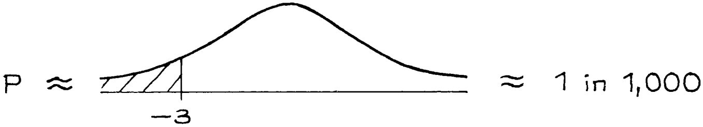
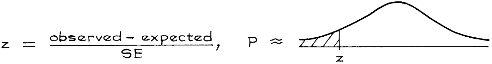

# Test Statistics and Significance Levels

Trong đoạn hội thoại ở Mục 1, Tiến sĩ Altshuler tạm thời cho rằng `null hypothesis` là đúng (trung bình của hộp là 50). Trên cơ sở này, cô ấy đã tính toán xem giá trị trung bình mẫu cách xa bao nhiêu `SE` so với `expected value` của nó:

\\[
\frac{48 - 50}{0.7} \approx -3
\\]

Đây là một ví dụ về `test statistic`.

> `test staticstic` được sử dụng để đo lường sự khác biệt giữa dữ liệu và những gì được mong đợi trên `null hypothesis`.

`test statistic` của Tiến sĩ Altshuler thường được gọi là z:

\\[
z = \frac{observed - expected}{SE}
\\]

Các thử nghiệm sử dụng _z-statistic_ được gọi là `z-test`. Hãy ghi nhớ cách giải thích.

> z cho biết giá trị được quan sát cách xa bao nhiêu `SE` so với `expected value` của nó, trong đó `expected value` được tính bằng cách sử dụng `null hypothesis`.

Chính `null hypothesis` đã bảo Tiến sĩ Altshuler sử dụng 50 làm chuẩn chứ không phải một số khác trong tử số của z. Đó là chính là điểm mà giả thuyết không được đưa vào quy trình. Các `null hyphothesis` khác sẽ đưa ra các điểm chuẩn khác nhau ở tử số của z. `null hypothesis` không cho chúng ta biết `SD` của hộp. Điều đó phải được ước tính từ dữ liệu để tính `SE` theo mẫu số của z.

z-statistic là −3 khiến Tiến sĩ Nullsheimer cảm thấy lạnh sống lưng. Tại sao nó lại đáng sợ? Suy cho cùng, 3 không phải là một con số lớn. Tất nhiên, câu trả lời là diện tích bên trái của −3 dưới `normal curve` nhỏ đến mức nực cười. Cơ hội để có được trung bình mẫu thấp hơn giá trị mong đợi từ 3 `SE` trở lên là khoảng 1 trên 1.000.

(Từ bảng chuẩn ở trang A104, diện tích là 0.135 trên 1%; làm tròn số, chúng ta nhận được 0,1 trên 1%; đây là 0.1 trên \\(0.01 = 0.001 = 1/1.000\\)).

Cơ hội 1 trên 1.000 buộc Tiến sĩ Nullsheimer phải thừa nhận rằng mức trung bình của hộp - không chỉ mức trung bình của mẫu - là dưới 50. Cơ hội 1 trên 1.000 này được gọi là _mức ý nghĩa quan sát được_. Mức ý nghĩa quan sát được thường được ký hiệu là P, nghĩa là xác suất và được gọi là `P-value`. Trong ví dụ, `P-value` của thử nghiệm là khoảng 1 trên 1.000.

Tại sao nhìn vào diện tích bên trái của −3? Điểm đầu tiên cần lưu ý: dữ liệu có thể diễn ra khác đi và khi đó z cũng sẽ khác. Ví dụ: nếu trung bình mẫu là 47.2 và `SD` là 14.1,

\\[
z = \frac{47.2 - 50}{0.63} \approx -4.4
\\]

Đây là bằng chứng mạnh mẽ hơn chống lại `null hypothesis`: 4.4 `SE` dưới 50 thậm chí còn tệ hơn "chỉ là may rủi" so với 3 `SE`. Mặt khác, nếu trung bình mẫu là 46.9 và `SD` là 37 thì

\\[
z = \frac{46.9 - 50}{1.65} \approx -1.9
\\]

Đây là bằng chứng yếu hơn. Vùng bên trái −3 biểu thị các mẫu thậm chí còn cho giá trị z cực trị hơn giá trị được quan sát và bằng chứng mạnh mẽ hơn chống lại `null hypothesis`.

> Mức ý nghĩa quan sát được là cơ hội nhận được một thống kê kiểm tra ở mức cực đoan hoặc cực đoan hơn mức được quan sát. Cơ hội được tính toán trên cơ sở `null hypothesis` là đúng. Cơ hội này càng nhỏ thì bằng chứng chống lại null càng mạnh mẽ.

z-test có thể được tóm tắt như sau:

Vì thống kê kiểm tra z phụ thuộc vào dữ liệu nên P cũng vậy. Đó là lý do tại sao P được gọi là mức ý nghĩa "quan sát được".

Tại điểm này, logic của z-test có thể được nhìn thấy rõ ràng hơn. Đó là một lập luận mâu thuẫn, được thiết kế để chỉ ra rằng `null hypothesis` sẽ dẫn đến một kết luận vô lý và do đó phải bị bác bỏ. Bạn xem dữ liệu, tính toán `test statistic` và nhận được mức ý nghĩa quan sát được. Lấy ví dụ, P là 1 trên 1.000. Để giải thích con số này, bạn bắt đầu bằng việc giả định rằng `null hypothesis` là đúng. Tiếp theo, bạn tưởng tượng nhiều nhà nghiên cứu khác đang lặp lại thí nghiệm.

Điều mà 1 trong 1.000 nói lên là `test statistic` của bạn thực sự rất xa. Chỉ một trong số một nghìn điều tra viên sẽ nhận được kết quả kiểm tra ở mức cực đoan hoặc cực đoan hơn kết quả mà bạn nhận được. `null hypothesis` đang tạo ra những điều vô lý và cần được bác bỏ. Nói chung, mức ý nghĩa quan sát được càng nhỏ thì bạn càng muốn bác bỏ null. Cụm từ "bác bỏ null" nhấn mạnh quan điểm rằng với một phép kiểm tra ý nghĩa, lập luận là mâu thuẫn.

Cách giải thích của chúng tôi về P có thể có vẻ phức tạp. Nó phức tạp. Thật không may, những cách giải thích đơn giản hơn hóa ra lại sai. Nếu có bất kỳ công lý nào trên thế giới này thì P sẽ là xác suất của `null hypothesis` dựa trên dữ liệu. Tuy nhiên, P được tính bằng null. Tệ hơn nữa, theo frequency theory, không có cách nào để xác định xác suất của `null hypothesis` là đúng.

Null là một tuyên bố về cái hộp. Bất kể bạn rút thăm thường xuyên như thế nào, `null hypothesis` luôn luôn đúng hoặc luôn sai vì hộp không thay đổi[^3]. (Một điểm tương tự về `confidence interval` được thảo luận trong [Mục 21.3](../ch21/ch21-03.md)).

Những gì mức ý nghĩa quan sát được mang lại là cơ hội có được bằng chứng chống lại null mạnh mẽ như bằng chứng hiện có - hoặc mạnh hơn - nếu null là đúng.

> `P-value` của một bài kiểm tra là cơ hội nhận được một `test statistic` lớn - giả sử `null hypothesis` là đúng. P không phải là khả năng `null hypothesis` đúng.

`z-test` được sử dụng cho các mẫu có kích thước đủ lớn, khi mà `normal approximation` có thể được sử dụng trên `probability histogram` cho giá trị trung bình của các lần rút thăm. (Trung bình đã được chuyển đổi thành `standard unit`, theo z.) Với các mẫu nhỏ, phải sử dụng các kỹ thuật khác, như được thảo luận trong Mục 6 bên dưới.

---

[^3]: For a Bayesian, the frequentist P-value of a test can be substantially different from the posterior probability of the null hypothesis; indeed, the latter must depend on (i) the power of the test and (ii) the prior probability of the null. For more discussion, see J. Berger and T. Sellke, "Testing a point null hypothesis: The irreconcilability of P-values and evidence", Journal of the American Statistical Association vol. 82 (1987) pp.112–39.
