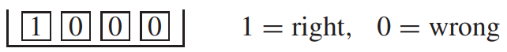
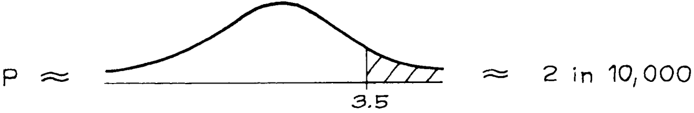
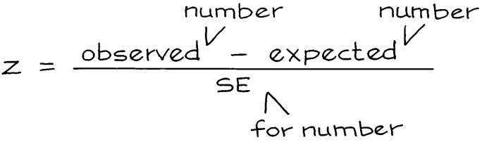
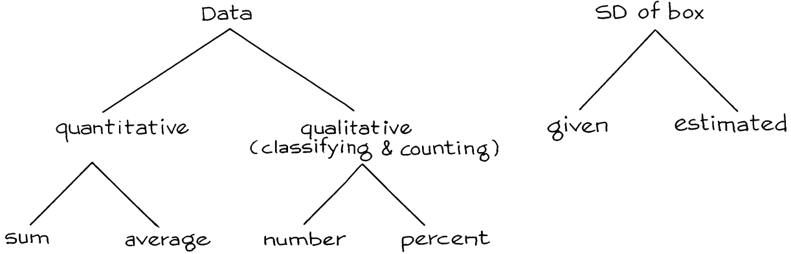

# Zero-One Boxes

`z-test` cũng có thể được sử dụng khi tình huống liên quan đến việc phân loại và đếm. Vấn đề là điền số 0 và số 1 vào hộp ([Mục 17.5](../ch17/ch17-05.md)). Mục này đưa ra một ví dụ.

Charles Tart đã thực hiện một thí nghiệm tại Đại học California, Davis để chứng minh ESP[^5]. Tart đã sử dụng một chiếc máy có tên "Aquarius". Aquarius có một bộ tạo số ngẫu nhiên điện tử và 4 "mục tiêu". Sử dụng trình tạo số ngẫu nhiên, máy chọn ngẫu nhiên một trong 4 mục tiêu. Nó không chỉ ra cái nào. Sau đó, đối tượng đoán mục tiêu nào đã được chọn bằng cách nhấn nút. Cuối cùng, máy sẽ chiếu sáng mục tiêu mà nó chọn và rung chuông nếu đối tượng đoán đúng. Máy theo dõi số lần thử và số lần đoán đúng.

Tart đã chọn ra 15 đối tượng được cho là có khả năng thấu thị. Mỗi đối tượng thực hiện 500 lần đoán về Aquarius, tổng cộng là \\(15 \times 500 = 7.500\\) lần đoán. Trong tổng số này, 2.006 đã đúng. Tất nhiên, ngay cả khi đối tượng không có khả năng thấu thị, họ vẫn đúng khoảng 1/4 số trường hợp. Nói cách khác, có khoảng \\(1/4 \times 7.500 = 1.875\\) lần đoán đúng, chỉ là ngẫu nhiên. Đúng, có số dư là \\(2.006 - 1.875 = 131\\) lần đoán đúng, nhưng điều này không thể được giải thích là một biến thể ngẫu nhiên sao?

Tart có thể - và đã - chống lại lời giải thích "đó chỉ là may rủi" bằng cách thực hiện một bài kiểm tra ý nghĩa. Để thiết lập mô hình hộp, ông cho rằng Aquarius sinh ra các số ngẫu nhiên nên mỗi mục tiêu trong 4 mục tiêu đều có 1 trong 4 cơ hội được chọn. Anh ấy cho rằng (tạm thời) rằng không có ESP. Bây giờ, một dự đoán có 1/4 cơ hội đúng.

Dữ liệu bao gồm một bản ghi của 7.500 lần đoán, cho biết mỗi lần đoán đúng hay sai. Giả thuyết không nói rằng dữ liệu tương tự 7.500 lần rút ra từ hộp

Số lần đoán đúng tương đương với tổng số 7.500 lần rút thăm từ hộp. Điều này hoàn thành mô hình hộp cho `null hypothesis`.

Máy đang phân loại từng lần đoán là đúng hay sai và đếm số lần đoán đúng. Đó là lý do vì sao cần có hộp zero-one. Khi giả thuyết không được chuyển sang mô hình hộp, phép thử z có thể được sử dụng:

\\[
z = \frac{observed - expected}{SE}
\\]

Số "quan sát" là 2.006, số lần đoán đúng. Số lần đoán đúng dự kiến xuất phát từ `null hypothesis` và là 1.875. Tử số của z-statistic là \\(2.006 − 1.875 = 131\\), số dư dự đoán đúng.

Bây giờ đến mẫu số. Bạn cần `SE` cho số lần đoán đúng. Nhìn vào mô hình hộp. Trong ví dụ này, `null hypothesis` cho bạn biết chính xác có gì trong hộp: 1 số 1 và 3 số 0. `SD` của hộp là \\(\sqrt{0.25} \times 0.75 \approx 0.43\\). `SE` là \\(\sqrt{7.500} \times 0.43 \approx 37\\). Vậy

\\[
z = 131/37 \approx 3.5
\\]

Giá trị quan sát được là 2.006 cao hơn 3.5 `SE` so với `expected value`. Và P rất nhỏ:

Sự dư thừa của những dự đoán đúng khó có thể bị loại bỏ như một `chance variation`. Đây có vẻ là bằng chứng thuyết phục cho ESP. Tuy nhiên, vẫn có những khả năng khác cần cân nhắc. Ví dụ, trình tạo số ngẫu nhiên của Aquarius có thể không tốt lắm ([Mục 29.5](../ch29/ch29-05.md)). Hoặc chiếc máy có thể cung cấp cho đối tượng một số manh mối tinh tế về việc nó đã chọn mục tiêu nào. Có thể có nhiều cách giải thích hợp lý cho kết quả này, ngoài ESP. Nhưng `chance variation` không phải là một trong số đó. Đó là những gì bài kiểm tra mức ý nghĩa cho thấy, khi kết thúc ví dụ ESP.
z-statistic tương tự được sử dụng ở đây như trong Mục 1:

\\[
z = \frac{observed - expected}{SE}
\\]

Mặc dù công thức giống nhau nhưng có một số khác biệt giữa `z-test` trong mục này và `z-test` trong Mục 1.

1. Trong Mục 1, `SE` cho trung bình. Ở đây, `SE` cho số lần đoán đúng. Để tính z, trước tiên hãy quyết định xem cái gì được "quan sát" ở tử số. Bạn đang làm việc với một tổng, một trung bình, một con số hay một phần trăm? Điều đó sẽ cho bạn biết nên sử dụng `SE` nào trong mẫu số. Trong ví dụ ESP, số lần đoán đúng đã được quan sát. Đó là lý do tại sao `SE` cho số lần lại đi vào mẫu số, như được biểu thị bằng hình vẽ.

2. Ở Mục 1, không rõ `SD` của hộp. Các nhà điều tra đã phải ước tính nó từ dữ liệu. Ở đây, `SD` của hộp được đưa ra bởi `null hypothesis`. Bạn không cần phải ước tính nó. Sơ đồ tóm tắt các điểm 1) và 2).

3. Trong Mục 1, có một `altervative hypothesis` về chiếc hộp: mức trung bình của nó dưới 50. Với ESP, không có cách nào hợp lý để thiết lập `alternative hypothesis` dưới dạng mô hình hộp. Lý do: nếu các đối tượng có ESP thì khả năng mỗi lần đoán đúng có thể phụ thuộc vào các lần thử trước đó và có thể thay đổi từ lần thử này sang lần thử khác. Khi đó dữ liệu sẽ không giống như dữ liệu rút ra từ một chiếc hộp[^6].

4. Ở Mục 1, dữ liệu tương đương rút ra từ một chiếc hộp, vì các điều tra viên đồng ý lấy một mẫu các phiếu ngẫu nhiên đơn giản. Cuộc tranh luận chỉ xoay quanh mức trung bình của hộp. Ở đây, một phần của câu hỏi là liệu dữ liệu có giống như được rút ra từ hộp hay không - bất kỳ chiếc hộp nào.

Các Chương 19-24 nói về việc ước tính các `parameter` từ dữ liệu và nhận biết margins of error. _Testing_, chủ đề của chương này, là về một loại câu hỏi khác. Ví dụ: một tham số có bằng một số giá trị được chỉ định trước hay không? Ước tính và thử nghiệm có liên quan với nhau nhưng mục tiêu thì khác nhau.

---

[^5]: We are using ESP loosely to cover PK and clairvoyance as well. The experiment is described in C. Tart, Learning to Use Extrasensory Perception (University of Chicago Press, 1976). One subject did not, in fact, complete all the runs. And there are also results from a "Ten Choice Trainer", see exercise 6 on p. 487.
