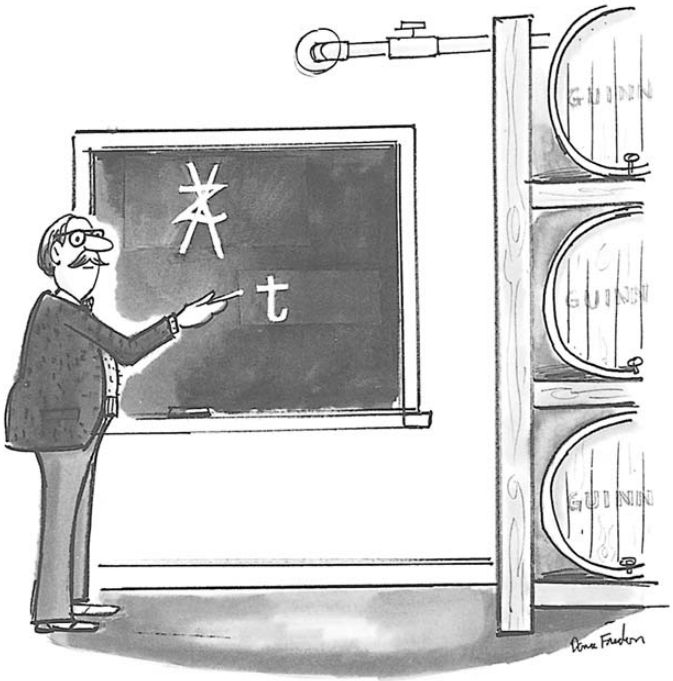
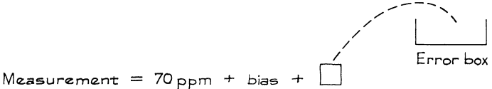
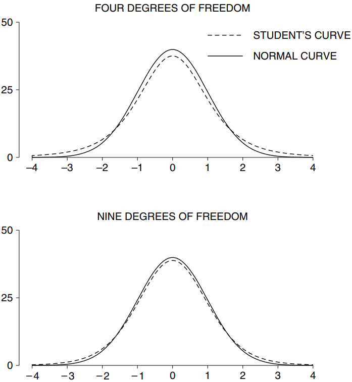
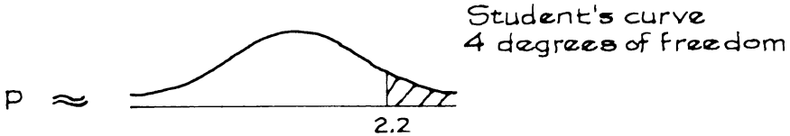
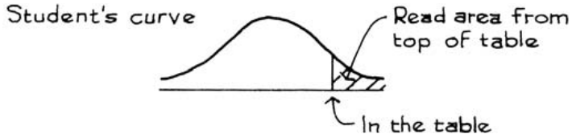
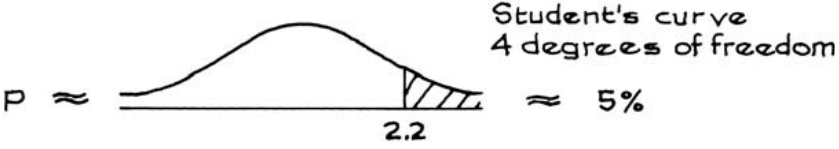
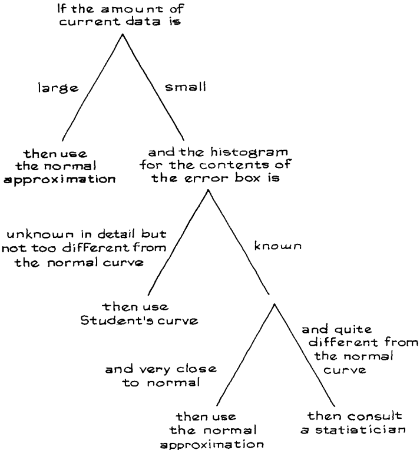
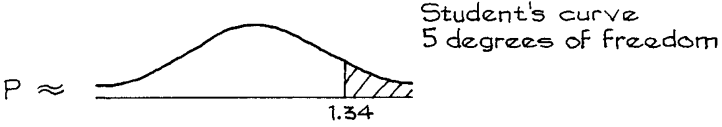
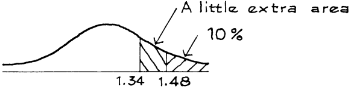
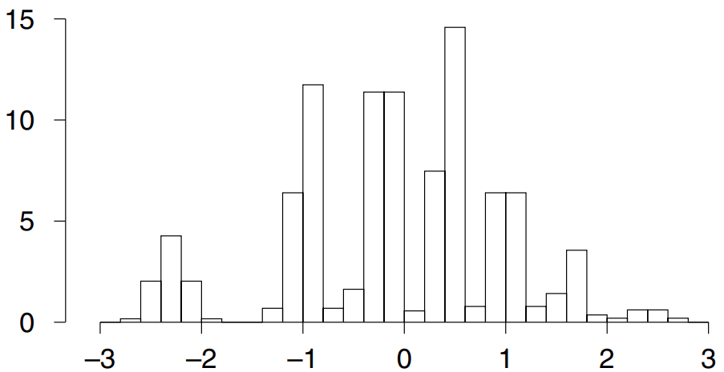

# The t-TEST

Với các mẫu nhỏ, `z-test` phải được điều chỉnh. Các nhà thống kê sử dụng `t-test` do W. S. Gosset (Anh, 1876-1936) phát minh ra. Gossett làm giám đốc điều hành tại Nhà máy bia Guinness, nơi ông đến sau khi lấy bằng tại Oxford. Anh xuất bản dưới bút danh "Student" vì người chủ của anh không muốn cuộc thi nhận ra kết quả có thể hữu ích như thế nào[^9].

Mục này sẽ trình bày cách thực hiện `t-test`, ví dụ. Tuy nhiên, cuộc thảo luận mang tính kỹ thuật một chút và có thể bỏ qua. Tại Los Angeles, nhiều nghiên cứu đã được tiến hành để xác định nồng độ CO (carbon monoxide) gần đường cao tốc với các điều kiện luồng giao thông khác nhau. Kỹ thuật cơ bản bao gồm việc thu thập các mẫu không khí trong các túi đặc biệt, sau đó xác định nồng độ CO trong các mẫu túi bằng cách sử dụng một máy gọi là máy đo quang phổ. Những máy này có thể đo nồng độ lên tới khoảng 100 ppm (phần triệu theo thể tích) với sai số khoảng 10 ppm. Máy đo quang phổ khá tinh vi và phải được hiệu chuẩn hàng ngày. Điều này liên quan đến việc đo nồng độ CO trong mẫu khí được sản xuất, gọi là _span gas_, trong đó nồng độ được kiểm soát chính xác ở mức 70 ppm. Nếu máy đọc được gần 70 ppm trên span gas thì máy đã sẵn sàng để sử dụng; nếu không thì phải điều chỉnh. Một yếu tố phức tạp là kích thước của sai số đo lường thay đổi theo từng ngày. Tuy nhiên, vào bất kỳ ngày cụ thể nào, chúng ta giả định rằng các sai số là độc lập và tuân theo `normal curve`; `SD` không xác định và thay đổi theo từng ngày[^10].

Một ngày nọ, một kỹ thuật viên thực hiện năm lần đo span gas và nhận được

\\[
78 \quad 83 \quad 68 \quad 72 \quad 88
\\]

Bốn trong số năm con số này cao hơn 70 và một trong số đó cao hơn khá nhiều. Điều này có thể được giải thích trên cơ sở `chance variation`không? Hay nó thể hiện `bias`, có lẽ do việc điều chỉnh máy không đúng cách?

Một thử nghiệm ý nghĩa được yêu cầu và cần có một mô hình hộp. Mô hình được sử dụng là mô hình Gauss ([Mục 24.3](../ch24/ch24-03.md)). Theo mô hình này, mỗi phép đo bằng giá trị thực 70 ppm, cộng với `bias`, cộng với một kết quả rút ra có thay thế từ error box. Các phiếu trong error box có giá trị trung bình là 0 và `SD` không xác định.

Tham số chính là `bias`. `null hypothesis` cho rằng `bias` bằng 0. Theo giả thuyết này, giá trị trung bình của 5 phép đo có `expected value` là 70 ppm; sự khác biệt giữa mức trung bình và 70 ppm được giải thích là sự `chance variation`. `alternative hypothesis` nói rằng `bias` khác 0, do đó sự khác biệt giữa giá trị trung bình của các phép đo và 70 ppm là có thật.

Như trước đây, `test statistic` thích hợp để sử dụng là

\\[
\frac{observed - expected}{SE}
\\]

Giá trị trung bình của 5 lần đo là 77.8 ppm và `SD` của chúng là 7.22 ppm. Có vẻ đúng khi ước tính `SD` của hộp lỗi là 7.22 ppm. `SE` cho tổng các lần rút là \\(\sqrt{5} \times 7.22 \approx 16.14\\) ppm. Và `SE` cho trung bình là \\(16.14/5 \approx 3.23\\) ppm. `test statistic` là

\\[
\frac{77.8 - 70}{3.23} \approx 2.4
\\]
Nói cách khác, giá trị trung bình của mẫu cao hơn khoảng 2.4 `SE` so với `expected value`trên `null hypothesis`. Bây giờ diện tích bên phải của 2.4 dưới `normal curve` nhỏ hơn 1%. `P-value` này trông giống như bằng chứng mạnh mẽ chống lại `null hypothesis`.

Tuy nhiên, vẫn còn thiếu một cái gì đó. `SD` của phép đo chỉ là ước tính cho `SD` của error box. Và số lượng phép đo quá nhỏ nên ước tính có thể bị sai lệch. Có thêm sự không chắc chắn cần được tính đến, được thực hiện theo hai bước.

**Bước 1.** Khi số lượng phép đo nhỏ, `SD` của error box không được ước tính bằng `SD` của phép đo. Thay vào đó, \\(SD^+\\) được sử dụng[^11]

\\[
SD^+ = \sqrt{\frac{\text{number of measurements}}{\text{number of measurements - one}}} \times SD
\\]

Ước tính này lớn hơn. (Xem trang 74 để biết định nghĩa về \\(SD^+\\) và trang 495 để biết logic đằng sau định nghĩa).
Trong ví dụ, số lượng phép đo là 5 và `SD `của chúng là 7.22 ppm. Vậy \\(SD^+ \approx \sqrt{5/4} \times 7.22 \approx 8.07\\) ppm. Sau đó, `SE` được tính theo cách thông thường. `SE` cho tổng là \\(\sqrt{5} \times 8.07 \approx 18.05\\) ppm; `SE` cho trung bình là \\(18.05/5 = 3.61\\) ppm. `test statistic` trở thành

\\[
\frac{77.8 - 70}{3.61} \approx 2.2
\\]

**Bước 2.** Bước tiếp theo là tìm `P-value`. Với số lượng lớn các phép đo, điều này có thể được thực hiện bằng cách sử dụng `normal curve`. Nhưng với số lượng phép đo ít, phải sử dụng một đường cong khác, gọi là `student's curve`. Hóa ra, `P-value` từ `student's curve`là khoảng 5%. Con số này cao hơn một chút so với 1% từ `normal curve`.
Việc sử dụng `student's curve` sẽ tốn một chút công sức. Trên thực tế, có một trong những đường cong này ứng với mỗi số _bậc tự do_. Trong bối cảnh này,

\\[
\text{degree of freedom = number of measurements - one}
\\]

`student's curve` đối với bậc tự do 4 và 9 được thể hiện trên Hình 1, với
`normal curve` để so sánh. Những `student's curve` trông khá giống `normal curve` nhưng ít chồng chất ở giữa và dàn trải hơn. Khi số bậc tự do tăng lên, các đường cong ngày càng gần với normal, phản ánh thực tế là `SD` của phép đo ngày càng gần với `SD` của error box. Tất cả các đường cong đều đối xứng quanh điểm 0 và tổng diện tích bên dưới bằng 100%.[^12]

**
Hình 1. `student's curve`. Đường đứt nét là `student's curve` cho 4 bậc tự do (hình trên) hoặc 9 bậc tự do (hình dưới). Đường liền nét là một `normal curve` để so sánh.
**

Trong ví dụ, với 5 phép đo thì có \\(5-1 = 4\\) bậc tự do. Để tìm `P-value`, chúng ta cần tìm diện tích bên phải của 2.2 dưới `student's curve` với 4 bậc tự do:

Có thể tìm thấy diện tích này từ một bảng đặc biệt (tr. A105), một phần của bảng này được trình bày trong Bảng 1. Các hàng được dán nhãn theo bậc tự do. Nhìn qua hàng có 4 bậc tự do. Mục đầu tiên là 1.53, trong cột có tiêu đề 10%. Điều này có nghĩa là diện tích bên phải của 1.53 dưới `student's curve` với 4 bậc tự do bằng 10%. Các mục khác có thể được đọc theo cách tương tự.

**
Bảng t rút gọn
**

| Degrees of freedom | 10%  | 5%   | 1%    |
| ------------------ | ---- | ---- | ----- |
| 1                  | 3.08 | 6.31 | 31.82 |
| 2                  | 1.89 | 2.92 | 6.96  |
| 3                  | 1.64 | 2.35 | 4.54  |
| 4                  | 1.53 | 2.13 | 3.75  |
| 5                  | 1.48 | 2.02 | 3.36  |

Trong ví dụ, có 4 bậc tự do và t là 2.2. Từ Bảng 1, diện tích dưới `student's curve` bên phải của 2.13 là 5%. Vậy diện tích bên phải của 2,2 phải vào khoảng 5%. `P-value` là khoảng 5%.

Bằng chứng đang chống lại `null hypothesis`, mặc dù không mạnh mẽ lắm. Điều này hoàn thành ví dụ.

`student's curve`nên được sử dụng trong các trường hợp sau đây.

- Dữ liệu giống như các lần rút từ hộp.

- Không biết `SD` của hộp.

- Số lượng quan sát ít nên `SD` của hộp không thể ước lượng chính xác được.

- Biểu đồ của nội dung trong hộp trông không quá khác biệt so với `normal curve`.

Với số lượng phép đo lớn (ví dụ 25 hoặc nhiều hơn), `normal curve` sẽ được sử dụng. Nếu biết `SD` của hộp và nội dung trong hộp tuân theo `normal curve` thì có thể sử dụng `normal curve` ngay cả đối với các mẫu nhỏ.[^13]
_Ví dụ 1._ Vào một ngày khác, 6 số trên span gas là

\\[
72 \quad 79 \quad 65 \quad 84 \quad 67 \quad 77
\\]

Máy đã được hiệu chuẩn đúng chưa? Hoặc các phép đo có thể hiện `bias` không?

_Giải pháp._ Mô hình vẫn giống như trước đây. Giá trị trung bình của các phép đo mới là 74 ppm và `SD` của chúng là 6.68 ppm. Vì chỉ có 6 quan sát nên `SD` của hộp lỗi phải được ước tính bằng \\(SD^+\\) của dữ liệu chứ không phải `SD`. \\(SD^+\\) là \\(\sqrt{6/5} \times 6.68 \approx 7.32\\) ppm, do đó `SE` cho trung bình là 2.99 ppm. Giờ

\\[
t = \frac{74 - 70}{2.99} \approx 1.34
\\]

Để tính `P-value`, `student's value` được sử dụng thay vì `normal curve`, với \\(6 − 1 = 5\\) bậc tự do.

Từ Bảng 1, diện tích bên phải của 1.34 dưới `student's curve` với 5 bậc tự do lớn hơn 10% một chút. Dường như không có nhiều bằng chứng về `bias`. Máy đã sẵn sàng để sử dụng. Lý do về 10%: từ bảng, diện tích bên phải của 1.48 là 10%. Và 1.34 nằm ngay bên trái của 1.48. Vậy diện tích bên phải của 1.34 lớn hơn 10% một chút.

---

[^9]: The anecdote about Student is reported in W. J. Youden, _Experimentation and Measurement_ (Washington, D.C., 1963).

[^10]: The t-test is one of the most popular statistical techniques, and we regret having to present it in a context which is both dry and partially hypothetical. (The story in the text is true, up to where they make a t-test; in practice, they don’t.) We didn’t run across any examples which were simultaneously real, interesting, and plausible. Our difficulty was the following. The t-test is used to compute significance levels. With small samples, some departures from normality can throw the computation off by a large factor. By way of illustration, the figure shows a probability histogram for the t-statistic, based on 10 draws made at random with replacement from the box [−3, −2, 5]. The distribution is far from t-like.\
    Probability histogram for t-statistic based on 10 draws with replacement from [−3, −2, 5]

The histogram was computed exactly, by considering all
    \\[
    \binom{12}{2} = 66
    \\]
possible divisions of 10 objects into 3 groups; for each group, we computed the probability and the t-statistic. For 3 of the divisions, the t-statistic is undefined, but their mass is only 10−5; another 2% of the mass is outside the range [−3, 3]. The example can easily be modified so there is a smooth density with a shift parameter. For the combinatorics, see W. Feller, _An Introduction to Probability Theory and its Applications_, vol. I, 3rd ed. (John Wiley & Sons, 1968, section II.4).\
To rely on the t-test, it seems to be necessary to know that the distribution of the errors is close to normal, without having a fair idea about the spread of the errors: if you knew the spread, you wouldn’t be using the t-distribution. But how would you know the shape of the distribution without knowing its spread?\
With large samples, departures from normality don’t matter so much. Student’s curves merge with the normal, and the t-statistic follows the normal curve (by the central limit theorem and the consistency of \\(\hat{\sigma}^2\\) as an estimator of \\(\sigma^2\\)). This is one thing statisticians mean by the "robustness of the t-test". In our terms, this concept of robustness applies to the z-test not the t-test. Two references-\
H. D. Posten, "The robustness of the one-sample t-test over the Pearson system", _Journal of Statistical Computation and Simulation_ vol. 9 (1979) pp. 133–49.\
E. Lehmann and W.-Y. Loh, "Pointwise vs. uniform robustness of some large sample tests
and confidence intervals", _Scandinavian Journal of Statistics_ vol. 17 (1990) pp. 177–87.\
Small departures from independence can have large impacts on both the z-test and the t-test. Also see notes 12–13 below.

[^11]: For present purposes, this is just a convention: the factor \\(\sqrt{n/(n − 1)}\\) could be absorbed into the multiplier derived from Student’s curve. In some contexts, however, \\(SD^+\\) is preferred to the SD of the sample as estimator for the SD of the population: \\((SD^+)^2\\) is unbiased, and this matters when pooling variances estimated from a large number of small samples.

[^12]: The equation for the curve is
    \\[
    \begin{align*}
    y &= \text{constant}(1 + \frac{t^2}{d})^{-(d + 1)/2} \\\\
    constant &= 100\\% \frac{\Gamma (\frac{d + 1}{2})}{\sqrt{\pi d} \Gamma (\frac{d}{2})} \\\\
    d &= \text{degrees of freedom}\\\\
    \Gamma &= \text{Euler's gama function}
    \end{align*}
    \\]
    The t-test was put on a rigorous mathematical footing by R. A. Fisher, who also showed that the procedure can give good approximations even when the errors did not follow the normal curve exactly: some departures from normality do not matter. This small-sample property is called "robustness" too. (But see note 10.)

[^13]: If the tickets in the box follow the normal curve, then the probability histogram for the sum of the draws does too-even with only a few draws. Technically, the convolution of a normal curve with itself gives another normal curve. If the tickets in the box have a known distribution, which is not normal, statisticians can work out the probability histogram for the sum or average of the draws, using convolutions.
