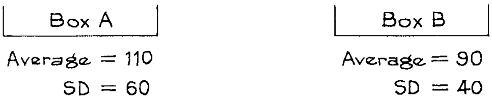
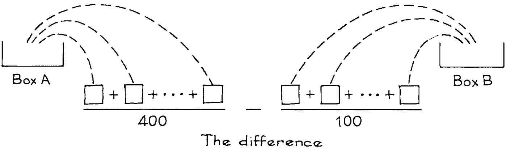
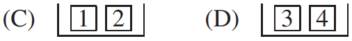

# The Standard Error for a Difference

Chương này nói về việc so sánh hai mẫu. `SE` cho sự chênh lệch giữa trung bình của chúng là cần thiết. Chúng ta bắt đầu với một ví dụ để minh họa toán học. (Ví dụ thực tế sẽ được đưa ra sau.) Giả sử hai hộp A và B có giá trị trung bình và `SD` được hiển thị bên dưới.

400 lần rút ngẫu nhiên được thực hiện có thay thế từ hộp A, và riêng 100 lần rút được thực hiện ngẫu nhiên có thay thế từ hộp B.

Vấn đề là tìm `expected value` và `standard error` cho sự chênh lệch giữa hai giá trị trung bình mẫu. Bước đầu tiên là tính riêng `expected value` và `SE` cho từng giá trị trung bình ([Mục 23.1](../ch23/ch23-01.md)):

\\[
\begin{align*}
\text{average of 400 draws from box A} &= 100 \pm 3 \text{ or so} \\\\
\text{average of 100 draws from box B} &= 90 \pm 4 \text{ or so}
\end{align*}
\\]

`expected value` của sự chênh lệch là chỉ là \\(110 - 90 = 20\\). Vấn đề tiếp theo là làm thế nào để đặt các `SE` lại với nhau:

\\[
(100 \pm 3) - (90 \pm 4) = 20 \pm ...?
\\]

Một phỏng đoán dễ hiểu là cộng các `SE`: \\(3 + 4 = 7\\). Điều này bỏ qua khả năng triệt tiêu của hai `chance error`. `SE` đúng, đáng chú ý là nhỏ hơn 7, có thể được tìm bằng cách sử dụng luật căn bậc hai.[^1]

`standard error` cho hiệu của hai đại lượng độc lập là \\(\sqrt{a^2 + b^2}\\), trong đó
- a là `SE` của đại lượng thứ nhất;
- b là `SE` của đại lượng thứ hai

Trong ví dụ này, các kết quả rút ra từ hai hộp được thực hiện độc lập nên hai giá trị trung bình là độc lập và áp dụng luật căn bậc hai. Giờ a là 3 và b là 4. Vậy `SE` của chênh lệch giữa hai giá trị trung bình là

\\[
\sqrt{3^2 + 4^2} = \sqrt{25} = 5
\\]

_Ví dụ 1._ 100 lần rút thăm được thực hiện ngẫu nhiên có thay thế từ hộp C như hình bên dưới. Một cách độc lập, 100 lần rút được thực hiện ngẫu nhiên có thay thế từ hộp D. Tìm `expected value` và `SE` cho chênh lệch giữa số số 1 được rút ra từ hộp C và số số 4 được rút ra từ hộp D.

_Giải pháp._ Số số 1 sẽ vào khoảng 50, thêm hoặc bớt 5 hoặc hơn. Số số 4 cũng sẽ vào khoảng 50, thêm hoặc bớt 5 hoặc hơn. `expected value` của chênh lệch là \\(50 - 50 = 0\\). Việc rút thăm được thực hiện độc lập nên hai số độc lập và áp dụng luật căn bậc hai. `SE` của chênh lệch là \\(5^2 + 5^2 \approx 7\\).

Ví dụ 2. 100 lần rút ngẫu nhiên có thay thế từ hộp

Số số 1 dự kiến là 25, với `SE` là 4.3. Số số 4 dự kiến ​​cũng là 25 với `SE` là 4.3. Đúng hay sai: `SE` của chênh lệch giữa số 1 và số 4 là \\(\sqrt{4.3^2 + 4.3^2}\\).

_Giải pháp._ Điều này là sai. Hai số này phụ thuộc vào nhau: nếu một số lớn thì số kia có thể nhỏ. Luật căn bậc hai không được áp dụng.

---

[^1]: Suppose X and Y are random variables, with variances \\(\sigma^2\\) and \\(\tau^2\\) respectively, and correlation \\(\rho\\). Then \\(var(X − Y ) = \sigma^2 + \tau^2 − 2\rho \sigma \tau\\). If \\(\rho = 1\\), the "chance errors" (i.e., departures from expected values) necessarily have the same sign, and offset each other-cancellation. Then the `SE` for the difference is \\(|\sigma − \tau|\\). If \\(\rho = −1\\), the errors reinforce each other, and the `SE` is \\(\sigma + \tau\\). The case of independence corresponds to \\(\rho = 0\\), and the `SE` is intermediate between the two extremes: \\(SE = \sqrt{\sigma^2 + \tau^2}\\).
