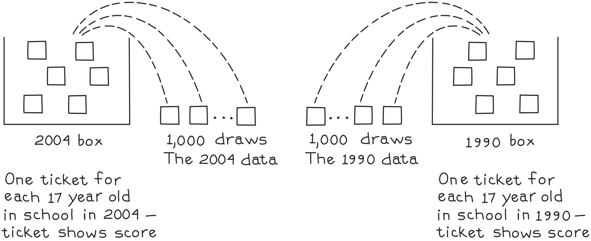
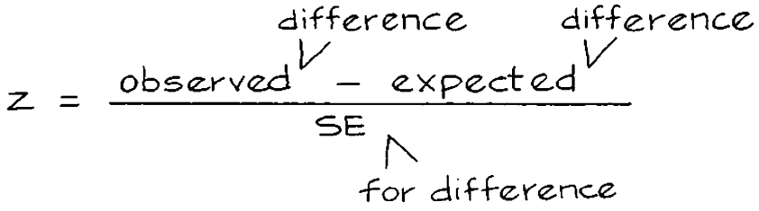

# Comparing Two Sample Averages

National Assessment of Educational Progress (NAEP) giám sát các xu hướng trong kết quả hoạt động của trường học. Mỗi năm, NAEP tổ chức các bài kiểm tra về một số môn học cho một mẫu thanh niên 17 tuổi đang đi học trên toàn quốc.[^2] Bài kiểm tra reading được tổ chức vào năm 1990 và một lần nữa vào năm 2004. Điểm trung bình giảm từ 290 xuống 285. Sự chênh lệch là 5 điểm. Đây có phải là sự thật hay chỉ là một `chance variation`?

Có thể sử dụng `z-test` nhưng việc tính toán phức tạp hơn so với trong Chương 26. Ở đó, giá trị trung bình mẫu được so sánh với một tiêu chuẩn bên ngoài. Ở đây, có hai mẫu và sự khác biệt về mức trung bình của chúng là vấn đề:

\\[
\text{average score in 2004 sample - average score in 1990 sample}
\\]

Cả hai mức trung bình đều có thể thay đổi theo cơ hội và `SE` cho sự chênh lệch phải tính đến điều đó. Có thể sử dụng phương pháp của Mục 1.
Để tính `SE`, bạn cần có mô hình hộp và mô hình này phụ thuộc vào thiết kế của mẫu. Trên thực tế, thiết kế NAEP khá phức tạp nhưng có thể trình bày một phiên bản đơn giản hóa ở đây. Giả sử rằng vào năm 2004 và 1990, bài kiểm tra được thực hiện với một `simple random sample` trên toàn quốc gồm 1.000 thanh niên 17 tuổi hiện đang đi học.

Với thiết kế này, mô hình rất đơn giản. Phải có hai hộp, một hộp cho mỗi năm thi trong hai năm. Hộp năm 2004 có hàng triệu phiếu - mỗi phiếu dành cho mỗi người 17 tuổi lúc đó và đang đi học. Con số trên phiếu cho biết người đó sẽ đạt được bao nhiêu điểm nếu họ làm bài kiểm tra reading NAEP. Dữ liệu năm 2004 giống như 1.000 lần rút ngẫu nhiên từ hộp. Hộp 1990 được thiết lập theo cách tương tự. Thế là hoàn thành mô hình.

`null hypothesis` nói rằng giá trị trung bình của hai hộp bằng nhau. Trên cơ sở đó, sự chênh lệch giữa các mức trung bình của mẫu được kỳ vọng là bằng 0 và sự khác biệt quan sát được chỉ phản ánh sự may mắn của kết quả rút thăm. Trường học không trở nên tồi tệ hơn. `alternative hypothesis` cho rằng mức trung bình của hộp năm 2004 nhỏ hơn mức trung bình của hộp năm 1990 - điểm đọc thực sự đã giảm và đó là lý do tại sao mức trung bình của hai mẫu lại khác nhau. Thống kê z hai mẫu sẽ giúp lựa chọn giữa các giả thuyết này.

Chúng ta bắt đầu với tử số của z-statistic. Đó là sự chênh lệch giữa các mức trung bình mẫu được quan sát: \\(285-290 = -5\\) điểm. Do đó, điểm chuẩn liên quan trong tử số của z là `expected value` của chênh lệch. `expected value` được tính bằng cách sử dụng `null hypothesis`. Trên cơ sở đó, chênh lệch giữa hai giá trị trung bình mẫu dự kiến là 0. Vì vậy tử số của z-statistic là

\\[
-5 - 0 = -5
\\]

Bây giờ là mẫu số. Cần có `SE` cho sự chênh lệch giữa các trung bình mẫu. Lấy từng mẫu một. Năm 2004, `SD` của 1.000 điểm kiểm tra hóa ra là 37. Vì vậy, `SD` của hộp 2004 được ước tính là 37. `SE` của tổng 1.000 điểm kiểm tra năm 2004 được ước tính là \\(\sqrt{1.000} \times 37 \approx 1.170\\). `SE` ở mức trung bình là \\(1.170/1.000 \approx 1.2\\). Năm 1990, `SD` là 40 và `SE` của mức trung bình năm 1990 là 1.3. `SE` của chênh lệch có thể được tính bằng phương pháp của phần trước vì các mẫu là độc lập:

\\[
\sqrt{1.2^2 + 1.3^2} \approx 1.8
\\]

Cuối cùng,

\\[
z \approx -5/1.8 \approx -2.8
\\]

Nói cách khác, sự chênh lệch giữa năm 2004 và 1990 là khoảng 2.8 `SE` thấp hơn `expected value` trong `null hypothesis` - đẩy giới hạn của `chance variation`. Chúng ta bác bỏ `null hypothesis` và chỉ còn lại `alternative hypothesis` rằng sự khác biệt là có thật. Mặt khác, sự khác biệt là nhỏ và các thước đo khác về kết quả hoạt động của trường cho kết quả lạc quan hơn. Chương 29 tiếp tục thảo luận.

z-statistic hai mẫu được tính từ

- kích thước của hai mẫu, •
- giá trị trung bình của hai mẫu,
- `SD` của hai mẫu.

Thử nghiệm giả định hai `simple random sample` độc lập.

Với NAEP, các mẫu đủ lớn để `probability histogram` để mỗi mức trung bình mẫu tuân theo `normal curve`. Sau đó z tuân theo `normal curve`. `z-test` hai mẫu cũng có thể được sử dụng cho phần trăm, như ví dụ tiếp theo cho thấy.[^3]

_Ví dụ 3._ Năm 1999, NAEP nhận thấy rằng 13% học sinh 17 tuổi đã học giải tích, so với 17% vào năm 2004. Sự khác biệt là có thật hay là `chance variation`?

_Giải pháp._ Một lần nữa, hãy giả sử rằng trong hai năm, NAEP lấy `simple random sample` trên toàn quốc gồm một nghìn thanh niên 17 tuổi hiện đang đi học. Ở đây có hai mẫu, do đó cần có `z-test` hai mẫu thay vì phép thử một mẫu (Chương 26). Như trong Ví dụ 2, có hai hộp, một cho năm 2004 và một cho năm 1999. Dữ liệu mang tính chất định tính chứ không phải định lượng, vì vậy số 0 và 1 sẽ xuất hiện trên phiếu. Phiếu được đánh dấu 1 nếu học sinh đã học giải tích và 0 nếu ngược lại. Dữ liệu năm 2004 tương tự 1.000 lần rút thăm từ hộp năm 2004. Hộp 1999 có thể được thiết lập theo cách tương tự. `null hypothesis` nói rằng phần trăm của số 1 trong hai hộp giống nhau. `alternative hypothesis` cho rằng tỷ lệ phần trăm trong hộp năm 2004 lớn hơn tỷ lệ phần trăm trong hộp năm 1999.

Để thực hiện `z-test`, chúng ta cần đặt `SE` cho chênh lệch giữa các phần trăm mẫu. Lấy từng mẫu một. `SE` của số 1 trong mẫu năm 2004 được ước tính là

\\[
\sqrt{1000} \times \sqrt{0.17 \times 0.83} \approx 11
\\]

`SE` cho phần trăm là

\\[
\frac{11}{1000} \times 100\\% = 1.2\\%
\\]

Tương tự, `SE` cho tỷ lệ phần trăm năm 1999 là 1.1%. `SE` cho sự chênh lệch là

\\[
\sqrt{1.2^2 + 1.1^2} \approx 1.6\\%
\\]

Trên `null hypothesis`, chênh lệch dự kiến là 0%. Sự khác biệt quan sát được là \\(17 − 13 = 4\\%\\). Vì vậy, `test statistic` là

\\[
z = \frac{\text{observed difference - expected difference}}{\text{SE for difference}} \approx \frac{4\\% - \\%}{1.6\\%} \approx 2.5
\\]

Một lần nữa, ta bác bỏ giả thiết vô hiệu: \\(P \approx 1\\%\\).

---

[^2]: NAEP 2004: Trends in Academic Progress, http://nces.ed.gov/nationsreportcard. Average scores are as reported in the text; the sample was much larger, and highly designed; the SDs were close to 30. However, the SEs reported in the text are about right. Scores on these standardized performance tests seem to have bottomed out around 1970, with minor variations up and down since then. Using the pooled sample variance in the denominator of the test statistic would not be appropriate here, because the population variances may differ—even if the null hypothesis is true.

[^3]:For the data source, see note 2. Three other tests are widely used for this sort of problem, besides the one presented in the text:\
    (i) Given the null hypothesis, the percentage of 1’s in the two boxes is the same, and can be estimated by pooling the two samples:
    \\[
    \frac{107 + 132}{200 + 300} = \frac{239}{500} \approx 48\\%
    \\]
    Trên cơ sở đó, `SD` chung của hai hộp được ước tính là
    \\[
    \sqrt{0.48 \times 0.52} \approx 0.50
    \\]
    This pooled SD can be used to compute the SE in the denominator of the test statistic. (However, the pooled SD should not be used for other purposes, like putting confidence intervals around the difference.)\
    (ii) Fisher’s "exact" test conditions on the total number of 1’s in the two samples. The test statistic is the number of 1’s in (say) the first sample; the sample sizes are fixed. The null distribution is the hypergeometric.\
    (iii) The \\(\chi^2\\) statistic may be computed from the \\(2 \times 2\\) table, and referred to a \\(\chi^{2}\_{1}\\) - distribution.\
    Conditional on the total number of 1’s in the two samples, test statistic (i) is a monotone function of the number of 1’s in the first sample; so tests (i) and (ii) are equivalent. In effect, the hypergeometric has been approximated by the normal, which is fine for reasonably large samples. Likewise, (iii) is equivalent to (i) and (ii); indeed, \\(\chi^2 \equiv Z\*1^2\\), where \\(Z*1\\) is the z-statistic computed with the pooled `SD`. If \\(Z\\) is the `z-statistic` computed from the separate SDs, as in the text, then \\(Z^2 > Z_1^2\\). However, as will be shown below, conditional on the total number of 1’s in the two samples, \\(Z\\) is a monotone function of the number of 1’s in the first sample. So our test is equivalent to tests (i)-(ii)-(iii).\
    Some notation will be helpful. Let \\(\xi\\) be the number of heads in n tosses of a p-coin, and \\(\hat{q} = \xi/n\\). Let \\(\zeta\\) be the number of heads in m tosses of a q-coin, and \\(\hat{q} = \zeta/m\\). The two coins are independent. The null hypothesis is that \\(p = q\\); the alternative, \\(p ̸= q\\). We condition on \\(s = \xi + \zeta\\) . Let \\(r = s/(m + n)\\). This r will be held constant.\
    For (i), the variance is computed as
    \\[
    v = r(1 - r)(\frac{1}{n} + \frac{1}{m})
    \\]
    and the test statistic is
    \\[
    Z_1 = (\hat{p} - \hat{q})/\sqrt{v}
    \\]
    For our test statistic, the variance is computed as
    \\[
    w = \frac{\hat{p}(1 - \hat{p})}{n} + \frac{\hat{q}(1 - \hat{q})}{m}
    \\]
    and the test statistic is
    \\[
    Z = (\hat{p} - \hat{q})/\sqrt{w}
    \\]
    We view m, n, and \\(r = s/(m + n)\\) as fixed; tacitly, we have assumed \\(0 < \hat{p}, \hat{q}, r < 1\\). It will be convenient to introduce the new variable \\(x = \hat{p} − r\\), so \\(\hat{q} = r − (nx/m)\\). Clearly, x takes only finitely many values. (Later, however, it will be convenient to think of x as running through the whole interval from its minimum value to its maximum.) Now
    \\[
    <!-- \begin{align*} -->
    \hat{p}(1 - \hat{p}) &= r(1 - r) + (1 - 2r)x - x^2 \\\\
    \hat{q}(1 - \hat{q}) &= r(1 - r) - \frac{n}{m}(1 - 2r)x - \frac{n^2}{m^2}x^2
    <!-- \end{align*} -->
    \\]
    The two variances are related as follows:
    \\[
    w = v + bx - cx^2
    \\]
    where
    \\[
    b = (\frac{1}{n} - \frac{n}{m^2})(1 - 2r), \quad c = \frac{1}{n} + \frac{n^2}{m^3}
    \\]
    Finally, our test statistic is
    \\[
    Z = \frac{m + n}{m}x/\sqrt{v + bx - cx^2}
    \\]
    Of course, w, v, and c are all positive; b may be positive or negative. The monotonicity of Z as a function of x follows from the lemma below.\
    \_Lemma.* Let v, c > 0 and let b be real. Confine x to the interval where \\(v + bx − cx2 > 0\\).\
    Let
    \\[
    f(x) = x/\sqrt{v + bx - cx^2}
    \\]
    Then f(x) is monotone increasing with x.\
    _Proof._ If \\(b \leq 0\\), this is trivial; so let b > 0. Then
    \\[
    \frac{df}{dx} = \frac{2v + bx}{2(v + bx - cx^2)^{3/2}} > 0
    \\]
