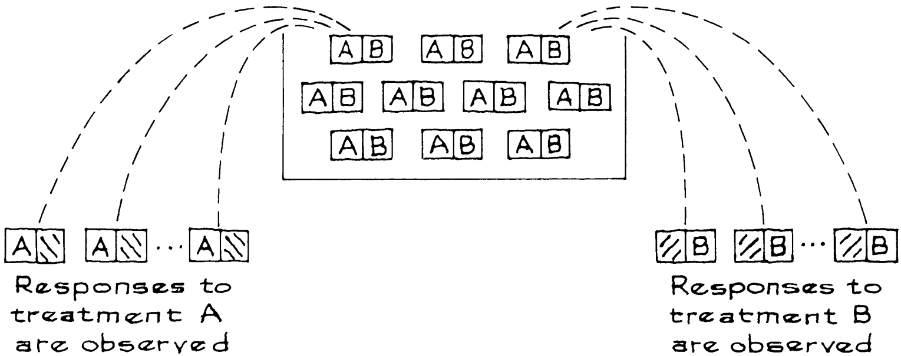

# Experiments

Phương pháp của Mục 2 cũng có thể được sử dụng để phân tích một số loại dữ liệu thực nghiệm nhất định, trong đó các nhà điều tra chọn ngẫu nhiên một số đối tượng nhận điều trị "A" và những đối tượng khác được nhận "B". Ví dụ, trong thử nghiệm thực địa vắc xin Salk, phương pháp điều trị A sẽ là vắc xin; điều trị B, nhóm đối chứng dùng giả dược (Chương 1). Chúng ta bắt đầu bằng một ví dụ để minh họa cơ chế và sau đó giải thích lý do tại sao phương pháp này hoạt động.

_Ví dụ 4._ Có 200 đối tượng trong một thử nghiệm lâm sàng nhỏ về vitamin C. Một nửa số đối tượng được chỉ định ngẫu nhiên vào nhóm điều trị (2.000 mg vitamin C mỗi ngày) và một nửa vào nhóm đối chứng (2.000 mg giả dược). Trong suốt thời gian thử nghiệm, nhóm điều trị bị cảm lạnh trung bình 2.3 lần và `SD` là 3.1. Nhóm đối chứng còn tệ hơn một chút: họ có trung bình 2.6 lần cảm lạnh và `SD` là 2.9. Sự khác biệt về giá trị trung bình có ý nghĩa thống kê không?

_Giải pháp._ Sự khác biệt giữa hai mức trung bình là −0.3 và bạn cần đặt `standard error` cho con số này. Chỉ cần giả vờ rằng bạn có hai mẫu độc lập được lấy ngẫu nhiên có thay thế. `SE` của tổng điều trị là \\(\sqrt{100} \times 3.1 = 31\\); `SE` của mức trung bình điều trị là \\(31/100 = 0.31\\). Tương tự, `SE` cho mức trung bình đối chứng là 0.29. `SE` cho sự chênh lệch là

\\[
\sqrt{0.31^2 + 0.29^2} \approx 0.42
\\]

Giả sử `null hypothesis` đúng: vitamin C không có tác dụng. Trên cơ sở này, `expected value` của chênh lệch là 0.0. Sự chênh lệch quan sát được là −0.3. Do đó

\\[
z = \frac{\text{observed difference - expected difference}}{\text{SE for difference}} = \frac{-0.3 - 0.0}{0.42} \approx -0.7
\\]

Sự chênh lệch có thể dễ dàng là do sự ngẫu nhiên: có quá nhiều người dễ bị tổn thương được xếp vào nhóm đối chứng.[^9]

Bây giờ, hãy nhìn vào hậu trường. Khi làm ví dụ này, bạn được yêu cầu giả vờ rằng các mẫu điều trị và đối chứng được lấy độc lập, ngẫu nhiên có thay thế, từ hai hộp. Tuy nhiên, thí nghiệm đã không được thực hiện theo cách đó. Có 200 đối tượng; 100 người được chọn ngẫu nhiên - không thay thế - để nhận vitamin C; 100 người còn lại dùng giả dược. Vì vậy, các lần rút được thực hiện không thay thế. Hơn nữa, các mẫu phụ thuộc. Ví dụ, một đối tượng có thể khá dễ bị cảm lạnh. Nếu đối tượng này thuộc nhóm vitamin C thì anh ta không thể thuộc nhóm giả dược. Do đó, việc phân công ảnh hưởng đến cả hai mức trung bình.

Tại sao `SE` lại hoạt động bình thường, bất chấp những vấn đề này? Lý do phụ thuộc vào mô hình hộp. Các nhà điều tra đang tiến hành một thử nghiệm. Họ chọn ngẫu nhiên một nhóm đối tượng để nhận điều trị A và một nhóm khác để nhận điều trị B. Như thường lệ, mô hình có một phiếu cho từng đối tượng. Nhưng bây giờ vé có hai số. Một cho thấy phản ứng sẽ như thế nào đối với phương pháp điều trị A; cái còn lại, đối với phương pháp điều trị B. Xem Hình 1. Chỉ có thể quan sát được một trong hai con số, bởi vì đối tượng chỉ có thể được áp dụng một trong hai phương pháp điều trị.

**
Hình 1. Một thí nghiệm đối chứng ngẫu nhiên so sánh phương pháp điều trị A và B. Có một phiếu cho mỗi đối tượng. Phiếu có hai số: một số thể hiện phản ứng của đối tượng với phương pháp điều trị A; còn lại là điều trị B. Chỉ có thể quan sát được một trong hai con số.
**

Trong mô hình, một số phiếu được rút ngẫu nhiên không thay thế từ hộp và quan sát thấy phản ứng với cách xử lý A. Dữ liệu về phương pháp điều trị A giống như đợt phản hồi đầu tiên này. Sau đó, nhiều lần rút ngẫu nhiên hơn được thực hiện không thay thế từ hộp và quan sát thấy phản ứng với cách xử lý B. Dữ liệu về phương pháp điều trị B giống như đợt phản hồi thứ hai này. Trong Ví dụ 4, mỗi người trong số 200 đối tượng được chỉ định dùng vitamin C hoặc dùng giả dược. Trong trường hợp như vậy, mẫu thứ hai chỉ bằng số phiếu còn lại trong hộp sau khi mẫu đầu tiên được rút ra.

`null hypothesis` cho rằng phản ứng giống nhau đối với cả hai phương pháp điều trị.[^10] Để kiểm tra giả thuyết này, các nhà điều tra thường so sánh mức trung bình (hoặc phần trăm):

\\[
\text{average response in group A - average response in group B}
\\]

`SE` cho sự chênh lệch này là gì? Giải pháp cho Ví dụ 4 dường như liên quan đến hai sai lầm được đề cập trước đó

- Các lần rút được thực hiện không thay thế, nhưng các `SE` được tính toán như khi rút có thay thế.
- Hai giá trị trung bình này phụ thuộc vào nhau nhưng các `SE` được kết hợp với nhau như thể trung bình là độc lập.

Khi số lần rút ít so với số phiếu trong hộp thì không có sai sót nào nghiêm trọng. Có rất ít sự khác biệt giữa lần rút có hoặc không thay thế, và sự phụ thuộc giữa các mức trung bình cũng rất nhỏ. Gần như có hai hộp riêng biệt, một hộp dành cho nhóm điều trị và một hộp dành cho nhóm đối chứng. Tuy nhiên, mô hình "hai hộp" không thực tế đối với một thử nghiệm ngẫu nhiên có kiểm soát - trừ khi các đối tượng thực sự được chọn làm mẫu ngẫu nhiên từ một quần thể lớn. Điều đó thật bất thường, mặc dù bài tập 8 (tr. 520) đưa ra một ví dụ.

Nếu số lần rút lớn so với kích thước của hộp - và đây là trường hợp thông thường - thì bản thân tác động của mỗi sai sót có thể rất đáng kể. Ví dụ, khi một nửa số đối tượng được phân vào mỗi nhóm điều trị, như trong Ví dụ 4, hệ số hiệu chỉnh sẽ nhỏ hơn đáng kể 1 ([Mục 20.4](../ch20/ch20-04.md)). Sự phụ thuộc cũng có thể mạnh. Điều may mắn là khi áp dụng cho các thử nghiệm ngẫu nhiên, quy trình của Mục 2 mang tính thận trọng, có xu hướng đánh giá quá cao `SE` một lượng nhỏ. Đó là vì hai sai sót bù đắp cho nhau.

- Sai sót đầu tiên thổi phồng `SE`.
- Sai sót thứ hai khiến `SE` lùi lại.

> Có một hộp. Mỗi phiếu có hai số. Một cho thấy phản ứng sẽ như thế nào đối với phương pháp điều trị A; còn lại là điều trị B. Chỉ có thể quan sát được một trong các con số. Một số phiếu được rút ngẫu nhiên không thay thế từ hộp. Trong mẫu này, quan sát phản ứng với phương pháp điều trị A. Sau đó, mẫu thứ hai được rút ngẫu nhiên không thay thế các phiếu còn lại. Trong mẫu thứ hai, quan sát phản ứng với phương pháp điều trị B.
>
> `SE` cho sự chênh lệch giữa hai giá trị trung bình mẫu có thể được ước tính một cách thận trọng như sau:
>
> 1. tính `SE` cho các giá trị trung bình như thể các phép rút được thực hiện có thay thế;
> 2. kết hợp các `SE` như thể các mẫu độc lập.

Để làm cho phép toán hoạt động, `SE` cho hai giá trị trung bình mẫu phải được tính trên cơ sở rút CÓ thay thế- mặc dù các lần rút được thực hiện KHÔNG thay thế. Đó là điều bù đắp cho sự phụ thuộc giữa hai mẫu.[^11] Tóm lại: khi dữ liệu đến từ một thử nghiệm ngẫu nhiên (như ví dụ 4), quy trình ở Mục 2 có thể được sử dụng ngay cả khi có sự phụ thuộc.

--- 
[^9]: For references to real trials on vitamin C, with interesting sidelights on blinding the randomization, see note 12, chapter 2.

[^10]: A weaker version of the null is sometimes used: the average response is the same for both treatments. With the strict null, there is really only one number for each ticket (copied into both fields). The strict null is appropriate in many cases, and always has the charm of simplicity. However, the weak null may be more realistic if the new treatment hurts some subjects but helps others. Moreover, some alternative hypotheses do seem to require two numbers for each subject, one for the response to treatment and one for the response to placebo. The discussion continues in note 11.

[^11]: Consider a clinical trial to compare treatments A and B. We consider the weak form of the null, as in note 10; and the alternative, which does not constrain the responses at all. Suppose there are N subjects, indexed by \\(i = 1,..., N\\). Let \\(x_i\\) be the response of subject i to treatment A; likewise, \\(y_i\\) is the response to B. For each i, either \\(x_i\\) or \\(y_i\\) can be observed, but not both. Let
\\[
\begin{align*}
\bar{x} &= \frac{1}{N}\sum_{i=1}^{N}x_i     &    \bar{y} &= \frac{1}{N}\sum_{i=1}^{N}y_i\\\\
\sigma^2 &= \frac{1}{N}\sum_{i=1}^{N}(x_i - \bar{x})^2  &  \tau^2 &=  \frac{1}{N}\sum_{i=1}^{N}(y_i - \bar{y})^2
\end{align*}\\\\
cov(x,y) = \frac{1}{N}\sum_{i=1}^{N}(x_i - \bar{x})(y_i - \bar{y})
\\]\
This model is sufficiently flexible to handle the weak form of the null hypothesis (note 10), as well as subject-to-subject heterogeneity under the alternative hypothesis. Thus, for instance, the average difference between treatments A and B—averaged over all the subjects in the study is \\(\bar{x} − \bar{y}\\). This “average causal effect” measures the difference between putting all the subjects into regime A, or putting all of them into regime B. The average causal effect is often the key parameter. And it is estimable, although the two responses are not simultaneously observable for any individual subject. Indeed, \\(\bar{x}, \bar{y}, \sigma^2,\text{ and }\tau^2\\) are all estimable; on the other hand, \\(cov(x, y)\\) cannot be estimated by a sample covariance.\
Responses in treatment and control are often modeled, for instance, as independent binomialwith two different \\(p\\)'s, or independent normals with two different \\(\mu\\)'s. These parametric modelsseem less realistic. Independence of the two sample averages is generally wrong, and there is noreason to assume subjects are exchangeable within each treatment group. Such assumptions arenot secured by randomization, which only makes the two groups comparable as groups. Thus,theoretical underpinnings are absent for, e.g., the t-test. It is surprising—and reassuring—thatthe permutation distributions of the conventional test statistics more or less coincide with themodel-based distributions, at least in the contexts we are considering.\
We now compute the variance of \\(\bar{X} − \bar{Y}\\) under the alternative hypothesis, in our permutationsetup. Let S be a random subset of \\({1,..., N}\\), with n elements; this group gets treatment A, so \\(x_i\\) is observed for \\(i \in S\\). Let T be a random subset of \\({1,..., N}\\), with m elements, disjoint from S. This group gets treatment B, so \\(y_j\\) is observed for \\(j \in T\\) . We estimate the population means \\(\bar{x}\\) and \\(\bar{y}\\) by the sample means
\\[
\bar{X} = \frac{1}{n}\sum_{i \in S}x_i \quad \bar{Y} = \frac{1}{m}\sum_{j \in T}y_i
\\]
By combinatorial calculations,
\\[
var \bar{X} = \frac{N - n}{N - 1} \frac{\sigma^2}{n} \quad var \bar{Y} = \frac{N - m}{N - 1}\frac{\tau^2}{m}\\\\
cov(\bar{X},\bar{Y}) = -\frac{1}{N - 1}cov(x,y)
\\]
Thus
\\[
\begin{align*}
var(\bar{X}, \bar{Y}) &= \frac{N - n}{N - 1} \frac{\sigma^2}{n} + \frac{N - m}{N - 1}\frac{\tau^2}{m} + \frac{2}{N - 1}cov(x,y)\\\\
 &= \frac{N}{N - 1}(\frac{\sigma}{n} + \frac{\tau^2}{m}) + \frac{1}{N - 1}[2cov(x,y) - \sigma^2 - \tau^2]\\\\
&\leq \frac{N}{N - 1}(\frac{\sigma^2}{n} + \frac{\tau^2}{m})
\end{align*}
\\]\
because \\(cov(x, y) \leq \sigma \tau\\) and \\(2\sigma \tau − \sigma^2 − \tau^2 \leq 0\\). The "conservative estimate" in the text is \\(\sigma^2/n + \tau^2/m\\). In practice, \\(\sigma^2\\) and \\(\tau^2\\) would be estimated by sample variances.\
The signs may be a little perplexing. In general, we expect x and y to be positively correlated over all subjects. If too many subjects with high x-values are assigned to treatment A, then too few with high y-values are left for B. So the sample averages \\(\bar{X}\\) and \\(\bar{Y}\\) are negatively correlated. In principle, \\(cov(x, y)\\) should be near its upper limit \\(\sigma \tau\\) , at least when x and y are highly correlated across subjects. Then the "conservative estimate" should be reasonably accurate for large samples. The strict null hypothesis in the text specifies that \\(x \equiv y\\). Then \\(\sigma = \tau\\) , and thecalculation is exact under the null hypothesis. Also see note 14 below. Of course, if N is largerelative to m and n, then \\(\bar{X}\\) and \\(\bar{Y}\\) are nearly independent; again, the "conservative estimate" willbe nearly right.\
The impact of other variables may be handled as follows. Let η denote treatment status. Letω denote the state of other variables influencing the response. We assume there is a function f such that the response of subject i to treatment is \\(f(i, η, \omega)\\). Let \\(\rho\\) denote the assignment variable:if \\(\rho(i) = A\\) then subject i is assigned to treatment A, and likewise for B. We assume that \\(\rho\\) and \\(\omega\\) are independent: given \\(\omega\\), the law of \\(\rho\\) is uniform over all partitions of the subjects into a groupS of cardinality n assigned to A and another group of cardinality m assigned to B. The objectof randomization, blinding, etc. is to secure this assumption. Then our argument can be doneseparately for each \\(\omega\\), with
\\[
\begin{align*}
x_i &= f(i,A,\omega) \quad \text{for } i \in S \\\\
y_j &= f(j,B,\omega) \quad \text{for } j \in T
\end{align*}
\\]
Few experiments are done on random samples of subjects. Instead, there is some initialscreening process. Only subjects who pass the screen are randomized, and these subjects are bestviewed as a sample of convenience. Therefore, some care is needed in setting up the inferenceproblem. In our model, each subject has two potential responses, one to the treatment regimeand one to the control regime. The "population" consists of pairs of responses. Both responsescannot be simultaneously observed for any subject. The experiment generates data not for thewhole population, but for part of it. We observe responses to the treatment regime for subjects inthe treatment group, and responses to the control regime for subjects in the control group. Thestatistical inference is from these observations to parameters characterizing the set of pairs ofresponses for the subjects that are randomized. The inference is not to some larger population ofsubjects—that kind of generalization would not be automatically justified by randomization. Thisis one aspect of Campbell’s distinction between "internal validity" and "external validity:" seeW. R. Shadish, T. D. Cook, W. T. Campbell, _Experimental and Quasi-Experimental Designs forGeneralized Causal Inference_(Houghton Mifflin, 2002).\
We are thinking primarily of experiments where subjects are divided into two random groups. However, similar comments apply if, for instance, subjects are paired by some ad hoc procedure; then a coin is tossed for each pair, choosing one subject for the treatment regime and one for the control regime. Again, the inference is to parameters characterizing the set of possible responses, and is made conditionally on the set of subjects and the pairing.\
The model seems to go back to Neyman’s early work on agricultural experiments. Some
references:\
J. Neyman, "Sur les applications de la theorie des probabilit ´ es aux experiences agricoles: Essai des principes,” Roczniki Nauk Rolniczki vol. 10 (1923) pp. 1–51, in Polish; English translation by D. Dabrowska and T. Speed, Statistical Science, vol. 5 (1990) pp. 463–80.\
H. Scheffe, “Models in the analysis of variance,” ´ Annals of Mathematical Statistics vol. 27 (1956) pp. 251–71.\
J. L. Hodges, Jr. and E. Lehmann, Basic Concepts of Probability and Statistics (Holden-Day, 1964, section 9.4; 2nd ed. reprinted by SIAM, 2004).\
D. Rubin, “Estimating causal effects of treatments in randomized and nonrandomized studies,” Journal of Educational Psychology vol. 66 (1974) pp.688–701.\
J. Robins, “Confidence interval for causal parameters,” Statistics in Medicine vol. 7 (1988) pp. 773–85.\
P. Holland, “Causal inference, path analysis, and recursive structural equations models,”\
Sociological Methodology 1988, C. Clogg, editor (American Sociological Association, Washington, D.C., Chapter 13.)\
L. Dumbgen, "Combinatorial stochastic processes," Stochastic Processes and their Applications vol. 52 (1994) pp. 75–92.\
D. A. Freedman, Statistical Models: Theory and Practice (Cambridge University Press, 2005).\
Minor technical issues: (i) The relevant central limit theorem is for sampling without replacement (note 1, chapter 23). (ii) For small samples, the t-distribution may not provide a better approximation than the normal: the assumptions underlying the t-test do not hold.

