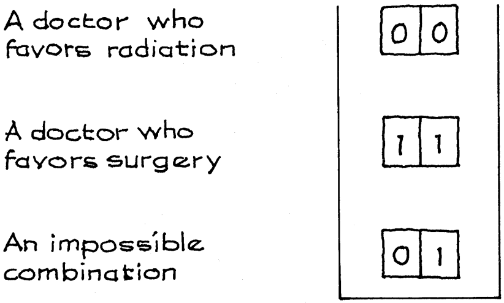

# More on Experiments

Kỹ thuật được mô tả trong phần trước cũng có thể được sử dụng cho các thử nghiệm trong đó phản hồi mang tính định tính hơn là định lượng, do đó, phiểu phải hiển thị số 0 và 1. Mục này sẽ đưa ra một ví dụ; nhưng trước tiên, một số tài liệu nền tảng. Lý thuyết tiêu chuẩn về hành vi kinh tế giả định việc ra quyết định "hợp lý", tuân theo các quy tắc chính thức (và có lẽ không thực tế) nhất định. Đặc biệt, lý thuyết này cho rằng những người ra quyết định phản ứng với các sự kiện chứ không phải cách trình bày các sự kiện. Mặt khác, các nhà tâm lý học có xu hướng nghĩ rằng việc "đóng khung" - cách trình bày - có giá trị. Công việc thực nghiệm ủng hộ quan điểm tâm lý học.[^12]

Một nghiên cứu của Amos Tversky và những người khác liên quan đến việc trình bày thông tin về hiệu quả của phẫu thuật hoặc xạ trị như những liệu pháp thay thế cho bệnh ung thư phổi. Đối tượng là một nhóm gồm 167 bác sĩ đang tham gia khóa học mùa hè tại Harvard.[^13] Thông tin được trình bày theo hai cách khác nhau. Một số bác sĩ nhận được form A, báo cáo tỷ lệ tử vong.

_Form A)_ Trong 100 người được phẫu thuật, có 10 người chết trong quá trình điều trị, 32 người chết sau một năm và 66 người chết sau 5 năm. Trong số 100 người được xạ trị, không ai chết trong quá trình điều trị, 23 người sẽ chết sau một năm và 78 người sẽ chết sau 5 năm.

Các bác sĩ khác có loại B, báo cáo tỷ lệ sống sót.

_Form B)_ Trong số 100 người được phẫu thuật, 90 người sẽ sống sót sau điều trị, 68 người sẽ sống sót sau một năm hoặc lâu hơn và 34 người sẽ sống sót sau 5 năm hoặc lâu hơn. Trong số 100 người được xạ trị, tất cả sẽ sống sót sau quá trình điều trị, 77 người sẽ sống sót sau một năm hoặc lâu hơn và 22 người sẽ sống sót sau 5 năm hoặc lâu hơn.

Cả hai form đều chứa thông tin giống hệt nhau. Ví dụ, 100 bệnh nhân sẽ chết trong khi phẫu thuật (form A), do đó 90 trong số 100 bệnh nhân sẽ sống sót (form B). Đến năm thứ năm, viễn cảnh của bệnh nhân ung thư phổi khá ảm đạm.

Trong thí nghiệm, 80 trong số 167 bác sĩ được chọn ngẫu nhiên và được đưa cho form A. 87 người còn lại nhận được form B. Sau khi đọc dạng, mỗi bác sĩ viết ra liệu pháp mà họ muốn giới thiệu cho bệnh nhân ung thư phổi. Đáp lại form A, 40/80 bác sĩ chọn phẫu thuật (Bảng 1). Nhưng đáp lại form B, 73/87 người ủng hộ phẫu thuật: 40/80 là 50%, 73/87 là 84%. Phong cách trình bày có vẻ quan trọng.

**
Bảng 1. Kết quả từ một thử nghiệm về tác động của việc trình bày dữ liệu.
**

|                          | Form A | Form B |
| ------------------------ | ------ | ------ |
| Favored surgery          | 40     | 73     |
| Favored radiation        | 40     | 14     |
| Total                    | 80     | 87     |
| Percent favoring surgery | 50%    | 84%    |

Một nhà kinh tế đang bảo vệ lý thuyết quyết định tiêu chuẩn có thể lập luận rằng sự khác biệt chỉ là do ngẫu nhiên. Dựa trên thông tin giống nhau trên cả hai hình thức, một số bác sĩ sẽ đề nghị phẫu thuật trong khi những người khác sẽ chọn xạ trị. Nhưng quyết định không thể phụ thuộc vào cách trình bày thông tin. Nhờ sự may mắn của cuộc rút thăm, nhà kinh tế học có thể nói, có quá nhiều bác sĩ ủng hộ phẫu thuật được chọn để nhận form B, và quá ít người trong số họ được chọn form A. Suy cho cùng, chỉ có 80 người ở nhóm A, và 87 người ở nhóm B. Dường như có rất nhiều chỗ cho `chance variation`.

Để đánh giá lập luận này, cần phải kiểm tra ý nghĩa. Sự khác biệt giữa hai tỷ lệ phần trăm trong Bảng 1 là 34% và bạn cần đặt `standard error` cho sự khác biệt này. Có thể sử dụng phương pháp của Ví dụ 4. Giả sử bạn có hai mẫu độc lập, được lấy ngẫu nhiên có thay thế. Mẫu đầu tiên là các bác sĩ thuộc form A. Có 80 người trong số họ và 40 người được ưu tiên phẫu thuật. `SE` cho số favoring surgery là

\\[
\sqrt{80} \times \sqrt{0.50 \times 0.50} \approx 4.5
\\]

`SE` cho tỷ lệ favoring surgery là \\(4.5/80 \times 100\\% \approx 5.6\\%\\). Mẫu thứ hai là các bác sĩ nhận form B, `SE` cho tỷ lệ favoring surgery trong phản hồi từ form B là 3.9%. `SE` cho sự chênh lệch là

\\[
\sqrt{5.6^2+3.9^2} \approx 6.8\\%
\\]

Trên `null hypothesis`, sự chênh lệch dự kiến giữa tỷ lệ phần trăm trong hai mẫu là 0.0%. Sự chênh lệch quan sát được là 34%. `test statistic` là

\\[
z = \frac{\text{observed difference - expected difference}}{\text{SE for difference}} = \frac{34\\% - 0.0\\%}{6.8\\%} = 5.0
\\]

Chance không phải là lời giải thích hợp lý cho kết quả ở Bảng 1.

Một cái nhìn khác sau hậu trường: Một mô hình hộp cho thí nghiệm này cần có một phiếu cho mỗi bác sĩ. Như trong phần trước, mỗi phiếu hiển thị một cặp các số [A,B].
Số đầu tiên trên phiếu mã hóa phản hồi ở form A. Đó là 1 nếu bác sĩ favor surgery khi được đưa ra form A và 0 nếu cô ấy thích xạ trị. Tương tự, số thứ hai trên phiếu mã hóa phản hồi ở form B.

80 lần rút được thực hiện ngẫu nhiên không thay thế từ hộp và các phản hồi về form A được quan sát là [A] . Các phản hồi cho form A trong thí nghiệm giống như lô 80 lần rút thăm đầu tiên này. 50% trong Bảng 1 giống như tỷ lệ phần trăm của 1 trong lô rút thăm này. 87 phiếu còn lại trong hộp là mẫu thứ hai. Với mẫu thứ hai này, các phản hồi đối với form B được quan sát thấy [B] . Các câu trả lời cho form B giống như lô thứ hai gồm 0 và 1. 84% trong Bảng 1 tương tự tỷ lệ phần trăm của 1 trong mẫu thứ hai.

Bây giờ `null hypothesis` có thể được thiết lập dưới dạng mô hình. Vì cả hai form đều truyền tải thông tin giống nhau nên nhà kinh tế cho rằng phản hồi của bác sĩ đối với hai form này phải giống nhau nên cả hai con số trên phiếu đều giống nhau (Hình 2). Mô hình hộp có thể được sử dụng để chỉ ra rằng phương pháp của chúng ta đưa ra ước tính thận trọng cho `SE`.[^14]

**
Hình 2. `null hypothesis` cho thí nghiệm: quyết định giữa xạ trị và phẫu thuật dựa trên form A hoặc form B với cùng thông tin. Số đầu tiên trên phiếu mã hóa câu trả lời ở form A; thứ hai, ở B. Các phản hồi favoring surgery được mã hóa là "1".
**

Thiết kế thử nghiệm được sử dụng trong nghiên cứu này có vẻ hơi gián tiếp. Tại sao không lần lượt đưa ra cả hai dạng bảng câu hỏi cho tất cả các bác sĩ? Lý do rất đơn giản. Việc hỏi cả hai câu hỏi cùng lúc sẽ thúc đẩy các đối tượng trở nên nhất quán hơn: có lẽ họ thấy rằng cả hai form đều mô tả cùng một dữ liệu.[^15]

---

[^12]: A. Tversky and D. Kahneman, “Rational choice and the framing of decisions,” Journal of Business vol. 59, no. 4, part 2 (1986) pp. S251–78. Also see D. Kahneman and A. Tversky, “On the reality of cognitive illusions,” Psychological Review vol. 103 (1996) pp. 582–96 (with discussion); D. Kahneman and A. Tversky, editors, Choices, Values, and Frames (Cambridge University Press, 2000); A. K. Sen, Rationality and Freedom (Harvard University Press, 2002).

[^13]: B. J. McNeil, S. G. Pauker, H. C. Sox, Jr., and A. Tversky, “On the elicitation of preferences for alternative therapies,” New England Journal of Medicine vol. 306 (1982) pp. 1259–62.

[^14]: There were \\(80 + 87 = 167\\) subjects in all (table 1). Of them, \\(40 + 73 = 113\\) favored surgery; the remaining 54 favored radiation. The strict null hypothesis (note 10) specifies \\(x \equiv y\\), so \\(\sigma = \tau\\) and both are computable from the data. Indeed, on the null hypothesis, the percentage of doctors favoring surgery is \\(113/167 \times 100\\% \approx 68\\%\\). Then
    \\[
    \sigma = \tau \approx \sqrt{0.68 \times 0.32} \approx 0.47
    \\]
Likewise, the covariance between \\(\bar{X}\\) and \\(\bar{Y}\\) can be computed exactly. This term achieves the upper bound \\(\sigma \tau = \sigma^2\\), because the correlation between x and y across subjects is 1. Now
\\[
var(\bar{X} - \bar{Y}) = \frac{N}{N - 1}(\frac{1}{n} + \frac{1}{m})\sigma^2
\\]
The two forms of the test statistic (pooled or separate SDs, see note 3) are virtually identical. For example, if the null hypothesis defines the model, the r.m.s. difference between the values of the two statistics is only 0.013. Furthermore, the normal approximation is quite good: for either statistic, the chance of exceeding 2 in absolute value is about 4.8%, compared to the normal tail probability of 4.6%.

[^15]: D. Kahneman and A. Tversky, “Choices, values, and frames,” American Psychologist vol. 39 (1984) pp. 341–50.
