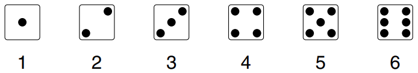

# Introduction

Nó fit với thực tế đến mức nào? Sớm hay muộn, câu hỏi này phải được hỏi về bất kỳ mô hình chance nào. Và trong nhiều trường hợp, nó có thể được giải quyết bằng \\(\chi^2-test\\) (do Karl Pearson phát minh vào năm 1900).[^1] \\(\chi\\) là một chữ cái Hy Lạp, thường được viết là "chi", đọc giống như chữ "ki" trong kite, vì vậy \\(\chi^2\\) được đọc là "ki-square". [Mục 26.5](../ch26/ch26-05.md) đã giải thích cách kiểm tra mô hình chance cho một thí nghiệm cận tâm lý học. Ở đó, mỗi lần đoán được phân thành một trong hai loại - đúng hoặc sai. Theo mô hình, một lần đoán có 1/4 cơ hội đúng nên số lần đoán đúng bằng tổng các lần rút từ hộp

Trong trường hợp đó, `z-test` là phù hợp nhưng chỉ có hai loại liên quan. Nếu có nhiều hơn hai loại, các nhà thống kê sử dụng \\(\chi^2\\) thay vì phép `z-test`. Ví dụ, bạn có thể muốn xem liệu xúc xắc có công bằng hay không. Mỗi lần ném có thể được phân thành một trong 6 loại:

\\(\chi^2-test\\) sẽ giúp kiểm tra xem các loại này có khả năng xảy ra như nhau hay không, như trong ví dụ tiếp theo.

_Ví dụ 1._ Một người đánh bạc bị buộc tội sử dụng xúc sắc gian lận nhưng anh ta bào chữa vô tội. Hồ sơ 60 lần ném gần nhất (Bảng 1). Có sự bất đồng về cách giải thích dữ liệu và một nhà thống kê được gọi đến.

**
Bảng 1. 60 lần tung xúc xắc có thể được gian lận.
**

|     |     |     |     |     |     |     |     |     |     |
| --- | --- | --- | --- | --- | --- | --- | --- | --- | --- |
| 4   | 3   | 3   | 1   | 2   | 3   | 4   | 6   | 5   | 6   |
| 2   | 4   | 1   | 3   | 3   | 5   | 3   | 4   | 3   | 4   |
| 3   | 3   | 4   | 5   | 4   | 5   | 6   | 4   | 5   | 1   |
| 6   | 4   | 4   | 2   | 3   | 3   | 2   | 4   | 4   | 5   |
| 6   | 3   | 6   | 2   | 4   | 6   | 4   | 6   | 3   | 2   |
| 5   | 4   | 6   | 3   | 3   | 3   | 5   | 3   | 1   | 4   |

_Thảo luận._ Nếu con bạc vô tội thì các số ở Bảng 1 giống như kết quả rút 60 lần (ngẫu nhiên có thay thế) từ hộp

Theo mô hình này, mỗi số sẽ xuất hiện khoảng 10 lần: _expected frequency_ là 10. Để tìm hiểu xem dữ liệu so sánh với kỳ vọng như thế nào, bạn phải đếm và xem trên thực tế mỗi số đã xuất hiện bao nhiêu lần. _Observed frequencies_ được trình bày trong Bảng 2. Kiểm tra số học: tổng của mỗi cột tần số phải là 60, tổng số mục trong Bảng 1. ("Frequncy" là thuật ngữ thống kê cho số lần xảy ra điều gì đó).

**
Bảng 2. Tần suất quan sát và dự kiến của dữ liệu trong Bảng 1.
**

| Value | Observed frequency | Expected frequency |
| ----- | ------------------ | ------------------ |
| 1     | 4                  | 10                 |
| 2     | 6                  | 10                 |
| 3     | 17                 | 10                 |
| 4     | 16                 | 10                 |
| 5     | 8                  | 10                 |
| 6     | 9                  | 10                 |
|       |                    |                    |
| sum   | 60                 | 60                 |

Như bảng chỉ ra, có quá nhiều số 3. `SE` cho số 3 là \\(\sqrt{60} \times \sqrt{1/6 \times 5/6} \approx 2.9\\), do đó số quan sát được cao hơn số dự kiến khoảng 2.4 `SE`. Nhưng khoan bắn con bạc. Nhà thống kê sẽ không khuyên bạn nên trình bày từng dòng một trên bảng.

- Một số dòng trong bảng có thể trông đáng ngờ. Ví dụ: trong Bảng 2 cũng có quá nhiều số 4.

- Mặt khác, với nhiều dòng trong bảng, có khả năng cao là ít nhất một trong số chúng sẽ trông đáng ngờ - ngay cả khi xúc xắc công bằng. Nó giống như chơi roulette Nga. Nếu cứ tiếp tục thì sớm hay muộn bạn cũng sẽ thua.

Đối với mỗi dòng của bảng, có sự khác biệt giữa tần số quan sát được và tần số dự kiến. Ý tưởng là kết hợp tất cả những khác biệt này thành một thước đo tổng thể về khoảng cách giữa giá trị được quan sát và `expected value`. Những gì \\(\chi^2\\) làm là bình phương mỗi hiệu, chia cho tần suất dự kiến tương ứng và lấy tổng:

\\[
\chi^2 = \text{sum of}\frac{\text{(observed frequency - expected frequency)}^2}{\text{expected frequency}}
\\]

Có một thuật ngữ cho mỗi dòng trong bảng. Thoạt nhìn, công thức có vẻ khá độc đoán. Tuy nhiên, mọi nhà thống kê đều sử dụng nó vì một đặc tính rất tiện lợi, sẽ được chỉ ra sau.

Với số liệu ở Bảng 2, thống kê \\(\chi^2\\) là

\\[
\frac{(4-10)^2}{10} + \frac{(6-10)^2}{10} + \frac{(17-10)^2}{10} + \frac{(16-10)^2}{10} + \frac{(8-10)^2}{10} + \frac{(9-10)^2}{10} = \frac{142}{10} = 14.2
\\]

Khi tần số quan sát được khác xa tần số dự kiến, số hạng tương ứng trong tổng lớn; khi cả hai ở gần nhau thì số hạng này nhỏ. Giá trị \\(\chi^2\\) lớn cho thấy tần số quan sát được và tần số dự kiến cách xa nhau. Giá trị \\(\chi^2\\) nhỏ có nghĩa ngược lại: quan sát được gần với kỳ vọng. Vì vậy, \\(\chi^2\\) đưa ra thước đo khoảng cách giữa tần số quan sát được và tần số dự kiến.[^2]

Tất nhiên, ngay cả khi dữ liệu trong Bảng 1 được tạo ra bằng cách tung xúc xắc công bằng 60 lần, thì \\(\chi^2\\) có thể bằng 14.2 hoặc hơn - khả năng phòng thủ `chance variation`. Điều này có hợp lý không? Để tìm hiểu, chúng ta cần biết khả năng khi một con xúc xắc công bằng được tung 60 lần và \\(\chi^2\\) được tính từ các tần số quan sát được, giá trị của nó sẽ là 14.2 hoặc hơn.

Tại sao “hoặc nhiều hơn”? Giá trị quan sát được 14.2 có thể là bằng chứng chống lại mô hình vì nó quá lớn, nghĩa là tần số quan sát được quá xa so với tần số dự kiến. Nếu vậy, các giá trị lớn hơn 14.2 sẽ là bằng chứng mạnh mẽ hơn đối với mô hình. Khả năng mô hình tạo ra bằng chứng mạnh mẽ chống lại chính nó là bao nhiêu? Để tìm hiểu, chúng tôi tính toán cơ hội nhận được thống kê \\(\chi^2\\) từ 14.2 trở lên.

Việc tính toán cơ hội này tưởng chừng là một công việc lớn lao nhưng máy tính lại thực hiện trong nháy mắt và kết quả là 1.4%. Nếu xúc xắc công bằng thì chỉ có 1.4% cơ hội để nó tạo ra thống kê \\(\chi^2\\) lớn bằng (hoặc lớn hơn) thống kê được quan sát. Đến đây thì nhà thống kê đã xong. Mọi thứ có vẻ không tốt cho con bạc.

1.4% được gọi là “mức ý nghĩa quan sát được” và được ký hiệu là P, như trong chương 26. Vào thời của Pearson, không có máy tính để tìm ra các chance. Vì vậy ông đã phát triển một phương pháp xấp xỉ P bằng tay. Phương pháp này liên quan đến một đường cong mới, được gọi là đường cong \\(\chi^2\\). Chính xác hơn, có một đường cong cho mỗi số bậc tự do.[^3] Đường cong 5 và 10 bậc tự do được thể hiện trên Hình 1.

**
Hình 1. Đường cong \\(\chi^2\\) cho bậc tự do 5 và 10. Các đường cong có đuôi dài bên phải. Khi bậc tự do tăng lên, các đường cong sẽ phẳng hơn và di chuyển sang phải. (Đường cong liền nét biểu thị 5 bậc tự do; nét đứt biểu thị 10 bậc tự do.)
**

Đôi khi, thật khó để tính ra bậc tự do. Tuy nhiên, trong Ví dụ 1, mô hình đã được chỉ định đầy đủ. Không có tham số nào để ước tính từ dữ liệu vì mô hình đã cho bạn biết những gì có trong hộp. Khi mô hình được xác định đầy đủ, việc tính toán bậc tự do rất dễ dàng:

\\[
\text{degrees of freedom} = \text{number of terms in } \chi^2 - one
\\]

Trong ví dụ 1, có \\(6 - 1 = 5\\) bậc tự do. Tại sao? Trong Bảng 2, sáu tần số quan sát được có tổng bằng 60. Nếu bạn biết năm tần số bất kỳ trong số đó, bạn có thể tính tần số thứ sáu. Chỉ có năm tần số có thể thay đổi tự do. (So sánh [Mục 26.6](../ch26/ch26-06.md))

> Đối với \\(\chi^2-test\\), P xấp xỉ bằng diện tích bên phải giá trị quan sát được của thống kê \\(\\chi^2\\), dưới đường cong \\(\chi^2\\) với số bậc tự do thích hợp. Khi mô hình được xác định đầy đủ (không có tham số để ước tính),
> \\[\text{degrees of freedom} = \text{number of terms in } \chi^2 - one\\]

Cho Ví dụ 1,

Diện tích này có thể được tìm thấy bằng cách sử dụng bảng hoặc máy tính thống kê. Về nguyên tắc, có một bảng cho mỗi đường cong nhưng điều này sẽ bất tiện đến mức phải sử dụng một cách sắp xếp khác, như trình bày trong Bảng 3 (trích từ bảng lớn hơn ở trang A106). Các khu vực tính bằng phần trăm được liệt kê ở đầu bảng; bậc tự do được liệt kê ở phía bên trái. Ví dụ: nhìn vào cột có 5% và hàng có 5 bậc tự do. Trong phần thân bảng có mục 11.07, nghĩa là diện tích bên phải của 11.07 dưới đường cong cho 5 bậc tự do là 5%. Diện tích bên phải của 14.2 dưới đường cong 5 bậc tự do không thể được đọc từ bảng, nhưng nó nằm trong khoảng từ 5% (vùng bên phải của 11.07) và 1% (vùng bên phải của 15.09). Thật hợp lý khi đoán rằng diện tích dưới đường cong bên phải của 14.2 chỉ lớn hơn 1% một chút.

**
Bảng 3. Bảng \\(\chi^2\\) rút gọn được trích ra từ bảng lớn hơn trên p. A106.
**

| Degrees of freedom | 90%   | 50%  | 10%   | 5%    | 1%    |
| ------------------ | ----- | ---- | ----- | ----- | ----- |
| 1                  | 0.016 | 0.46 | 2.71  | 3.84  | 6.64  |
| 2                  | 0.21  | 1.39 | 4.60  | 5.99  | 9.21  |
| 3                  | 0.58  | 2.37 | 6.25  | 7.82  | 11.34 |
| 4                  | 1.06  | 3.36 | 7.78  | 9.49  | 13.28 |
| 5                  | 1.61  | 4.35 | 9.24  | 11.07 | 15.09 |
| 6                  | 2.20  | 5.35 | 10.65 | 12.59 | 16.81 |
| 7                  | 2.83  | 6.35 | 12.02 | 14.07 | 18.48 |
| 8                  | 3.49  | 7.34 | 13.36 | 15.51 | 20.09 |
| 9                  | 4.17  | 8.34 | 14.68 | 16.92 | 21.67 |
| 10                 | 4.86  | 9.34 | 15.99 | 18.31 | 23.21 |

Pearson đã phát triển song song các công thức cho thống kê \\(\chi^2\\) và đường cong \\(\chi^2\\). Mục tiêu của ông là ước chừng các giá trị P mà không cần phải thực hiện một phép tính nào - theo tiêu chuẩn ở thời của ông - khá khó khăn. Ước tính gần đúng của ông tốt đến mức nào? Hình 2 cho thấy biểu đồ xác suất của thống kê \\(\chi^2\\) với 60 lần tung xúc xắc công bằng. Một đường cong \\(\chi^2\\) với 5 bậc tự do cũng được vẽ.

**
Hình 2. Phép xấp xỉ của Pearson. Bảng trên cùng hiển thị `probability histogram` cho thống kê \\(\chi^2\\) với 60 lần tung xúc xắc công bằng, so với đường cong \\(\chi^2\\) (5 bậc tự do). Biểu đồ phía dưới hiển thị tỷ lệ diện tích đuôi. Ví dụ: lấy 14.2 trên trục hoành. Diện tích bên dưới biểu đồ bên phải của 14.2 là 1.4382%. Diện tích dưới đường cong là 1.4388%. Tỷ lệ \\(1.4382/1.4388 \approx 0.9996\\) được vẽ trên 14.2. Các tỷ lệ khác được vẽ theo cách tương tự.
**

Biểu đồ hơi gập ghềnh hơn một chút so với đường cong, nhưng vẫn tuân theo nó khá tốt. Vùng dưới biểu đồ ở bên phải của bất kỳ giá trị cụ thể nào sẽ gần với vùng tương ứng dưới đường cong. Tỷ lệ của các diện tích đuôi này được biểu thị ở hình bên dưới.

Trong Ví dụ 1, diện tích bên phải của 14.2 dưới biểu đồ cho giá trị chính xác của P. Đó là 1.4382%. Diện tích bên phải của 14.2 dưới đường cong là giá trị gần đúng của Pearson cho P. Đó là 1.4388%. Không tệ. Khi số lượng cuộn tăng lên, giá trị gần đúng sẽ tốt hơn và biểu đồ sẽ ít gập ghềnh hơn.[^4]

Theo nguyên tắc chung, phép xấp xỉ sẽ tốt khi tần số dự kiến ở mỗi dòng trong bảng là 5 hoặc hơn. Trong Bảng 2, mỗi tần suất dự kiến là 10 và giá trị gần đúng là rất tốt. Mặt khác, con số gần đúng sẽ không tốt cho 100 lần rút từ hộp.

Trong trường hợp này, số 1 dự kiến chỉ là 1; tương tự cho 2 và 3 . Những con số dự kiến quá nhỏ để xấp xỉ đáng tin cậy.

Khi nào nên sử dụng \\(\chi^2-test\\) thay vì `z-test`? Nếu vấn đề là có bao nhiêu phiếu mỗi loại trong hộp, hãy sử dụng \\(\chi^-test\\). Nếu chỉ số trung bình của hộp là quan trọng, hãy sử dụng `z-test`. Ví dụ: giả sử bạn đang rút có thay thế từ một hộp phiếu được đánh số từ 1 đến 6; tỷ lệ phần trăm của các loại phiếu khác nhau là không rõ. Để kiểm tra giả thuyết rằng mỗi giá trị xuất hiện trên \\(16\frac{2}{3}\\%\\) số phiếu, hãy sử dụng \\(\chi^2-test\\). Về cơ bản, chỉ có một hộp thỏa mãn giả thuyết này:

Mặt khác, để kiểm tra giả thuyết rằng giá trị trung bình của hộp là 3.5, hãy sử dụng `z-test`. Tất nhiên, có nhiều hộp bên cạnh [1 2 3 4 5 6] có trung bình là 3.5: ví dụ:

Tóm lại:

- \\(\chi^2-test\\) cho biết liệu dữ liệu có giống kết quả của việc rút ngẫu nhiên từ một hộp chứa nội dung đã cho hay không.
- `z-test` cho biết liệu dữ liệu có giống kết quả của việc rút ngẫu nhiên từ một hộp có giá trị trung bình cho trước hay không.[^5]

Phần cân bằng của phần này cho biết \\(\chi^2\\) được sử dụng như thế nào trong vòng quay may mắn.[^6] Một số người trúng giải California State Lottery được chọn để xuất hiện trên một chương trình trò chơi truyền hình có tên "The Big Spin". Mỗi thí sinh quay một bánh xe bằng nhôm đúc nặng, có 100 khe được đánh số từ 1 đến 100. Một quả bóng cao su cứng nảy xung quanh bên trong bánh xe rồi rơi xuống khe này hay khe khác để xác định giải thưởng được trao cho thí sinh.

Hàng triệu đô la đang bị đe dọa nên bánh xe phải được kiểm tra khá cẩn thận. Nhà tư vấn thống kê Don Ylvisaker của The State Lottery Commission đã yêu cầu quay bánh xe 800 lần và đếm số lần bóng rơi vào mỗi ô. Sau đó, ông thực hiện \\(\chi^2-test\\) giữa các tần số quan sát được so với tần số dự kiến. Thống kê \\(\chi^2\\) hóa ra là 119. Có \\(100 - 1 = 99\\) bậc tự do và \\(P \approx 8\\%\\). Điều này có vẻ ngoài lề.

Ô 69 xuất hiện thường xuyên nhất và ô 19 ít xuất hiện nhất. Hai số này đối diện nhau. Bánh xe sau đó được kiểm tra cẩn thận hơn. Một vật nặng bằng kim loại được tìm thấy ở phía sau, gắn vào vành xe gần khe số 69. Rõ ràng, việc này được thực hiện để cân bằng bánh xe, giống như bạn cân bằng một chiếc lốp ô tô. Trọng lượng được loại bỏ, bánh xe được cân bằng lại và các cuộc kiểm tra được thực hiện lại. 400 số đầu tiên trông không có gì đặc biệt ngẫu nhiên, nhưng mọi thứ đã được cải thiện từ đó. Hóa ra, những người vận hành đã tra dầu vào bánh xe ở vòng quay 400 vì nó kêu cót két. Bánh xe đã được chấp nhận và hoạt động tốt. (Nó được bôi dầu thường xuyên.)

---

[^1]: K. Pearson, “On the criterion that a given system of deviations from the probable in the case of a correlated system of variables is such that it can reasonably be supposed to have arisen from random sampling,” Phil. Mag., series V, vol. 1 (1900) pp. 157–75.

[^2]: If the chance model is right, each term is expected to be a bit less than one; the sum of all the terms is expected to be n − 1, where n is the number of terms.

[^3]: The equation for the curve is
    \\[
    \begin{align*}
    y &= \frac{100\\%}{\Gamma(d/2)} (\frac{1}{2})^{d/2} x^{(d/2)-1} e^{-x/2} \\\\
    d &= \text{degrees of freedom} \\\\
    \Gamma &= \text{Euler's gamma function}
    \end{align*}
    \\]

[^4]: The exact distribution was obtained using a program that stepped through all six-tuples of numbers adding up to 60, arranged in lexicographic order. It computed the χ2-statistic for each sixtuple, and the corresponding probability (using the multinomial formula). These probabilities were summed to give the answer—and the probability histogram in figure 2. The calculation seemed to be accurate to about 15 decimal places, since the sum of all the probabilities was 1 − 10−15. The wiggles in figure 2 are real.\
   Many books recommend the Yates correction (subtracting 0.5 from the absolute difference before squaring, when this difference exceeds 0.5). With one degree of freedom, this is equivalent to the continuity correction (p. 317) and is a good thing to do. With more than one degree of freedom, numerical calculations show that it is often a bad thing to do. The histogram can be shifted much too far to the left. Numerical computations also show that with 5 observations expected per cell, and only a few degrees of freedom, the χ2-curve can be trusted out to the 5% point or so. With 10 observations expected per cell, the curve can be trusted well past the 1% point. Even if one or two cells in a moderate-size table have expecteds in the range 1–5, the approximation is often good.

[^5]: When there are only two kinds of tickets in the box, the χ2-statistic is equal to the square of the z-statistic. Since the square of a normal variable is χ2 with 1 degree of freedom, the χ2-test will in this case give exactly the same results as a (two-tailed) z-test. Also see note 3 to chapter 27.

[^6]: The data for this example, and for exercise 9 on p. 532, were kindly supplied by the California State Lottery through their statistical consultant Don Ylvisaker (UCLA).
