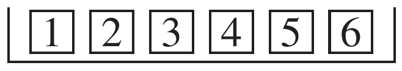

# The Structure of the Chi-Square Test

Mục 1 mô tả \\(\chi^2-test\\). Các thành phần là gì?

_(a) The basic data._ Điều này bao gồm một số quan sát, thường được ký hiệu là N. Đối với xúc xắc, N là 60 và dữ liệu cơ bản nằm trong bảng 1. Đối với bánh xe may mắn, N là 800. Dữ liệu cơ bản là 800 con số được tạo ra trên các vòng quay thử nghiệm .

_(b) The chance model._ Cho đến nay chỉ có một loại chance model được xem xét trong chương này. Có một hộp phiếu, trong đó có nội dung được đưa ra. Rút thăm được thực hiện ngẫu nhiên có thay thế từ hộp. Theo mô hình, dữ liệu tương tự các lần rút. Đối với xúc xắc, cái hộp là

Đối với bánh xe may mắn, hộp có 100 phiếu được đánh số từ 1 đến 100.

_(c) The frequency table._ Đối với mỗi giá trị, tần số quan sát được lấy từ dữ liệu cơ bản bằng cách đếm.[^7] Tần số dự kiến được lấy từ N và chance model. Bảng 2 báo cáo tần số quan sát được và dự kiến của khuôn. Bảng tần số cho bánh xe sẽ có 100 hàng; nó bị bỏ qua.

_(d) \\(\chi^2-statistic\\)._ Điều này được tính từ công thức. Đối với xúc xắc, \\(\chi^2-statistic\\) là 14.2; đối với bánh xe, \\(\chi^2-statistic\\) là 119.

_(e) The degrees of freedom._ Nó ít hơn một so với số số hạng trong tổng của \\(\chi^2\\) (khi nội dung của hộp được mô hình chỉ định). Đối với xúc xắc, có 5 bậc tự do; đối với bánh xe may mắn, có 99. Bậc tự do được tính toán từ mô hình chứ không phải từ dữ liệu.

_(f) The observed significance level._ Giá trị này gần đúng bằng diện tích bên phải \\(\chi^2-statistic\\), dưới \\(\chi^2-curve\\) với số bậc tự do thích hợp. Đối với xúc xắc, \\(P \approx 1.4\\%\\); đối với bánh xe, \\(P \approx 8\\%\\).

Thuật ngữ này phức tạp vì mọi thứ đều bắt đầu bằng “\\(\chi^2\\)”.

- \\(\chi^2-test\\) bao gồm các bước (a–f).
- \\(\chi^2-statistic\\) được tính toán từ dữ liệu mỗi lần bạn thực hiện kiểm định.
- Hai \\(\chi^2-curve\\) được thể hiện trên Hình 1.
- \\(\chi^2-table\\) dựa trên các đường cong và được sử dụng để tra cứu `P-value`.

Bất cứ thứ gì có trong hộp, các đường cong và bảng \\(\chi^2\\) giống nhau đều có thể được sử dụng để xấp xỉ P, miễn là N đủ lớn. Đó chính là động cơ thúc đẩy công thức này. Với các số liệu thống kê kiểm định khác, sẽ cần có một đường cong mới cho mỗi hộp.

---

[^7]: In some cases (e.g., with only a few observations per cell), it is advisable to group the data.
